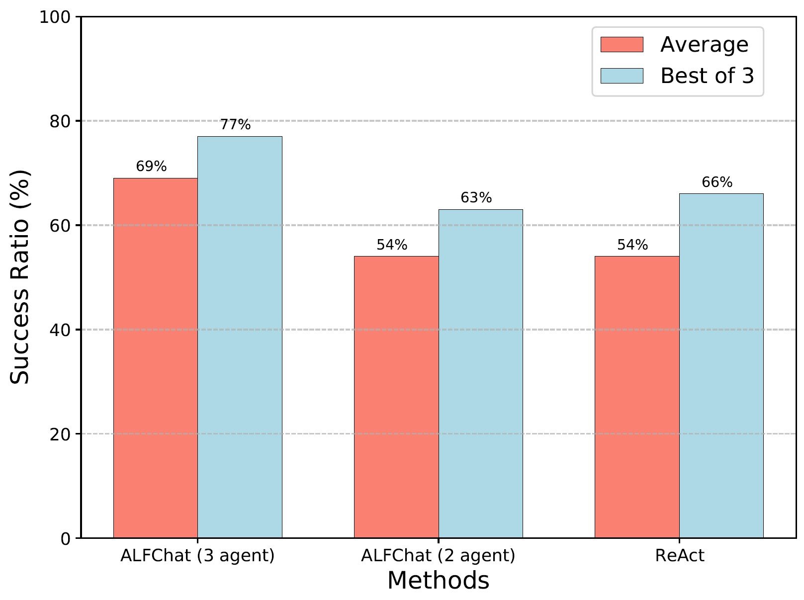

# Decision Making-ALFWorld
This is the code for evaluating ALFChat on ALFWorld.

## Setup
### Option 1: Local Installation
Download `alfworld` data and install environments following instructions [here](https://github.com/alfworld/alfworld).

### Option 2: Docker (Recommended)
We provide a docker that has set up all the environments. The code is in its `/autogen-eval` directory.

```bash
docker pull leoljl/alfchat:v2
docker run -it leoljl/alfchat zsh
# now you are in docker environment
cd /autogen-eval/application/A3-decision-making-ALFWorld
```

## Evaluation on Benchmark

Fill in your api-key in `twoagent.py`, then run the following command to evaluate ALFChat (2 agent) on AlfWorld. The conversation history will be saved in `logs_twoagent/`

```bash
python twoagent.py
```
Fill in your api-key in `multiagent.py`, then run the following command to evaluate ALFChat (3 agent) on AlfWorld. The conversation history will be saved in `logs_multiagent/`

```bash
python multiagent.py
```

To calculate success rate given conversation history, use the following command.

```bash
python count.py --dir logs_multiagent/
python count.py --dir logs_twoagent/
```
We compare task success rate between ReAct, ALFChat (2 agent), ALFChat (3 agent).

