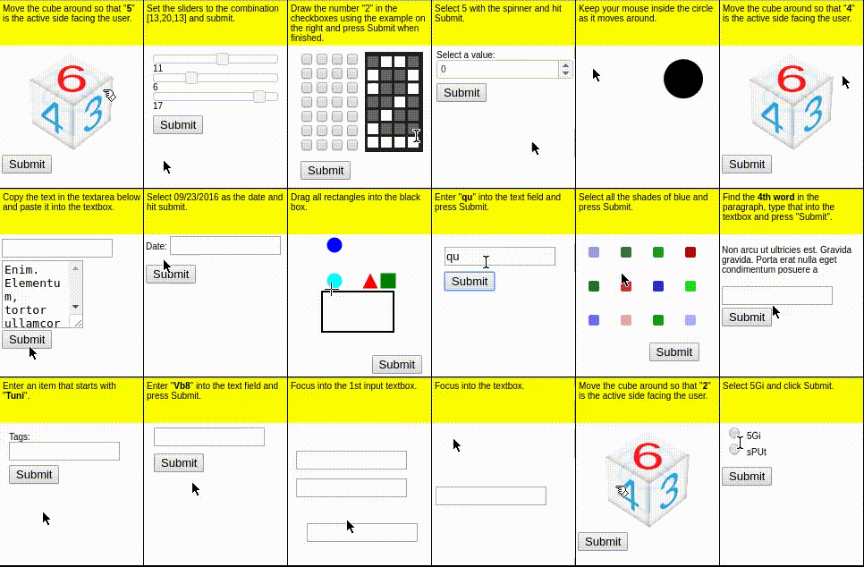
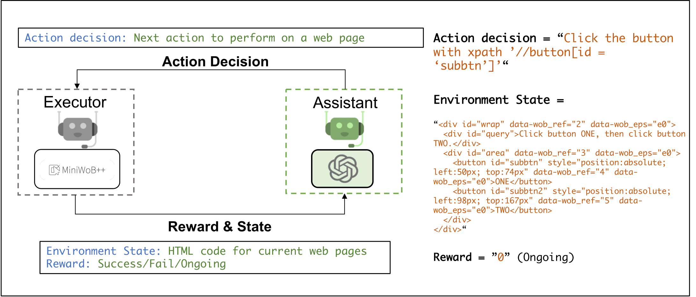
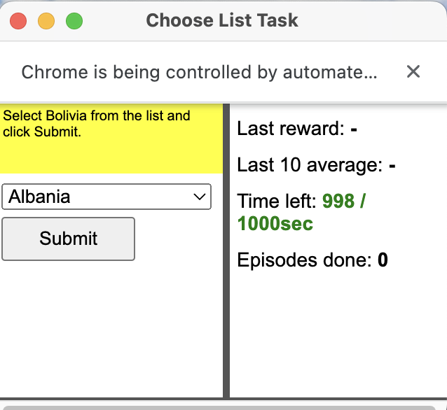
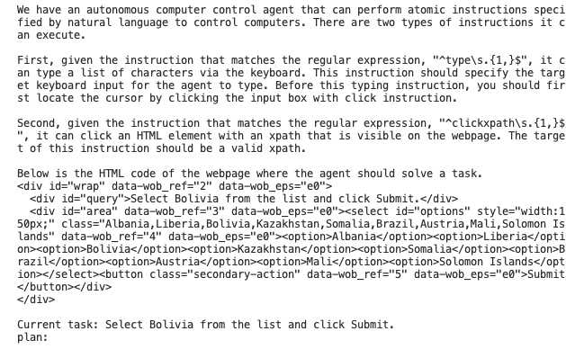
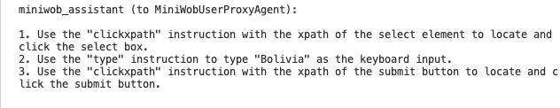
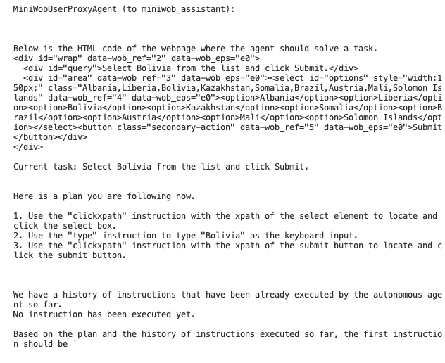
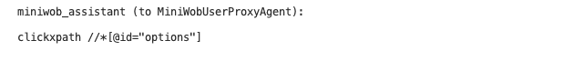
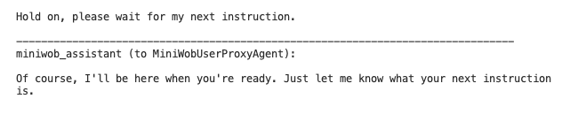
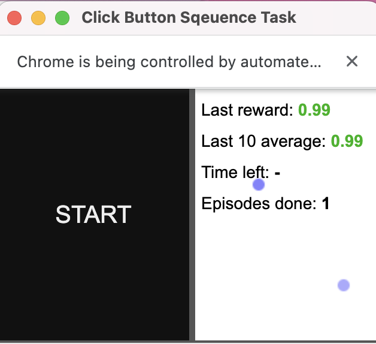
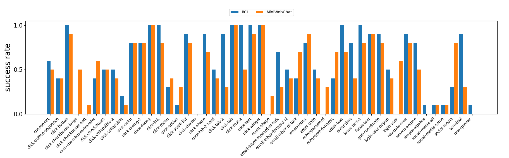

# Browser interactions application

## Miniwob++ benchmark



The goal of the benchmark Miniwob++ is to train machine learning models (agents) to do things in a browser that can be specified in natural language. It contains a collection of over 100 web interaction environments along with JavaScript and Python interfaces for programmatically interacting with them. It use The Gymnasium interface allows an agent to initialize and interact with a MiniWoB++ environment as follows:
```
import gymnasium
env = gymnasium.make('miniwob/click-test-2-v1', render_mode='human')
try:
  observation, info = env.reset(seed=42)
  for _ in range(1000):
    action = policy(observation)  # User-defined policy function
    observation, reward, terminated, truncated, info = env.step(action)
    if terminated:
      observation, info = env.reset()
finally:
  env.close()
```

## Miniwob++ integration with Autogen
We evaluate Autogen’s capabilities for making online decisions on the benchmark minibwob++. We used two agents for our implementation. One is the origin AssistantAgent of Autogen without any modification. This agent is responsible for proposing/modifying the plan to complete the given task and make decisions at each step based on the interaction environment. The other is Executor Agent, which is responsible for interacting with the minibwob++ benchmark, executing the actions sent by the AssistantAgent, and returning the results to the AssistantAgent. 



## Setup

1. Install packages
```sh
conda install --yes --file requirements.txt 
cd computergym
pip install -e .
```

2. Set up openai key in *main.py* and *config.json*.  


## Step-by-step demo

#### 1. Run command 

```sh
python main.py --problem click-button-sequence
```

*Available problems are in available_tasks.txt.*

#### 2. Executor Agent sends enviroment and task information to the AssistantAgent





#### 3. Get initial plan from the AssistantAgent


#### 4. Executor Agent excutes and AssistantAgent comunicate to complete the first step





#### 5. Task Success



## Evaluation on multiple tasks

We make a comparison with the state of the art method RCI[1].  



## Notice

This implementation is partially based on [rci-agent](https://github.com/posgnu/rci-agent), including prompts and data processing.

## Reference

[1] Kim, G., Baldi, P., & McAleer, S. (2023). Language models can solve computer tasks. arXiv preprint arXiv:2303.17491.

