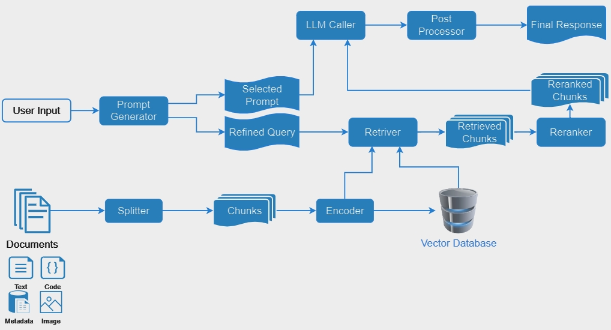

# AutoGen Retrieval-Augmented Generation Agent (RagAgent) and Capability (Ragability)

Introducing an agent capable of performing Retrieval-Augmented Generation (RAG) for the given message.

Upon receipt of a message, the agent employs RAG to generate a reply. It retrieves documents based on the message, then generates a reply using both the retrieved documents and the message itself. Additionally, it supports automatic context updates during the conversation, either autonomously or at the user`s request.

We also support enabling the RAG capability for any conversable agent with `Ragability`.

## Overall Design
The overall architecture of the agent is outlined below:



It consists of two main workflows: raw document processing and user input response.

Given raw documents encompassing text, code, metadata (such as tables or databases), and even images, we utilize a `Splitter` to segment the documents into `Chunks`. These Chunks are then encoded using an `Encoder` to compute embeddings, which are stored as `Documents` within a vector database. This process enables the creation of a comprehensive knowledge base for subsequent retrieval operations.

Once the knowledge base is established, we can enhance our responses to user input. Upon receiving a message, the `Prompt Generator` categorizes it into different types, such as `qa`, `code`, or `unknown`, and selects an appropriate prompt. The message is also refined into multiple query strings for later retrieval. The `Retriever` searches the vector database for relevant documents based on these refined queries, yielding `Retrieved Chunks`. These Chunks are then passed to the `Reranker`, where relevant documents are reordered into `Reranked Chunks` based on relevance. A final prompt is generated using the `Selected Prompt` and `Reranked Chunks`, which is then sent to the backend Language Model via the `LLM Caller`. Post-processing, handled by the `Post Processor`, results in the generation of the `Final Response`.

## RoadMap
[Roadmap for RAG #1657](https://github.com/microsoft/autogen/issues/1657)

- [x] core functionalities
- [x] notebook example
- [x] capability for any agent
- [ ] blog
- [ ] unstructured as splitter
- [ ] qdrant as vectordb
- [ ] lancedb as vectordb
- [ ] benchmark
- [ ] async

## Class Diagram
<div align="center"></img></div>

## Demo Code

- RagAgent

```python
import autogen
from autogen.agentchat.contrib.rag import RagAgent, logger
import logging

logger.setLevel(logging.DEBUG)

config_list = autogen.config_list_from_json(
    "OAI_CONFIG_LIST",
    file_location=".",
    filter_dict={
        "model": ["gpt-3.5-turbo", "gpt-35-turbo", "gpt-35-turbo-0613", "gpt-4", "gpt4", "gpt-4-32k"],
    },
)

print("LLM models: ", [config_list[i]["model"] for i in range(len(config_list))])

llm_config = {
    "timeout": 60,
    "config_list": config_list,
}


def termination_msg(x):
    return isinstance(x, dict) and "TERMINATE" == str(x.get("content", ""))[-9:].upper()


userproxy = autogen.UserProxyAgent(
    name="userproxy",
    is_termination_msg=termination_msg,
    human_input_mode="ALWAYS",
    code_execution_config={"use_docker": False, "work_dir": ".tmp"},
    default_auto_reply="Reply `TERMINATE` if the task is done.",
    description="The boss who ask questions and give tasks.",
)


rag_config = {
    "docs_path": "./website/docs",
}

rag = RagAgent(
    name="rag",
    is_termination_msg=termination_msg,
    human_input_mode="NEVER",
    max_consecutive_auto_reply=5,
    llm_config=llm_config,
    rag_config=rag_config,
    code_execution_config=False,
    description="Assistant who has extra content retrieval power for solving difficult problems.",
)

userproxy.initiate_chat(recipient=rag, message="What is AutoGen?")
```

<div align="center"></img></div>

- Ragability

To make any conversable agent ragable, instantiate both the agent and the Ragability class, then pass the agent to
ragability.add_to_agent(agent).

```python
normal_assistant = autogen.AssistantAgent(name="normal assistant", llm_config=llm_config, max_consecutive_auto_reply=3)

ragability = Ragability(llm_config=llm_config, rag_config=rag_config, verbose=2)
ragability.add_to_agent(normal_assistant)

_ = userproxy.initiate_chat(normal_assistant, message=message)
```

## Notebook Example
For more examples of RAG, please check [RAG notebook](../../../../notebook/agentchat_RAG_new.ipynb).
