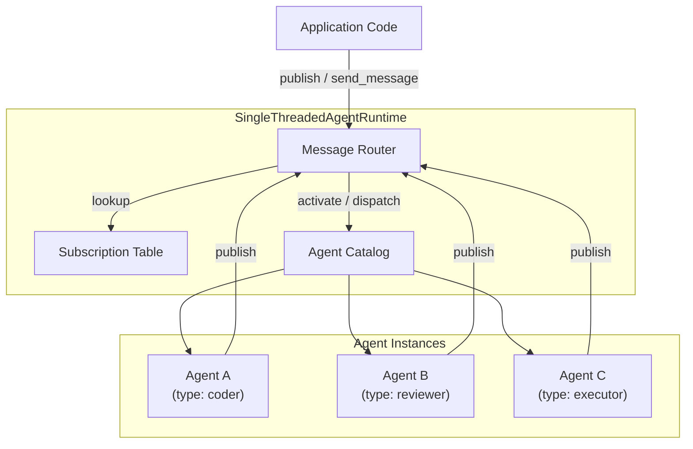
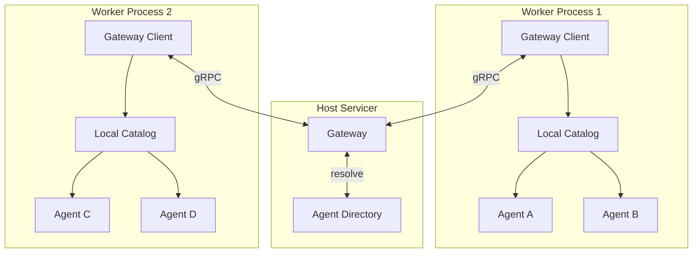
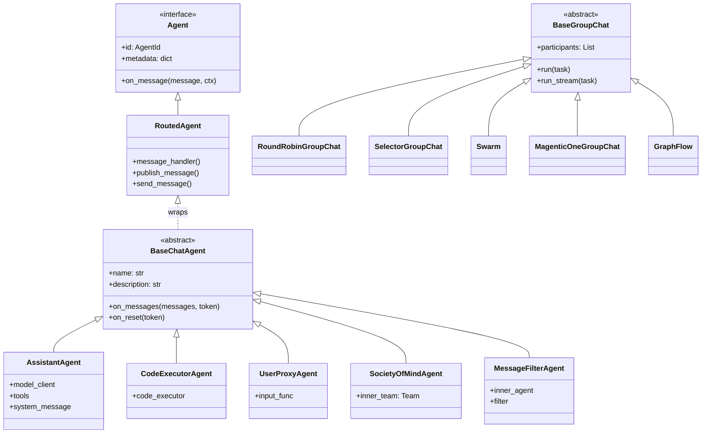
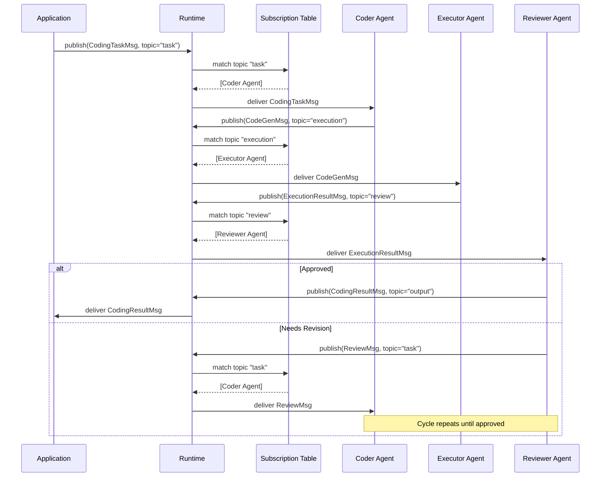
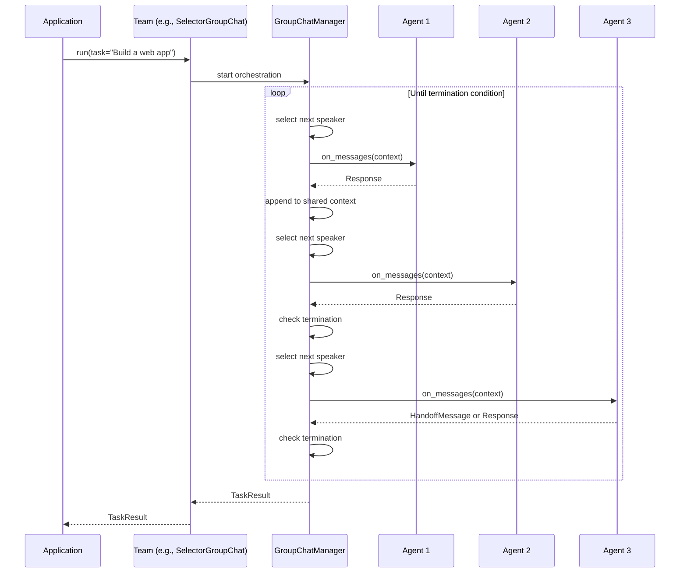
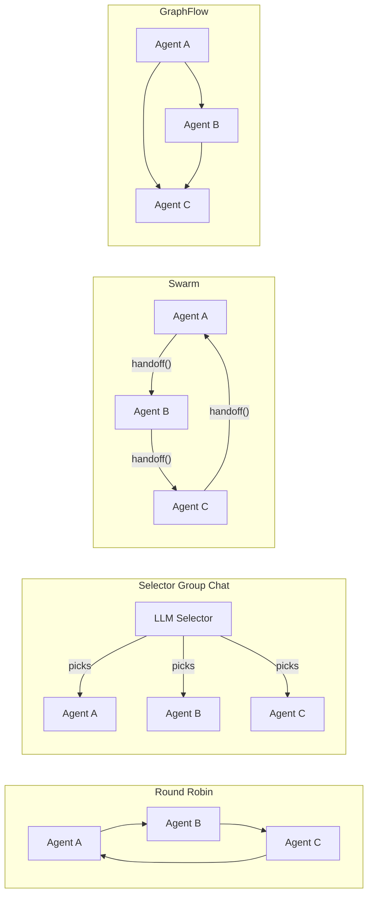
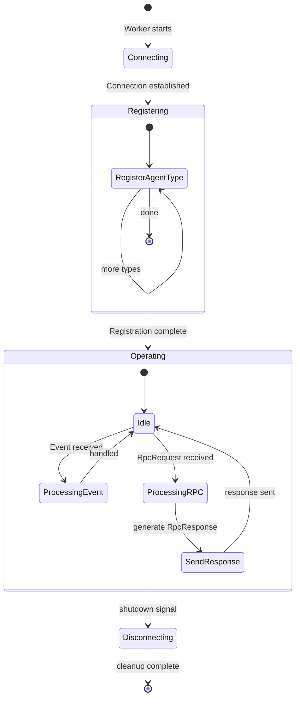

# Architecture Diagrams

Visual reference for AutoGen's internal architecture. These diagrams complement the written design documents and should be kept in sync as the system evolves.

## Agent Runtime Architecture

AutoGen supports two runtime modes. Both expose the same programming interface to agents — the only difference is how messages are routed.

### Standalone Runtime

All agents live in a single process. The runtime manages message dispatch and agent lifecycle directly.

### Distributed Runtime

Agents run across multiple worker processes. A central host servicer coordinates routing, while workers advertise the agent types they support and manage local agent lifecycles.

## Agent Type Hierarchy

AutoGen layers two abstraction levels: a low-level core agent model and a higher-level AgentChat API built on top of it.

## Message Flow: Publish-Subscribe

The core communication primitive is publish-subscribe. Agents subscribe to topic types, and the runtime matches published messages to subscribers.

## AgentChat Team Execution

When using the high-level AgentChat API, a Team orchestrates multi-agent conversations. Each team type uses a different strategy to select the next speaker.

## Team Pattern Comparison

A quick reference for how the built-in team types differ in their speaker-selection strategy.

## Worker Protocol Lifecycle

The protocol between a worker process and the host servicer in a distributed deployment follows three phases.

