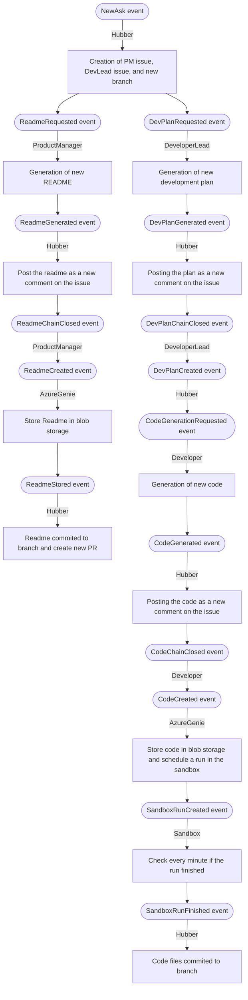

# How does the event flow look like?

```mermaid
graph TD;
    NEA([NewAsk event]) -->|Hubber| NEA1[Creation of PM issue, DevLead issue, and new branch];
    
    RR([ReadmeRequested event]) -->|ProductManager| PM1[Generation of new README];
    NEA1 --> RR;
    PM1 --> RG([ReadmeGenerated event]);
    RG -->|Hubber| RC[Post the readme as a new comment on the issue];
    RC --> RCC([ReadmeChainClosed event]);
    RCC -->|ProductManager| RCR([ReadmeCreated event]);
    RCR --> |AzureGenie| RES[Store Readme in blob storage];
    RES --> RES2([ReadmeStored event]);
    RES2 --> |Hubber| REC[Readme commited to branch and create new PR];

    DPR([DevPlanRequested event]) -->|DeveloperLead| DPG[Generation of new development plan];
    NEA1 --> DPR;
    DPG --> DPGE([DevPlanGenerated event]);
    DPGE -->|Hubber| DPGEC[Posting the plan as a new comment on the issue];
    DPGEC --> DPCC([DevPlanChainClosed event]);
    DPCC -->|DeveloperLead| DPCE([DevPlanCreated event]);
    DPCE --> |Hubber| DPC[Creates a Dev issue for each subtask];

    DPC([CodeGenerationRequested event]) -->|Developer| CG[Generation of new code];
    CG --> CGE([CodeGenerated event]);
    CGE -->|Hubber| CGC[Posting the code as a new comment on the issue];
    CGC --> CCCE([CodeChainClosed event]);
    CCCE -->|Developer| CCE([CodeCreated event]);
    CCE --> |AzureGenie| CS[Store code in blob storage and schedule a run in the sandbox];
    CS --> SRC([SandboxRunCreated event]);
    SRC --> |Sandbox| SRM[Check every minute if the run finished];
    SRM --> SRF([SandboxRunFinished event]);
    SRF --> |Hubber| SRCC[Code files commited to branch];
```
