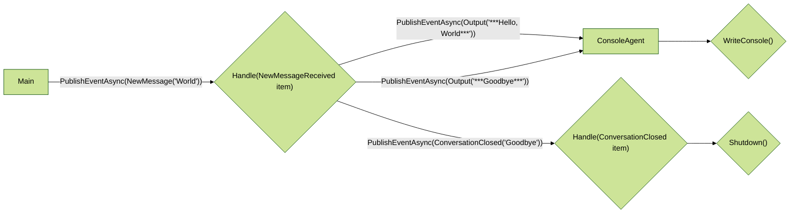

# AutoGen 0.4 .NET Hello World Sample

This [sample](Program.cs) demonstrates how to create a simple .NET console application that listens for an event and then orchestrates a series of actions in response.

## Prerequisites

To run this sample, you'll need: [.NET 8.0](https://dotnet.microsoft.com/en-us/) or later.
Also recommended is the [GitHub CLI](https://cli.github.com/).

## Instructions to run the sample

```bash
# Clone the repository
gh repo clone microsoft/autogen
cd dotnet/samples/Hello
dotnet run
```

## Key Concepts

This sample illustrates how to create your own agent that inherits from a base agent and listens for an event. It also shows how to use the SDK's App Runtime locally to start the agent and send messages.

Flow Diagram:



### Writing Event Handlers

The heart of an autogen application are the event handlers. Agents select a ```TopicSubscription``` to listen for events on a specific topic. When an event is received, the agent's event handler is called with the event data.

Within that event handler you may optionally *emit* new events, which are then sent to the event bus for other agents to process. The EventTypes are declared gRPC ProtoBuf messages that are used to define the schema of the event.  The default protos are available via the ```Microsoft.AutoGen.Abstractions;``` namespace and are defined in [autogen/protos](/autogen/protos). The EventTypes are registered in the agent's constructor using the ```IHandle``` interface.

```csharp
TopicSubscription("HelloAgents")]
public class HelloAgent(
    IAgentContext context,
    [FromKeyedServices("EventTypes")] EventTypes typeRegistry) : ConsoleAgent(
        context,
        typeRegistry),
        ISayHello,
        IHandle<NewMessageReceived>,
        IHandle<ConversationClosed>
{
    public async Task Handle(NewMessageReceived item)
    {
        var response = await SayHello(item.Message).ConfigureAwait(false);
        var evt = new Output
        {
            Message = response
        }.ToCloudEvent(this.AgentId.Key);
        await PublishEventAsync(evt).ConfigureAwait(false);
        var goodbye = new ConversationClosed
        {
            UserId = this.AgentId.Key,
            UserMessage = "Goodbye"
        }.ToCloudEvent(this.AgentId.Key);
        await PublishEventAsync(goodbye).ConfigureAwait(false);
    }
```

### Inheritance and Composition

This sample also illustrates inheritance in AutoGen. The `HelloAgent` class inherits from `ConsoleAgent`, which is a base class that provides a `WriteConsole` method.

### Starting the Application Runtime

AuotoGen provides a flexible runtime ```Microsoft.AutoGen.Agents.App``` that can be started in a variety of ways. The `Program.cs` file demonstrates how to start the runtime locally and send a message to the agent all in one go using the ```App.PublishMessageAsync``` method.

```csharp
// send a message to the agent
var app = await App.PublishMessageAsync("HelloAgents", new NewMessageReceived
{
    Message = "World"
}, local: true);

await App.RuntimeApp!.WaitForShutdownAsync();
await app.WaitForShutdownAsync();
```

### Sending Messages

The set of possible Messages is defined in gRPC ProtoBuf specs. These are then turned into C# classes by the gRPC tools. You can define your own Message types by creating a new .proto file in your project and including the gRPC tools in your ```.csproj``` file:

```proto
syntax = "proto3";
package devteam;
option csharp_namespace = "DevTeam.Shared";
message NewAsk {
  string org = 1;
  string repo = 2;
  string ask = 3;
  int64 issue_number = 4;
}
message ReadmeRequested {
   string org = 1;
   string repo = 2;
   int64 issue_number = 3;
   string ask = 4;
}
```

```xml
  <ItemGroup>
    <PackageReference Include="Google.Protobuf" />
    <PackageReference Include="Grpc.Tools" PrivateAssets="All" />
    <Protobuf Include="..\Protos\messages.proto" Link="Protos\messages.proto" />
  </ItemGroup>
```

You can send messages using the [```Microsoft.AutoGen.Agents.AgentWorker``` class](autogen/dotnet/src/Microsoft.AutoGen/Agents/AgentWorker.cs). Messages are wrapped in [the CloudEvents specification](https://cloudevents.io) and sent to the event bus.
