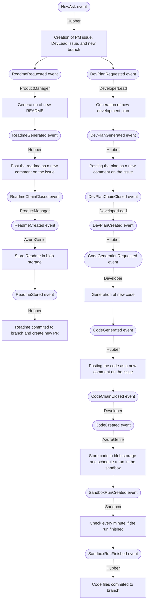

# GitHub Dev Team with AI Agents

Build a Dev Team using event driven agents. This project is an experiment and is not intended to be used in production.

## Background

From a natural language specification, set out to integrate a team of AI agents into your team’s dev process, either for discrete tasks on an existing repo (unit tests, pipeline expansions, PRs for specific intents), developing a new feature, or even building an application from scratch.  Starting from an existing repo and a broad statement of intent, work with multiple AI agents, each of which has a different emphasis - from architecture, to task breakdown, to plans for individual tasks, to code output, code review, efficiency, documentation, build, writing tests, setting up pipelines, deployment, integration tests, and then validation.
The system will present a view that facilitates chain-of-thought coordination across multiple trees of reasoning with the dev team agents.

## Get it running

Check [the getting started guide](./docs/github-flow-getting-started.md).

## Demo

https://github.com/microsoft/azure-openai-dev-skills-orchestrator/assets/10728102/cafb1546-69ab-4c27-aaf5-1968313d637f

## Solution overview

## How it works

* User begins with creating an issue and then stateing what they want to accomplish, natural language, as simple or as detailed as needed.
* Product manager agent will respond with a Readme, which can be iterated upon.
  * User approves the readme or gives feedback via issue comments.
  * Once the readme is approved, the user closes the issue and the Readme is commited to a PR.
* Developer lead agent responds with a decomposed plan for development, which also can be iterated upon.
  * User approves the plan or gives feedback via issue comments.
  * Once the readme is approved, the user closes the issue and the plan is used to break down the task to different developer agents.
* Developer agents respond with code, which can be iterated upon.
  * User approves the code or gives feedback via issue comments.
  * Once the code is approved, the user closes the issue and the code is commited to a PR.

