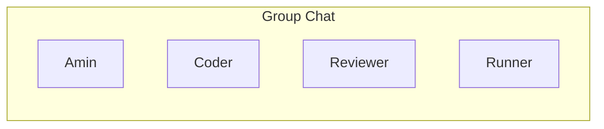

@AutoGen.Core.GroupChat invokes agents in a dynamic way. On one hand, It relies on its admin agent to intellegently determines the next speaker based on conversation context, and on the other hand, it also allows you to control the conversation flow by using a @AutoGen.Core.Graph. This makes it a more dynamic yet controlable way to determine the next speaker agent. You can use @AutoGen.Core.GroupChat to create a dynamic group chat with multiple agents working together to resolve a given task.

> [!NOTE]
> In @AutoGen.Core.GroupChat, when only the group admin is used to determine the next speaker agent, it's recommented to use a more powerful llm model, such as `gpt-4` to ensure the best experience.

## Use @AutoGen.Core.GroupChat to implement a code interpreter chat flow
The following example shows how to create a dynamic group chat with @AutoGen.Core.GroupChat. In this example, we will create a dynamic group chat with 4 agents: `admin`, `coder`, `reviewer` and `runner`. Each agent has its own role in the group chat:

### Code interpreter group chat
- `admin`: create task for group to work on and terminate the conversation when task is completed. In this example, the task to resolve is to calculate the 39th Fibonacci number.
- `coder`: a dotnet coder who can write code to resolve tasks.
- `reviewer`: a dotnet code reviewer who can review code written by `coder`. In this example, `reviewer` will examine if the code written by `coder` follows the condition below:
  - has only one csharp code block.
  - use top-level statements.
  - is dotnet code snippet.
  - print the result of the code snippet to console.
- `runner`: a dotnet code runner who can run code written by `coder` and print the result.

> [!NOTE]
> The complete code of this example can be found in `Example07_Dynamic_GroupChat_Calculate_Fibonacci`

### Create group chat

The code below shows how to create a dynamic group chat with @AutoGen.Core.GroupChat. In this example, we will create a dynamic group chat with 4 agents: `admin`, `coder`, `reviewer` and `runner`. In this case we don't pass a workflow to the group chat, so the group chat will use driven by the admin agent.

[!code-csharp]

> [!TIP]
> You can set up initial context for the group chat using @AutoGen.Core.GroupChatExtension.SendIntroduction*. The initial context can help group admin orchestrates the conversation flow.

Output:

### Below are break-down of how agents are created and their roles in the group chat.

- Create admin agent

The code below shows how to create `admin` agent. `admin` agent will create a task for group to work on and terminate the conversation when task is completed.

[!code-csharp]

- Create coder agent

[!code-csharp]

- Create reviewer agent

The code below shows how to create `reviewer` agent. `reviewer` agent is a dotnet code reviewer who can review code written by `coder`. In this example, a `function` is used to examine if the code written by `coder` follows the condition.

[!code-csharp]

> [!TIP]
> You can use @AutoGen.Core.FunctionAttribute to generate type-safe function definition and function call wrapper for the function. For more information, please check out [Create type safe function call](./Create-type-safe-function-call.md).

[!code-csharp]

- Create runner agent

> [!TIP]
> `AutoGen` provides a built-in support for running code snippet. For more information, please check out [Execute code snippet](./Run-dotnet-code.md).

[!code-csharp]
