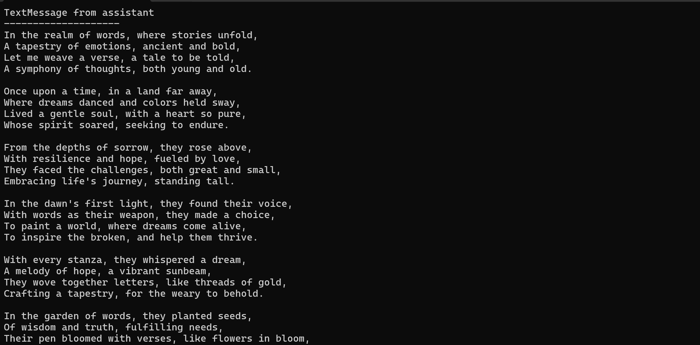

@AutoGen.Core.PrintMessageMiddleware is a built-in @AutoGen.Core.IMiddleware that pretty print @AutoGen.Core.IMessage to console.

> [!NOTE]
> @AutoGen.Core.PrintMessageMiddleware support the following @AutoGen.Core.IMessage types:
> - @AutoGen.Core.TextMessage
> - @AutoGen.Core.MultiModalMessage
> - @AutoGen.Core.ToolCallMessage
> - @AutoGen.Core.ToolCallResultMessage
> - @AutoGen.Core.Message
> - (streaming) @AutoGen.Core.TextMessageUpdate
> - (streaming) @AutoGen.Core.ToolCallMessageUpdate

## Use @AutoGen.Core.PrintMessageMiddleware in an agent
You can use @AutoGen.Core.PrintMessageMiddlewareExtension.RegisterPrintMessage* to register the @AutoGen.Core.PrintMessageMiddleware to an agent.

[!code-csharp]

@AutoGen.Core.PrintMessageMiddlewareExtension.RegisterPrintMessage* will format the message and print it to console

## Streaming message support

@AutoGen.Core.PrintMessageMiddleware also supports streaming message types like @AutoGen.Core.TextMessageUpdate and @AutoGen.Core.ToolCallMessageUpdate. If you register @AutoGen.Core.PrintMessageMiddleware to a @AutoGen.Core.IStreamingAgent, it will format the streaming message and print it to console if the message is of supported type.

[!code-csharp]

