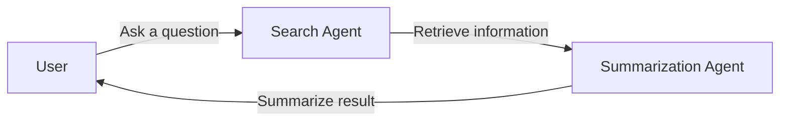

@AutoGen.Core.RoundRobinGroupChat is a group chat that invokes agents in a round-robin order. It's useful when you want to call multiple agents in a fixed sequence. For example, asking search agent to retrieve related information followed by a summarization agent to summarize the information. Beside, it also used by @AutoGen.Core.AgentExtension.SendAsync(AutoGen.Core.IAgent,AutoGen.Core.IAgent,System.String,System.Collections.Generic.IEnumerable{AutoGen.Core.IMessage},System.Int32,System.Threading.CancellationToken) in two agent chat.

### Use @AutoGen.Core.RoundRobinGroupChat to implement a search-summarize chat flow

> [!NOTE]
> Complete code can be found in [Example11_Sequential_GroupChat_Example](https://github.com/microsoft/autogen/blob/dotnet/dotnet/samples/AutoGen.BasicSamples/Example11_Sequential_GroupChat_Example.cs);

Step 1: Add required using statements

[!code-csharp]

Step 2: Create a `bingSearch` agent using @AutoGen.SemanticKernel.SemanticKernelAgent

[!code-csharp]

Step 3: Create a `summarization` agent using @AutoGen.SemanticKernel.SemanticKernelAgent

[!code-csharp]

Step 4: Create a @AutoGen.Core.RoundRobinGroupChat and add `bingSearch` and `summarization` agents to it

[!code-csharp]

Output:

