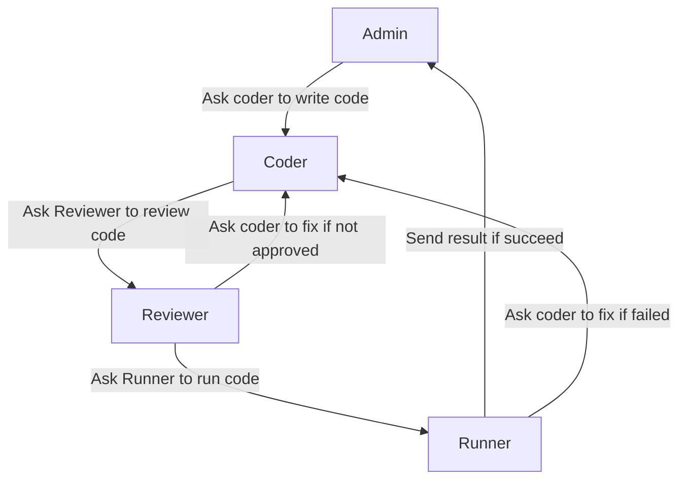

Sometimes, you may want to add more control on how the next agent is selected in a @AutoGen.Core.GroupChat based on the task you want to resolve. For example, in the previous [code writing example](./Group-chat.md), the original code interpreter workflow can be improved by the following diagram because it's not necessary for `admin` to directly talk to `reviewer`, nor it's necessary for `coder` to talk to `runner`.

By having @AutoGen.Core.GroupChat to follow a specific graph flow, we can bring prior knowledge to group chat and make the conversation more efficient and robust. This is where @AutoGen.Core.Graph comes in.

### Create a graph
The following code shows how to create a graph that represents the diagram above. The graph doesn't need to be a finite state machine where each state can only have one legitimate next state. Instead, it can be a directed graph where each state can have multiple legitimate next states. And if there are multiple legitimate next states, the `admin` agent of @AutoGen.Core.GroupChat will decide which one to go based on the conversation context.

> [!TIP]
> @AutoGen.Core.Graph supports conditional transitions. To create a conditional transition, you can pass a lambda function to `canTransitionAsync` when creating a @AutoGen.Core.Transition. The lambda function should return a boolean value indicating if the transition can be taken.

[!code-csharp]

Once the graph is created, you can pass it to the group chat. The group chat will then use the graph along with admin agent to orchestrate the conversation flow.

[!code-csharp]