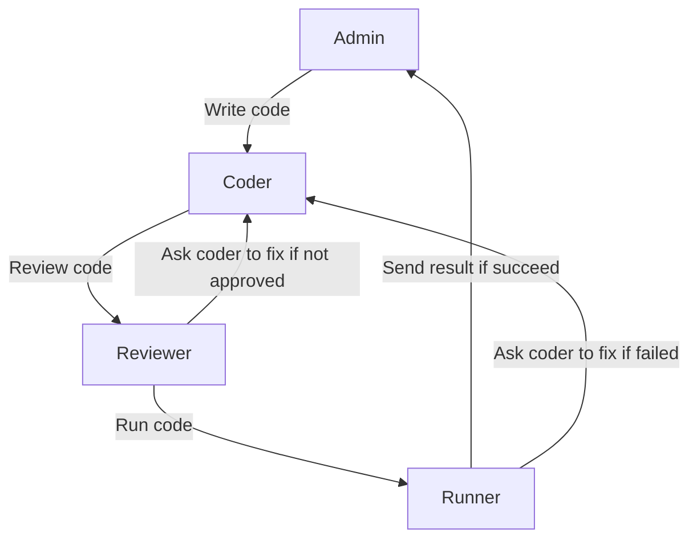

Sometimes, you may want to add more control on how the next agent is selected in a @AutoGen.Core.GroupChat based on the task you want to resolve. For example, in the previous [code writing example](./Group-chat.md), the original workflow can be represented by the following diagram:

In the workflow above, neither it's necessary to have `Admin` directly talk to `Reviewer`, nor it's neccsary for `Coder` to talk to `Runner`. By having @AutoGen.Core.GroupChat to follow a specific workflow, we can bring prior knowledge to group chat and make the conversation more efficient and robust. This is where @AutoGen.Core.Workflow comes in.

### Create a workflow
The following code shows how to create a workflow that represents the diagram above. The workflow doesn't need to be a finite state machine where each state can only have one legitimate next state. Instead, it can be a directed graph where each state can have multiple legitimate next states. And if there are multiple legitimate next states, the `admin` agent of @AutoGen.Core.GroupChat will decide which one to go based on the conversation context.

> [!NOTE]
> @AutoGen.Core.Workflow supports conditional transitions. To create a conditional transition, you can pass a lambda function to `canTransitionAsync` when creating a @AutoGen.Core.Transition. The lambda function should return a boolean value indicating if the transition can be taken.

[!code-csharp]

Once the workflow is created, you can pass it to the group chat when creating it. The group chat will then use the workflow along with admin agent to orchestrate the conversation flow.

[!code-csharp]