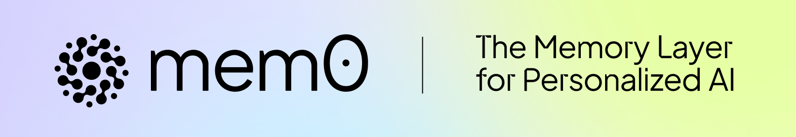

<p align="center">
  <a href="https://github.com/mem0ai/mem0">
    
  </a>
</p>
<p align="center" style="display: flex; justify-content: center; gap: 20px; align-items: center;">
  <a href="https://trendshift.io/repositories/11194" target="blank">
    
  </a>
</p>

<p align="center">
  <a href="https://mem0.ai">Learn more</a>
  ·
  <a href="https://mem0.dev/DiG">Join Discord</a>
  ·
  <a href="https://mem0.dev/demo">Demo</a>
  ·
  <a href="https://mem0.dev/openmemory">OpenMemory</a>
</p>

<p align="center">
  <a href="https://mem0.dev/DiG">
    
  </a>
  <a href="https://pepy.tech/project/mem0ai">
    
  </a>
  <a href="https://github.com/mem0ai/mem0">
    
  </a>
  <a href="https://pypi.org/project/mem0ai" target="blank">
    
  </a>
  <a href="https://www.npmjs.com/package/mem0ai" target="blank">
    
  </a>
  <a href="https://www.ycombinator.com/companies/mem0">
    
  </a>
</p>

<p align="center">
  <a href="https://mem0.ai/research"><strong>📄 Building Production-Ready AI Agents with Scalable Long-Term Memory →</strong></a>
</p>
<p align="center">
  <strong>⚡ +26% Accuracy vs. OpenAI Memory • 🚀 91% Faster • 💰 90% Fewer Tokens</strong>
</p>

##  🔥 Research Highlights
- **+26% Accuracy** over OpenAI Memory on the LOCOMO benchmark
- **91% Faster Responses** than full-context, ensuring low-latency at scale
- **90% Lower Token Usage** than full-context, cutting costs without compromise
- [Read the full paper](https://mem0.ai/research)

# Introduction

[Mem0](https://mem0.ai) ("mem-zero") enhances AI assistants and agents with an intelligent memory layer, enabling personalized AI interactions. It remembers user preferences, adapts to individual needs, and continuously learns over time—ideal for customer support chatbots, AI assistants, and autonomous systems.

### Key Features & Use Cases

**Core Capabilities:**
- **Multi-Level Memory**: Seamlessly retains User, Session, and Agent state with adaptive personalization
- **Developer-Friendly**: Intuitive API, cross-platform SDKs, and a fully managed service option

**Applications:**
- **AI Assistants**: Consistent, context-rich conversations
- **Customer Support**: Recall past tickets and user history for tailored help
- **Healthcare**: Track patient preferences and history for personalized care
- **Productivity & Gaming**: Adaptive workflows and environments based on user behavior

## 🚀 Quickstart Guide <a name="quickstart"></a>

Choose between our hosted platform or self-hosted package:

### Hosted Platform

Get up and running in minutes with automatic updates, analytics, and enterprise security.

1. Sign up on [Mem0 Platform](https://app.mem0.ai)
2. Embed the memory layer via SDK or API keys

### Self-Hosted (Open Source)

Install the sdk via pip:

```bash
pip install mem0ai
```

Install sdk via npm:
```bash
npm install mem0ai
```

### Basic Usage

Mem0 requires an LLM to function, with `gpt-4o-mini` from OpenAI as the default. However, it supports a variety of LLMs; for details, refer to our [Supported LLMs documentation](https://docs.mem0.ai/components/llms/overview).

First step is to instantiate the memory:

```python
from openai import OpenAI
from mem0 import Memory

openai_client = OpenAI()
memory = Memory()

def chat_with_memories(message: str, user_id: str = "default_user") -> str:
    # Retrieve relevant memories
    relevant_memories = memory.search(query=message, user_id=user_id, limit=3)
    memories_str = "\n".join(f"- {entry['memory']}" for entry in relevant_memories["results"])

    # Generate Assistant response
    system_prompt = f"You are a helpful AI. Answer the question based on query and memories.\nUser Memories:\n{memories_str}"
    messages = [{"role": "system", "content": system_prompt}, {"role": "user", "content": message}]
    response = openai_client.chat.completions.create(model="gpt-4o-mini", messages=messages)
    assistant_response = response.choices[0].message.content

    # Create new memories from the conversation
    messages.append({"role": "assistant", "content": assistant_response})
    memory.add(messages, user_id=user_id)

    return assistant_response

def main():
    print("Chat with AI (type 'exit' to quit)")
    while True:
        user_input = input("You: ").strip()
        if user_input.lower() == 'exit':
            print("Goodbye!")
            break
        print(f"AI: {chat_with_memories(user_input)}")

if __name__ == "__main__":
    main()
```

For detailed integration steps, see the [Quickstart](https://docs.mem0.ai/quickstart) and [API Reference](https://docs.mem0.ai/api-reference).

## 🔗 Integrations & Demos

- **ChatGPT with Memory**: Personalized chat powered by Mem0 ([Live Demo](https://mem0.dev/demo))
- **Browser Extension**: Store memories across ChatGPT, Perplexity, and Claude ([Chrome Extension](https://chromewebstore.google.com/detail/onihkkbipkfeijkadecaafbgagkhglop?utm_source=item-share-cb))
- **Langgraph Support**: Build a customer bot with Langgraph + Mem0 ([Guide](https://docs.mem0.ai/integrations/langgraph))
- **CrewAI Integration**: Tailor CrewAI outputs with Mem0 ([Example](https://docs.mem0.ai/integrations/crewai))

## 📚 Documentation & Support

- Full docs: https://docs.mem0.ai
- Community: [Discord](https://mem0.dev/DiG) · [Twitter](https://x.com/mem0ai)
- Contact: founders@mem0.ai

## Citation

We now have a paper you can cite:

```bibtex
@article{mem0,
  title={Mem0: Building Production-Ready AI Agents with Scalable Long-Term Memory},
  author={Chhikara, Prateek and Khant, Dev and Aryan, Saket and Singh, Taranjeet and Yadav, Deshraj},
  journal={arXiv preprint arXiv:2504.19413},
  year={2025}
}
```

## ⚖️ License

Apache 2.0 — see the [LICENSE](LICENSE) file for details.