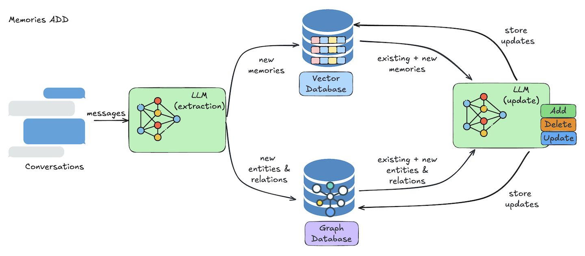

## Overview

The `add` operation is how you store memory into Mem0. Whether you're working with a chatbot, a voice assistant, or a multi-agent system, this is the entry point to create long-term memory.

Memories typically come from a **user-assistant interaction** and Mem0 handles the extraction, transformation, and storage for you.

Mem0 offers two implementation flows:

- **Mem0 Platform** (Managed, scalable, with dashboard + API)
- **Mem0 Open Source** (Lightweight, fully local, flexible SDKs)

Each supports the same core memory operations, but with slightly different setup. Below, we walk through examples for both.


## Architecture

<Frame caption="Architecture diagram illustrating the process of adding memories.">
  
</Frame>

When you call `add`, Mem0 performs the following steps under the hood:

1. **Information Extraction**
   The input messages are passed through an LLM that extracts key facts, decisions, preferences, or events worth remembering.

2. **Conflict Resolution**
   Mem0 compares the new memory against existing ones to detect duplication or contradiction and handles updates accordingly.

3. **Memory Storage**
   The result is stored in a vector database (for semantic search) and optionally in a graph structure (for relationship mapping).

You don’t need to handle any of this manually, Mem0 takes care of it with a single API call or SDK method.

---

## Example: Mem0 Platform

<CodeGroup>
```python Python
from mem0 import MemoryClient

client = MemoryClient(api_key="your-api-key")

messages = [
    {"role": "user", "content": "I'm planning a trip to Tokyo next month."},
    {"role": "assistant", "content": "Great! I’ll remember that for future suggestions."}
]

client.add(
    messages=messages,
    user_id="alice",
    version="v2"
)
```

```javascript JavaScript
import { MemoryClient } from "mem0ai";

const client = new MemoryClient({apiKey: "your-api-key"});

const messages = [
  { role: "user", content: "I'm planning a trip to Tokyo next month." },
  { role: "assistant", content: "Great! I’ll remember that for future suggestions." }
];

await client.add({
  messages,
  user_id: "alice",
  version: "v2"
});
```
</CodeGroup>

---

## Example: Mem0 Open Source

<CodeGroup>
```python Python
import os
from mem0 import Memory

os.environ["OPENAI_API_KEY"] = "your-api-key"

m = Memory()

messages = [
    {"role": "user", "content": "I'm planning to watch a movie tonight. Any recommendations?"},
    {"role": "assistant", "content": "How about a thriller movies? They can be quite engaging."},
    {"role": "user", "content": "I'm not a big fan of thriller movies but I love sci-fi movies."},
    {"role": "assistant", "content": "Got it! I'll avoid thriller recommendations and suggest sci-fi movies in the future."}
]

# Store inferred memories (default behavior)
result = m.add(messages, user_id="alice", metadata={"category": "movie_recommendations"})

# Optionally store raw messages without inference
result = m.add(messages, user_id="alice", metadata={"category": "movie_recommendations"}, infer=False)
```

```javascript JavaScript
import { Memory } from 'mem0ai/oss';

const memory = new Memory();

const messages = [
  {
    role: "user",
    content: "I like to drink coffee in the morning and go for a walk"
  }
];

const result = memory.add(messages, {
  userId: "alice",
  metadata: { category: "preferences" }
});
```
</CodeGroup>

---

## When Should You Add Memory?

Add memory whenever your agent learns something useful:

- A new user preference is shared
- A decision or suggestion is made
- A goal or task is completed
- A new entity is introduced
- A user gives feedback or clarification

Storing this context allows the agent to reason better in future interactions.


### More Details

For full list of supported fields, required formats, and advanced options, see the
[Add Memory API Reference](/api-reference/memory/add-memories).

---

## Need help?
If you have any questions, please feel free to reach out to us using one of the following methods:

<Snippet file="get-help.mdx"/>