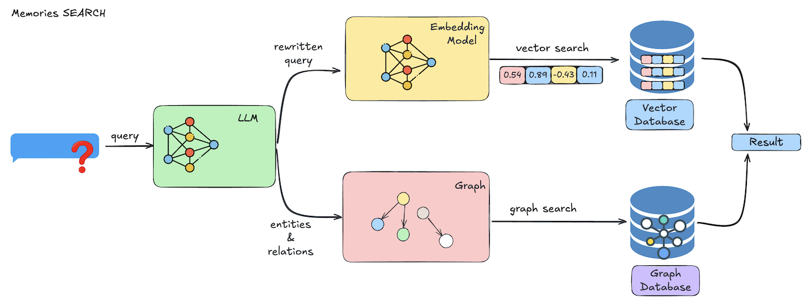

## Overview

The `search` operation allows you to retrieve relevant memories based on a natural language query and optional filters like user ID, agent ID, categories, and more. This is the foundation of giving your agents memory-aware behavior.

Mem0 supports:
- Semantic similarity search
- Metadata filtering (with advanced logic)
- Reranking and thresholds
- Cross-agent, multi-session context resolution

This applies to both:
- **Mem0 Platform** (hosted API with full-scale features)
- **Mem0 Open Source** (local-first with LLM inference and local vector DB)


## Architecture

<Frame caption="Architecture diagram illustrating the memory search process.">
  
</Frame>

The search flow follows these steps:

1. **Query Processing**
   An LLM refines and optimizes your natural language query.

2. **Vector Search**
   Semantic embeddings are used to find the most relevant memories using cosine similarity.

3. **Filtering & Ranking**
   Logical and comparison-based filters are applied. Memories are scored, filtered, and optionally reranked.

4. **Results Delivery**
   Relevant memories are returned with associated metadata and timestamps.

---

## Example: Mem0 Platform

<CodeGroup>
```python Python
from mem0 import MemoryClient

client = MemoryClient(api_key="your-api-key")

query = "What do you know about me?"
filters = {
   "OR": [
      {"user_id": "alice"},
      {"agent_id": {"in": ["travel-assistant", "customer-support"]}}
   ]
}

results = client.search(query, version="v2", filters=filters)
```

```javascript JavaScript
import { MemoryClient } from "mem0ai";

const client = new MemoryClient({apiKey: "your-api-key"});

const query = "I'm craving some pizza. Any recommendations?";
const filters = {
  AND: [
    { user_id: "alice" }
  ]
};

const results = await client.search(query, {
  version: "v2",
  filters
});
```
</CodeGroup>

---

## Example: Mem0 Open Source

<CodeGroup>
```python Python
from mem0 import Memory

m = Memory()
related_memories = m.search("Should I drink coffee or tea?", user_id="alice")
```

```javascript JavaScript
import { Memory } from 'mem0ai/oss';

const memory = new Memory();
const relatedMemories = memory.search("Should I drink coffee or tea?", { userId: "alice" });
```
</CodeGroup>

---

## Tips for Better Search

- Use descriptive natural queries (Mem0 can interpret intent)
- Apply filters for scoped, faster lookup
- Use `version: "v2"` for enhanced results
- Consider wildcard filters (e.g., `run_id: "*"`) for broader matches
- Tune with `top_k`, `threshold`, or `rerank` if needed


### More Details

For the full list of filter logic, comparison operators, and optional search parameters, see the
[Search Memory API Reference](/api-reference/memory/v2-search-memories).

---

## Need help?
If you have any questions, please feel free to reach out to us using one of the following methods:

<Snippet file="get-help.mdx"/>
