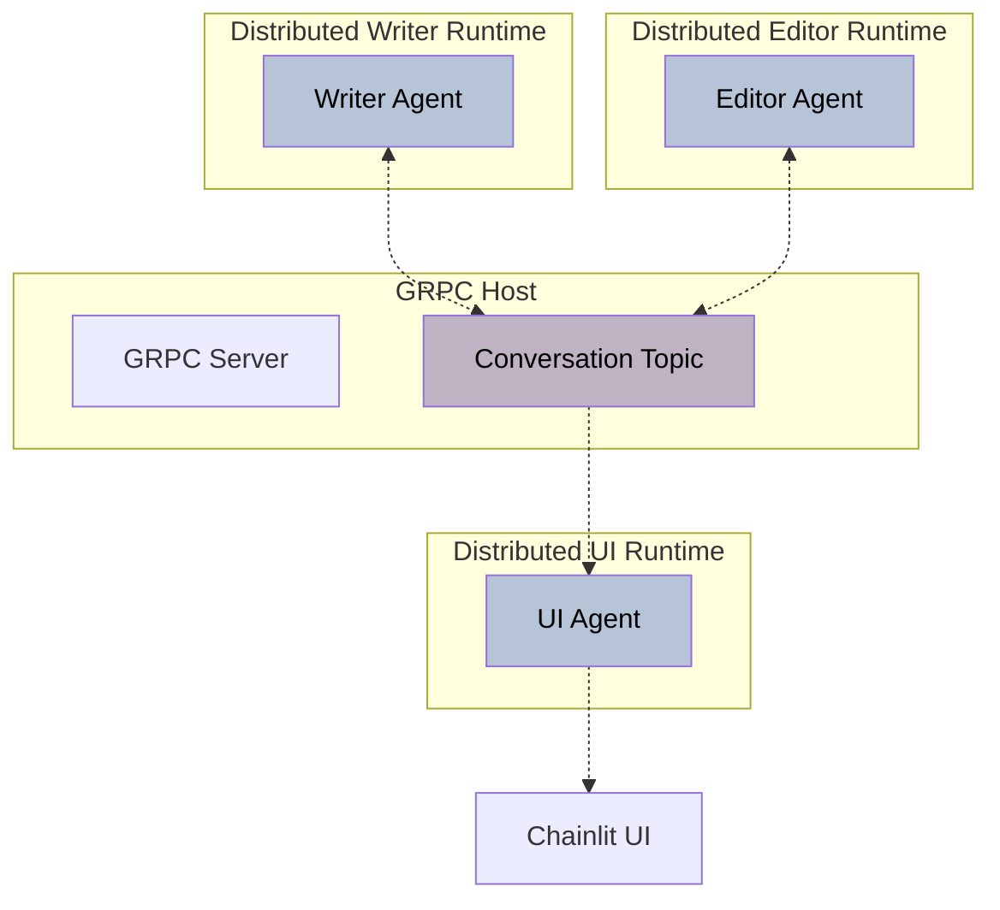

# Tutorial: Using Distributed Runtime in AutoGen

In this tutorial you'll learn how to distributed runtime works in AutoGen v0.4.
We'll first walk you through how to create your development environment and then we'll guide to to created a two
agent conversation in distributed group chat which is integrated with UI.

**Fast Track**:
If you're short on time, you can skip the detailed instructions and jump straight to the [Fast Track](##fast-track). These sections provide a complete set of commands to run the distributed runtime, including the UI agent, and the two agents in the conversation.

## What you'll learn

- How to setup and install AutoGen.
- How to run distributed runtime's host.
- How to connect agents to distributed runtime
- How to get two agents communicating in a distributed runtime
- How to add a UI agent to visualize the conversations



## Requirements and resources

You'll need:

- Linux, Mac, or Windows machine with Python >= 3.10, < 3.13
- An Azure Open AI Model Deployment for Chat Completion. If you prefer to use a Open AI API roken approach, you can do so with slight code changes.

While this exercise is designed to be self-sufficient, at any time feel free to consult the [source code](https://aka.ms/autogen-gh) or the [documentation](https://microsoft.github.io/autogen/dev/).

## Install the dependencies

Create a python virtual environment. Please feel free to use a virtual environment manager of your choice (e.g., `venv` or `conda`). You need two main packages for this series of excercises. `autogen-agentchat` that helps you build the distributed example and `chainlit` for the UI visualization.
Feel free to use `requirements.in` file to install required dependencies or `requirements.txt` file which has exact versions this excercises were tested on.

```bash
pip install -r requirements.txt
```

### Exercise 1: Run distributed host

Very first step in the distributed runtime is to spin up the host so it listens for gRpc connections from agents on the other processes. You can run it by running `python host.py`

```python
# host.py

async def main(host_address: str):
    host = ... # TODO: create a new GrpcWorkerAgentRuntimeHost and start it

    print(f"Host started at {host_address}")
    await host.stop_when_signal()


if __name__ == "__main__":
    asyncio.run(main(host_address="localhost:5000"))

```

### Exercise 2: Play with AssistantAgent

Create a new AssistantAgent from the autogen_agentchat package and make a chat completion API call. Tha main

### Using Azure OpenAI Client

If you already have a azure deployment of a chat completion model, you can just pass your deployment name and endpoint to the config below to instantiate your model client.
**Note**: You need to have azure clie installed and run `az login` to authenticate once. For more information, check [Authenticate to Azure using Azure CLI](https://learn.microsoft.com/en-us/cli/azure/authenticate-azure-cli)

```python
client_config = {
    "model": "gpt-4o",
    "azure_endpoint": "https://{your-custom-endpoint}.openai.azure.com",
    "azure_deployment": "{your-azure-deployment}",
    "api_version": "2024-08-01-preview",
    "azure_ad_token_provider": get_bearer_token_provider(
        DefaultAzureCredential(), "https://cognitiveservices.azure.com/.default"
    ),
}

model_client = AzureOpenAIChatCompletionClient(**client_config)
```

#### Using Azure OpenAI Client

If you want to use your OpenAI Token, you can alternatively initialize `model_client` using:

```python
model_client = OpenAIChatCompletionClient(
          model="gpt-4o",
          # api_key = "your_openai_api_key"
          )
```

#### Verify your agent chat!

```python
model_client = ... # TODO: Replace with one of the client instantiation methods above

agent = AssistantAgent(name="assistant", model_client=model_client)

response = await agent.on_messages(
    [TextMessage(content="Tell me two sentences about NeurIPS 2024!", source="user")], CancellationToken()
)
print(response)
```

### Exercise 3: Create a Wrapper Agent around assistant agent to leverage topic subscriptions

`RoutedAgent` is the base class from the `autogen-core` package that we would use to implement the topic subscription. Develop the file in a way that it can be run as `python agent.py host_address agent_name agent_system_message`

```python
# agent.py
class AssistantAgentWrapper(RoutedAgent):

    def __init__(
        self,
        description: str,
        group_chat_topic_type: str,
        agent: AssistantAgent,
    ) -> None:
        super().__init__(description=description)
        self._group_chat_topic_type = group_chat_topic_type
        self._agent = agent
        self._chat_history: List[LLMMessage] = []

    @message_handler
    async def handle_message(self, message: TextMessage, ctx: MessageContext) -> None:
        ... # TODO: Make proper call to agent, retreive results and publish it in the message
        await self.publish_message(
                TextMessage(content = "...", source = "..."),
                topic_id=DefaultTopicId(type="conversation_topic"),
            )


agent_runtime = GrpcWorkerAgentRuntime(host_address=host_address)
agent_runtime.add_message_serializer(get_serializers([TextMessage]))  # Add Message Serializer for TextMessage

agent_runtime.start()

agent_type = await AssistantAgentWrapper.register(
    agent_runtime,
    agent_name,
    lambda: AssistantAgentWrapper(
        description=agent_system_message,
        group_chat_topic_type="conversation_topic",
        agent=AssistantAgent(name=agent_name, system_message=agent_system_message, model_client=model_client),
    ),
)

# Note: Register agent to the conversation_topic so it can receive messages
await agent_runtime.add_subscription(TypeSubscription(topic_type="conversation_topic", agent_type=agent_type.type))

```

### Excercise 4: Run two agents at the same time

At this step, you need to make sure the following sets of commands (each in a seperate terminal) run and agents can communicate with eachother:

```bash
# First terminal
python3 host.py "localhost:5000"

# Second terminal
python3 agent.py "localhost:5000" editor_agent "You are an Editor. You just provide feedback on the message you receive."

# Third terminal
python3 agent.py "localhost:5000" writer_agent "You are a one sentence Writer and provide one sentence content each time"
```

Make sure agent.py publishes a user message to initiate the conversation.

### Excercise 5: Develop the UI Agent

Register a UI Agent which can receive messages in the group chat and send them to chainlit. You can run as `python3 ui.py "localhost:5000"`

```python

grpc_host: str = "localhost:5000"

class UIAgent(RoutedAgent):
    """Handles UI-related tasks and message processing for the distributed group chat system."""

    def __init__(self) -> None:
        super().__init__("UI Agent")

    @message_handler
    async def handle_message(self, message: TextMessage, ctx: MessageContext) -> None:
        # This is how we can send a message to Chainlit
        await Message(content=message.content, author=message.source).send()

# This decorator defines the entry point
@cl.on_chat_start
async def main():
    # Register a UI agent runtime and subscribe to the conversation_topic topic
    ...

if __name__ == "__main__":
    from chainlit.cli import run_chainlit

    if len(sys.argv) == 2:
        grpc_host = sys.argv[0]
    run_chainlit(
        __file__,
    )

```

## Fast Track

If you don't have the time to do the coding, you can use the full excercise implementation in [./complete_sample](./complete_sample).

1. Make sure you have the dependencies installed (e.g. `pip install -r requirements.txt`)
   2.\*\*\*\*
2. Go to the `complete_sample` folder in each terminal, activate your virtual environment in each (if you are using a venv) and run:
3. Privide either `azure_openai_endpoint` and `azure_openai_deployment` or only `openai_api_key` parameters when running `agent.py` file

```bash
# First terminal
python3 host.py --host-address "localhost:5000"
```

```bash
# Second terminal
python3 ui.py --host-address "localhost:5000"
```

```bash
# Third terminal
python3 agent.py --host-address "localhost:5000" --agent-name writer_agent --agent-system-message "You are a one sentence Writer and provide one sentence content each time" --azure-openai-endpoint "https://{your-custom-endpoint}.openai.azure.com" --azure-openai-deployment  "{your-azure-deployment}"
```

```bash
# Forth terminal
python3 agent.py --host-address "localhost:5000" --agent-name editor_agent --agent-system-message "You are an Editor. You just provide feedback on the message you receive." --azure-openai-endpoint "https://{your-custom-endpoint}.openai.azure.com" --azure-openai-deployment  "{your-azure-deployment}"
```

**Note**: If you are using OpenAI API Key, your third and forth commands will be like `python3 agent.py .... --openai-api-key "..."`

## Whats next?

- You are welcome to continue extending this example. You can try adding a LLM based group chat manager or send stream of messages in topics.
- Share your work! Record screenshots or videos of your example for distributed run time and tweet! You may also upload your solution to GitHub! Make sure to use #AutoGen hashtag and tag @pyautogen so that we can discover your work!

## Need help?

You can check [Distributed Group Chat Sample](https://github.com/microsoft/autogen/tree/c02d87e9cf90f4fd91da6b641f1de8077edb54db/python/packages/autogen-core/samples/distributed-group-chat) implementation to learn what else is possible!
