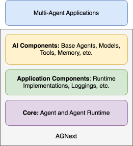

# AGNext Architectures

AGNext is a framework for building multi-agent applications with AI agents.
At the foundation level, it provides a runtime envionment to facilitate
communication between agents, manage their identities and lifecycles,
and enforce security and privacy boundaries.

AGNext supports two types of runtime architectures: standalone and distributed.
Both architectures provide a common set of APIs for building multi-agent applications,
so you can switch between them with no change to your agent implementation.
Each architecture can also have different implementations.

## Standalone Agent Runtime

Standalone runtime is suitable for single-process applications where all agents
are implemented in the same programming language and running in the same process.
In Python API, an example of standalone runtime is the {py:class}`~autogen_core.application.SingleThreadedAgentRuntime`.

The following diagram shows the standalone runtime architecture of AGNext.

Agents communicate via messages through the runtime. The runtime manages
the lifecycle of agents.

Developers can build agents quickly by using the provided components including
routed agent, AI model clients, tools for AI models, code execution sandboxes,
model context stores, and more.
They can also implement their own from scratch, or use other libraries.

## Distributed Agent Runtime

Distributed runtime is suitable for multi-process applications where agents
may be implemented in different programming languages and running on different
machines.

A distributed runtime, as shown in the diagram above,
consists of a host servicer and multiple workers.
The host servicer facilitates communication between agents across workers
and maintains the states of connections.
The workers run agents and communicate with the host servicer via gateways.
They advertise to the host servicer the agents they run and manage the agents' lifecycles.

Agents work the same way as in the standalone runtime so that developers can
switch between the two runtime architectures with no change to their agent implementation.

## API Layers

The API consists of the following layers:

- {py:mod}`autogen_core.base`
- {py:mod}`autogen_core.application`
- {py:mod}`autogen_core.components`

The following diagram shows the relationship between the layers.

The {py:mod}`autogen_core.base` layer defines the
core interfaces and base classes for agents, messages, and runtime.
This layer is the foundation of the framework and is used by the other layers.

The {py:mod}`autogen_core.application` layer provides concrete implementations of
runtime and utilities like logging for building multi-agent applications.

The {py:mod}`autogen_core.components` layer provides reusable components for building
AI agents, including type-routed agents, AI model clients, tools for AI models,
code execution sandboxes, and memory stores.

The layers are loosely coupled and can be used independently. For example,
you can swap out the runtime in the {py:mod}`autogen_core.application` layer with your own
runtime implementation.
You can also skip the components in the {py:mod}`autogen_core.components` layer and
build your own components.
