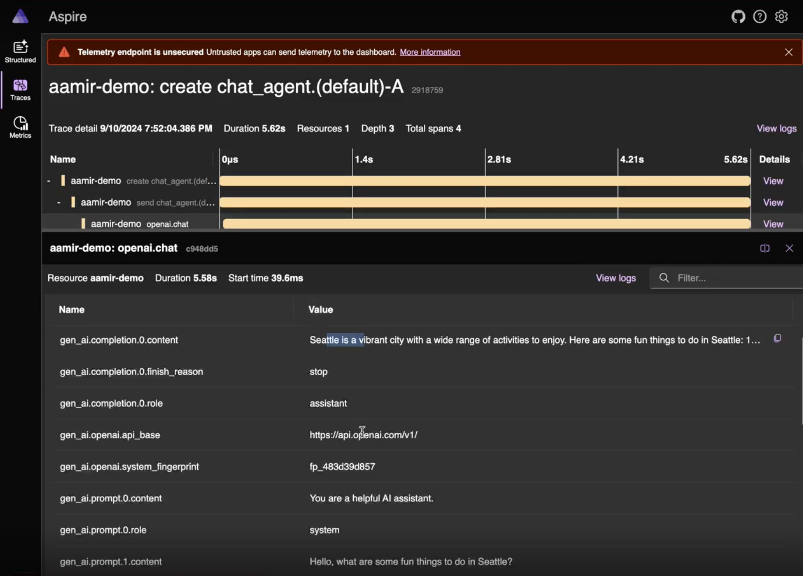

# Instrumentating your code locally

AutoGen supports instrumenting your code using [OpenTelemetry](https://opentelemetry.io). This allows you to collect traces and logs from your code and send them to a backend of your choice.

While debugging, you can use a local backend such as [Aspire](https://aspiredashboard.com/) or [Jaeger](https://www.jaegertracing.io/). In this guide we will use Aspire as an example.

## Setting up Aspire

Follow the instructions [here](https://learn.microsoft.com/en-us/dotnet/aspire/fundamentals/dashboard/overview?tabs=bash#standalone-mode) to set up Aspire in standalone mode. This will require Docker to be installed on your machine.

## Instrumenting your code

Once you have a dashboard set up, now it's a matter of sending traces and logs to it. You can follow the steps in the [Telemetry Guide](../framework/telemetry.md) to set up the opentelemetry sdk and exporter.

After instrumenting your code with the Aspire Dashboard running, you should see traces and logs appear in the dashboard as your code runs.

## Observing LLM calls using Open AI

If you are using the Open AI package, you can observe the LLM calls by setting up the opentelemetry for that library. We use [opentelemetry-instrumentation-openai](https://pypi.org/project/opentelemetry-instrumentation-openai/) in this example.

Install the package:
```bash
pip install opentelemetry-instrumentation-openai
```

Enable the instrumentation:
```python
from opentelemetry.instrumentation.openai import OpenAIInstrumentor

OpenAIInstrumentor().instrument()
```

Now running your code will send traces including the LLM calls to your telemetry backend (Aspire in our case).

