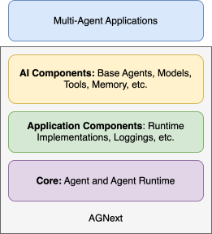

# API Layers

The API consists of the following layers:

- {py:mod}`autogen_core.base`
- {py:mod}`autogen_core.application`
- {py:mod}`autogen_core.components`

The following diagram shows the relationship between the layers.

The {py:mod}`autogen_core.base` layer defines the
core interfaces and base classes for agents, messages, and runtime.
This layer is the foundation of the framework and is used by the other layers.

The {py:mod}`autogen_core.application` layer provides concrete implementations of
runtime and utilities like logging for building multi-agent applications.

The {py:mod}`autogen_core.components` layer provides reusable components for building
AI agents, including type-routed agents, AI model clients, tools for AI models,
code execution sandboxes, and memory stores.

The layers are loosely coupled and can be used independently. For example,
you can swap out the runtime in the {py:mod}`autogen_core.application` layer with your own
runtime implementation.
You can also skip the components in the {py:mod}`autogen_core.components` layer and
build your own components.