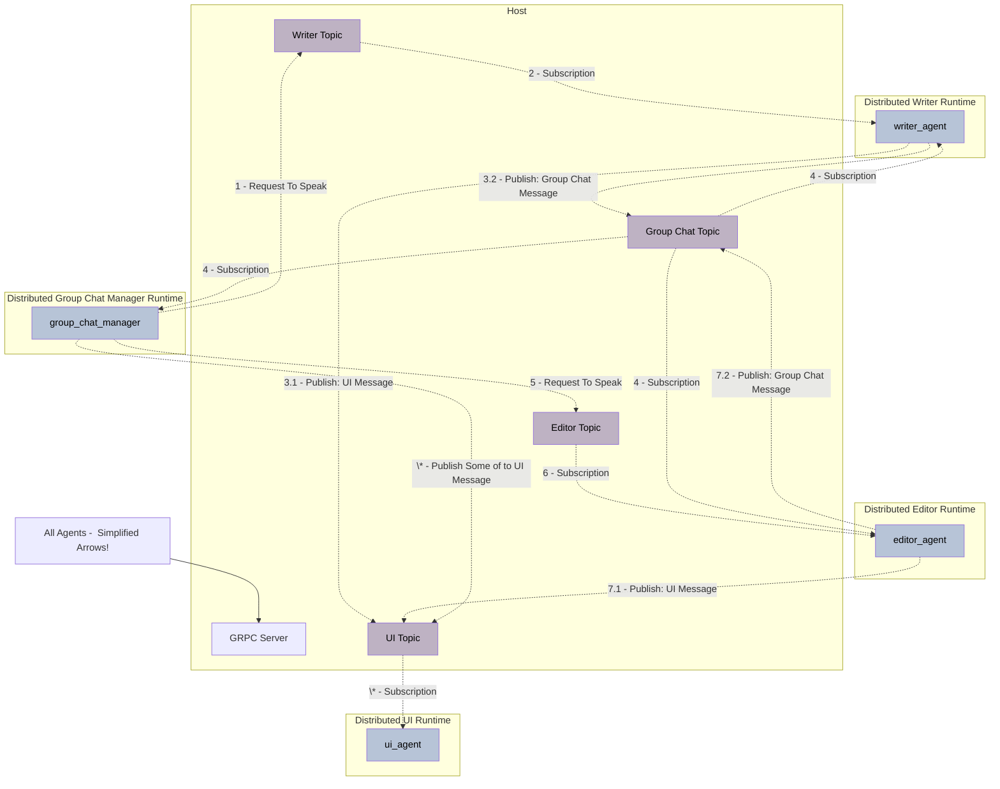

# Distributed Group Chat

This example runs a gRPC server using [GrpcWorkerAgentRuntimeHost](../../src/autogen_core/application/_worker_runtime_host.py) and instantiates three distributed runtimes using [GrpcWorkerAgentRuntime](../../src/autogen_core/application/_worker_runtime.py). These runtimes connect to the gRPC server as hosts and facilitate a round-robin distributed group chat. This example leverages the [Azure OpenAI Service](https://azure.microsoft.com/en-us/products/ai-services/openai-service) to implement writer and editor LLM agents. Agents are instructed to provide concise answers, as the primary goal of this example is to showcase the distributed runtime rather than the quality of agent responses.

## Setup

### Setup Python Environment

1. Create a virtual environment as instructed in [README](../../../../../../../../README.md).
2. Run `uv pip install chainlit` in the same virtual environment

### General Configuration

In the `config.yaml` file, you can configure the `client_config` section to connect the code to the Azure OpenAI Service.

### Authentication

The recommended method for authentication is through Azure Active Directory (AAD), as explained in [Model Clients - Azure AI](https://microsoft.github.io/autogen/dev/user-guide/core-user-guide/framework/model-clients.html#azure-openai). This example works with both the AAD approach (recommended) and by providing the `api_key` in the `config.yaml` file.

## Run

### Run Through Scripts

The [run.sh](./run.sh) file provides commands to run the host and agents using [tmux](https://github.com/tmux/tmux/wiki). The steps for this approach are:

1. Install tmux.
2. Activate the Python environment: `source .venv/bin/activate`.
3. Run the bash script: `./run.sh`.

Here is a screen recording of the execution:

**Note**: Some `asyncio.sleep` commands have been added to the example code to make the `./run.sh` execution look sequential and visually easy to follow. In practice, these lines are not necessary.

### Run Individual Files

If you prefer to run Python files individually, follow these steps. Note that each step must be run in a different terminal process, and the virtual environment should be activated using `source .venv/bin/activate`.

1. `python run_host.py`: Starts the host and listens for agent connections.
2. `chainlit run run_ui.py  --port 8001`: Starts the Chainlit app and UI agent and listens on UI topic to display messages. We're using port 8001 as the default port 8000 is used to run host (assuming using same machine to run all of the agents)
3. `python run_editor.py`: Starts the  editor agent and connects it to the host.
4. `python run_writer.py`: Starts the  writer agent and connects it to the host.
5. `python run_group_chat_manager.py`: Run chainlit app which starts  group chat manager agent and sends the initial message to start the conversation.

## What's Going On?

The general flow of this example is as follows:

0. The UI Agent runs starts the UI App, listens for stream of messages in the UI topic and displays them in the UI.
1. The  Group Chat Manager, on behalf of  `User`, sends a `RequestToSpeak` request to the  `writer_agent`.
2. The  `writer_agent` writes a short sentence into the group chat topic.
3. The  `editor_agent` receives the message in the group chat topic and updates its memory.
4. The  Group Chat Manager receives the message sent by the writer into the group chat simultaneously and sends the next participant, the  `editor_agent`, a `RequestToSpeak` message.
5. The  `editor_agent` sends its feedback to the group chat topic.
6. The  `writer_agent` receives the feedback and updates its memory.
7. The  Group Chat Manager receives the message simultaneously and repeats the loop from step 1.

Here is an illustration of the system developed in this example:

## TODO:

- [ ] Properly handle chat restarts. It complains about group chat manager being already registered
- [ ] Add streaming to the UI like [this example](https://docs.chainlit.io/advanced-features/streaming) when [this bug](https://github.com/microsoft/autogen/issues/4213) is resolved
