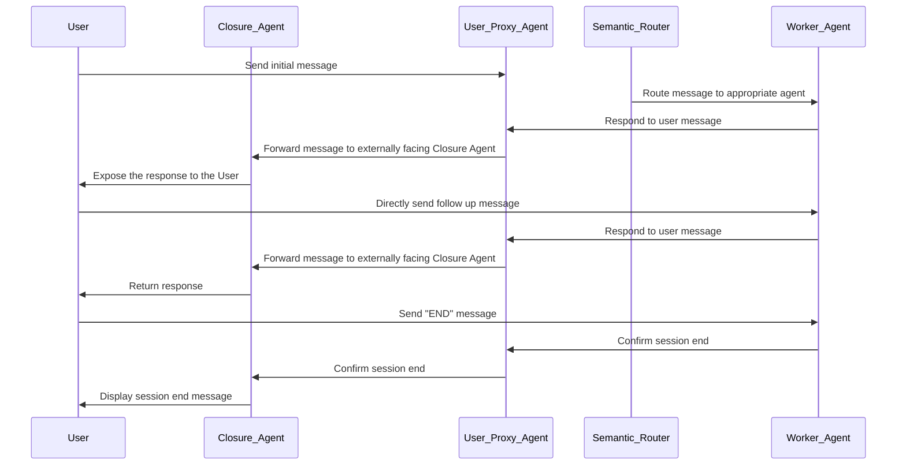

# Multi Agent Orchestration, Distributed Agent Runtime Example

This repository is an example of how to run a distributed agent runtime. The system is composed of three main components:

1. The agent host runtime, which is responsible for managing the eventing engine, and the pub/sub message system.
2. The worker runtime, which is responsible for the lifecycle of the distributed agents, including the "semantic router".
3. The user proxy, which is responsible for managing the user interface and the user interactions with the agents.


## Example Scenario

In this example, we have a simple scenario where we have a set of distributed agents (an "HR", and a "Finance" agent) which an enterprise may use to manage their HR and Finance operations. Each of these agents are independent, and can be running on different machines. While many multi-agent systems are built to have the agents collaborate to solve a difficult task - the goal of this example is to show how an enterprise may manage a large set of agents that are suited to individual tasks, and how to route a user to the most relevant agent for the task at hand.

The way this system is designed, when a user initiates a session, the semantic router agent will identify the intent of the user (currently using the overly simple method of string matching), identify the most relevant agent, and then route the user to that agent. The agent will then manage the conversation with the user, and the user will be able to interact with the agent in a conversational manner.

While the logic of the agents is simple in this example, the goal is to show how the distributed runtime capabilities of autogen supports this scenario independantly of the capabilities of the agents themselves.

## Getting Started

1. Install `autogen-core` and its dependencies

## To run

Since this example is meant to demonstrate a distributed runtime, the components of this example are meant to run in different processes - i.e. different terminals.

In 2 separate terminals, run:

```bash
# Terminal 1, to run the Agent Host Runtime
python run_host.py
```

```bash
# Terminal 2, to run the Worker Runtime
python run_semantic_router.py
```

The first terminal should log a series of events where the vrious agents are registered
against the runtime.

In the second terminal, you may enter a request related to finance or hr scenarios.
In our simple example here, this means using one of the following keywords in your request:

- For the finance agent: "finance", "money", "budget"
- For the hr agent: "hr", "human resources", "employee"   

You will then see the host and worker runtimes send messages back and forth, routing to the correct
agent, before the final response is printed.

The conversation can then continue with the selected agent until the user sends a message containing "END",at which point the agent will be disconnected from the user and a new conversation can start.

## Message Flow

Using the "Topic" feature of the agent host runtime, the message flow of the system is as follows:


