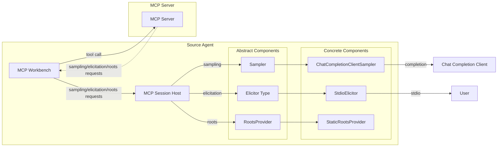
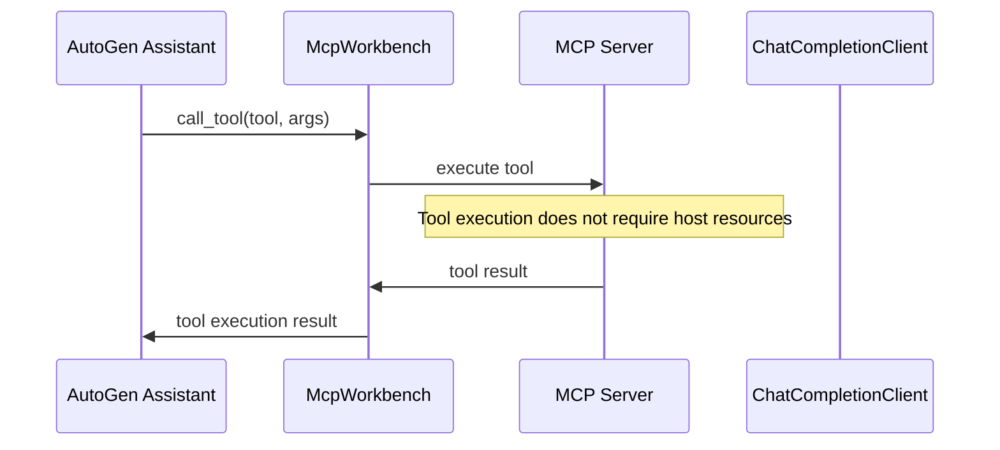
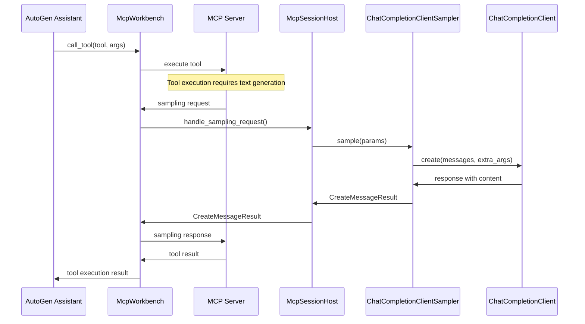
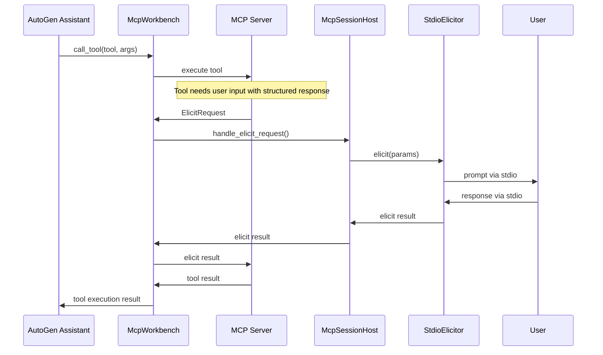
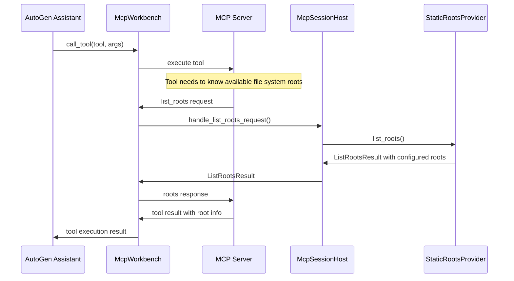

# MCP Session Host

The `McpSessionHost` supports MCP Server -> MCP Host requests within the AutoGen ecosystem. By design it should require minimal or no changes to your AutoGen agents, simply provide a host to the `McpWorkbench`.

The following MCP features are supported:

1. **Sampling**: Text generation using language models
2. **Elicitation**: Interactive user prompting and structured data collection
3. **Roots**: File system root listing for server access

## Architecture



## Sequence Diagrams

### Normal Tool Calling Flow




### Sampling Request Flow



### Elicitation Request Flow



### List Roots Request Flow



## Components

### McpSessionHost

The main host-side component that handles server-to-host requests and coordinates with component providers:

- **Sampler**: Handles sampling requests via `Sampler`s (e.g. `ChatCompletionClientSampler`)
- **Elicitor**: Handles elicitation requests via `Elicitor`s (e.g. `StdioElicitor`, `StreamElicitor`)
- **RootsProvider**: Provides file system access configuration via `RootsProvider`s (e.g. `StaticRootsProvider`)

### Component Types

#### Samplers
Handle text generation requests from MCP servers:
- **ChatCompletionClientSampler**: Routes sampling requests to any `ChatCompletionClient`

#### Elicitors
Handle structured prompting requests from MCP servers:
- **StdioElicitor**: Interactive user prompting via standard input/output streams.
- **StreamElicitor**: Base class for stream-based elicitation

#### RootsProviders
Manage file system root access for MCP servers:
- **StaticRootsProvider**: Provides a static list of file system roots

## Usage

### Example

```diff
from autogen_agentchat.agents import AssistantAgent, UserProxyAgent
from autogen_agentchat.teams import RoundRobinGroupChat
from autogen_ext.models.openai import OpenAIChatCompletionClient
from autogen_ext.tools.mcp import McpWorkbench, StdioServerParams
+ from autogen_ext.tools.mcp import (
+     ChatCompletionClientSampler,
+     McpSessionHost,
+     StaticRootsProvider,
+     StdioElicitor,
+ )
+ from pydantic import FileUrl
+ from mcp.types import Root

# Setup model client
model_client = OpenAIChatCompletionClient(model="gpt-4o")

+ # Create components
+ sampler = ChatCompletionClientSampler(model_client)
+ elicitor = StdioElicitor()
+ roots = StaticRootsProvider([
+     Root(uri=FileUrl("file:///workspace"), name="Workspace"),
+     Root(uri=FileUrl("file:///docs"), name="Documentation"),
+ ])

+ # Create host with all capabilities
+ host = McpSessionHost(
+     sampler=sampler,    # For sampling requests
+     elicitor=elicitor,  # For elicitation requests
+     roots=roots,        # For roots requests
+ )

# Setup MCP workbench
mcp_workbench = McpWorkbench(
    server_params=StdioServerParams(
        command="python",
        args=["your_mcp_server.py"]
    ),
+     host=host,
)

# Create MCP-enabled assistant
assistant = AssistantAgent(
    "assistant",
    model_client=model_client,
    workbench=mcp_workbench,
)
```
