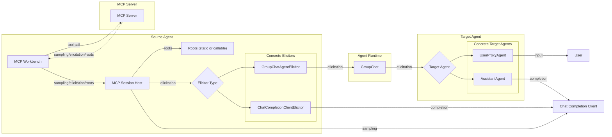
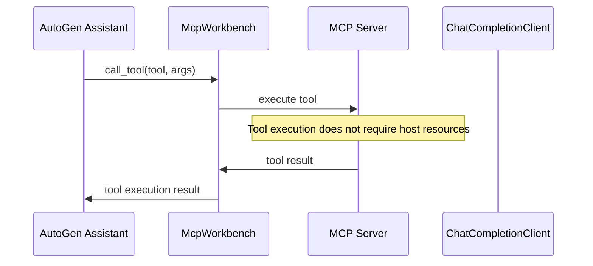
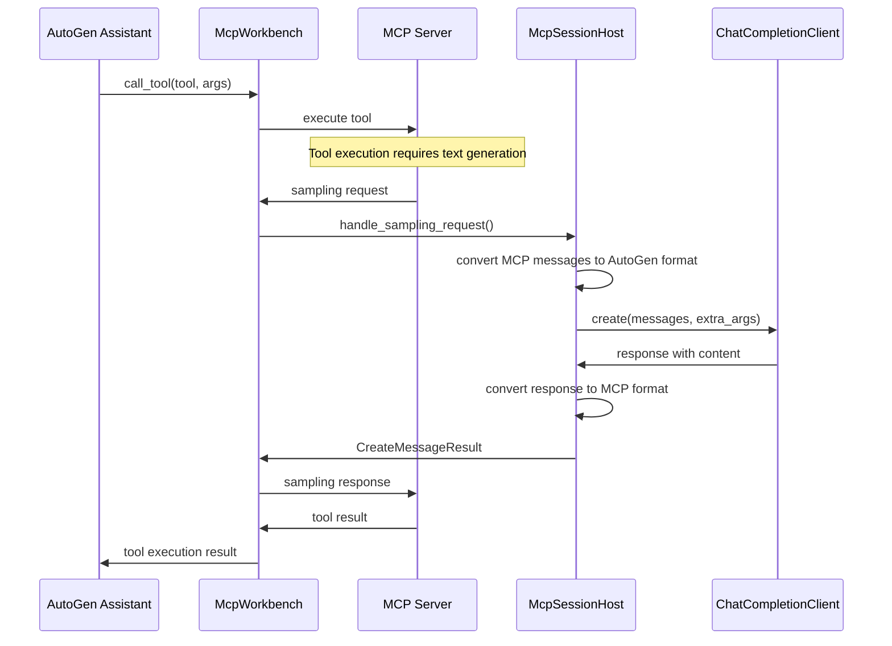
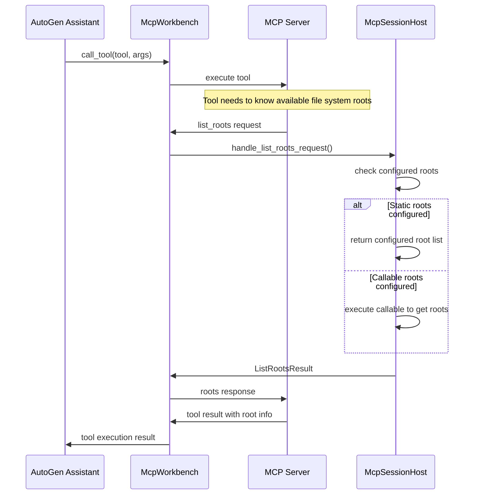

# MCP Session Host

The `McpSessionHost` supports MCP Server -> MCP Host requests within the AutoGen ecosystem. By design it should require minimal or no changes to your AutoGen agents, simply provide a host to the `McpWorkbench`.

The following MCP features are supported:

1. **Sampling**: Text generation using language models
2. **Elicitation**: Interactive user prompting and structured data collection
3. **Roots**: File system root listing for server access

## Architecture



## Sequence Diagrams

### Normal Tool Calling Flow




### Sampling Request Flow



### Elicitation Request Flow

```mermaid
sequenceDiagram
    sequenceDiagram
    participant Assistant as AutoGen Assistant
    participant Workbench as McpWorkbench
    participant Server as MCP Server
    participant Host as McpSessionHost
    participant Elicitor as GroupChatAgentElicitor
    participant Runtime as AgentRuntime
    participant TargetAgent as Target Agent
    participant ModelClient as ChatCompletionClient
    participant User

    Assistant->>Workbench: call_tool(tool, args)
    Workbench->>Server: execute tool
    Note over Server: Tool needs user input with structured response
    Server->>Workbench: ElicitRequest
    Workbench->>Host: handle_elicit_request()
    Host->>Elicitor: elicit(params)
    Elicitor->>Runtime: send_message(elicit_message, target_agent)
    Runtime->>TargetAgent: process message
    alt TargetAgent is UserProxy
        TargetAgent->>User: request user input
        User->>TargetAgent: user response
    else TargetAgent is LLM Agent
        TargetAgent->>ModelClient: request completion
        ModelClient->>TargetAgent: generated completion
    end
    TargetAgent->>Runtime: Response
    Runtime->>Elicitor: Response
    Elicitor->>ModelClient: Request completion to convert Target Agent response to JSON.
    ModelClient->>Elicitor: JSON formatted response
    Elicitor->>Host: elicit result
    Host->>Workbench: elicit result
    Workbench->>Server: elicit result
    Server->>Workbench: tool result
    Workbench->>Assistant: tool execution result
```

### List Roots Request Flow



## Components

### McpSessionHost

The main host-side component that handles server-to-host requests and coordinates with AutoGen components:

- **Model Client**: Handles sampling requests using any `ChatCompletionClient`
- **Elicitor**: Routes elicitation requests to a ChatComletionClient or to AutoGen agents for user interaction
- **Roots**: Provides file system access configuration

### Elicitors

Elicitors handle structured prompting requests from MCP servers on the host side:

#### GroupChatAgentElicitor
Routes elicitation requests to specific agents within a group chat, allowing for interactive user input collection through AutoGen agents.

#### ChatCompletionClientElicitor
Handles elicitation requests directly using a language model, suitable for automated structured responses.

## Usage

### Example

```diff
from autogen_agentchat.agents import AssistantAgent, UserProxyAgent
from autogen_agentchat.teams import RoundRobinGroupChat
from autogen_ext.models.openai import OpenAIChatCompletionClient
from autogen_ext.tools.mcp import McpWorkbench, StdioServerParams
+ from autogen_ext.tools.mcp.host import GroupChatAgentElicitor, McpSessionHost

# Setup model client
model_client = OpenAIChatCompletionClient(model="gpt-4o")

# Create agents
user_proxy = UserProxyAgent("user_proxy")

+ # Create elicitor targeting the user proxy
+ elicitor = GroupChatAgentElicitor("user_proxy", model_client=model_client)

+ # Create host with elicitation support
+ host = McpSessionHost(
+     model_client=model_client,  # For sampling requests
+     elicitor=elicitor,         # For elicitation requests,
+     roots=[
+         mcp_types.Root(uri="file:///workspace", name="Workspace"),
+         mcp_types.Root(uri="file:///docs", name="Documentation"),
+     ]
+ )

# Setup MCP workbench
mcp_workbench = McpWorkbench(
    server_params=StdioServerParams(
        command="python",
        args=["your_mcp_server.py"]
    ),
+     host=host,
)

# Create MCP-enabled assistant
assistant = AssistantAgent(
    "assistant",
    model_client=model_client,
    workbench=mcp_workbench,
)

# Create team and link elicitor
team = RoundRobinGroupChat([assistant, user_proxy])
+ # ⚠️ Critical: Must set_group_chat before team.run**  
+ elicitor.set_group_chat(team)

result = await team.run(task="...")
```
