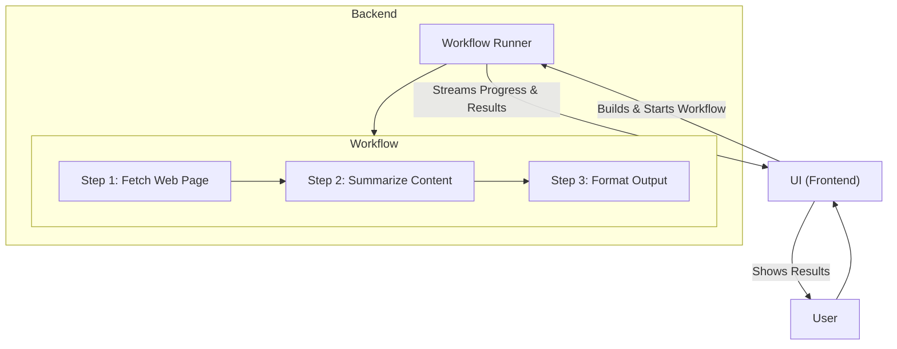
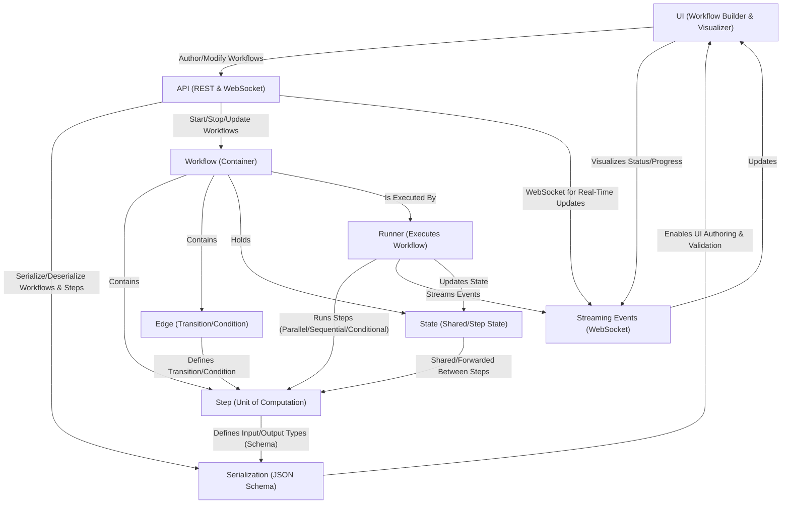

# Workflows in AutoGen Studio (Experimental)

## How it Works: Example Story

A user builds a workflow in the UI (e.g., "Summarize a web page"). The UI sends the workflow to the backend runner, which runs each step (fetch, summarize, format). Progress and results stream back to the UI for live visualization.

---

## Architecture Overview

## What is a Workflow?

A **Workflow** is a container for a set of **Steps** (units of computation) and **Edges** (transitions/conditions between steps). Workflows enable deterministic, composable chains of logic, supporting parallel, sequential, and conditional execution.

- **Steps**: Each step defines input/output types (with full schema), is fully serializable, and can be validated. Steps can transform data, call APIs, or run agents. ([code](./steps/_step.py))
- **Edges**: Define transitions between steps, with optional conditions (output, state, or expression-based). ([code](./core/_models.py))
- **Workflow Class**: Holds steps, edges, state, and metadata. Supports serialization for UI authoring. ([code](./core/_workflow.py))
- **Runner**: Executes workflows, supporting parallel, sequential, and conditional logic. Streams real-time events for UI updates. ([code](./core/_runner.py))

## UI & Serialization

- **Serialization**: All steps and workflows are defined with JSON schemas, enabling UI-based authoring, validation, and modification.
- **UI Integration**: The UI allows users to build, edit, and visualize workflows. Real-time status and progress are streamed via WebSocket events. ([API code](../web/routes/workflows.py))

## Agents as Steps (Anything as Steps)

- **Custom Steps**: Any agent or logic can be added as a step by implementing the [`BaseStep`](./steps/_step.py) interface. Steps must define input/output types as Pydantic models for validation and UI compatibility.
- **Examples**: See [`AgentStep`](./steps/_agent.py) for LLM agents, [`FunctionStep`](./steps/_step.py) for arbitrary functions, and [`HttpStep`](./steps/_http.py) for HTTP calls.
- **State Access**: Steps read/update workflow state via the provided `Context` object (`context.get()` / `context.set()`).
- **Requirement**: All steps must specify input/output schemas and implement the `execute(input_data, context)` method.

## Example Workflows

- [Simple Sequential](./examples/simple_sequential.py)
- [Parallel](./examples/simple_parallel.py)
- [Conditional](./examples/simple_conditional.py)
- [Fan-out/Fan-in](./examples/fan_out_fan_in.py)
- [Webpage Summarization](./examples/summarize_webpage.py)

---

For more details, see the [core implementation](./core/_workflow.py), [step definitions](./steps/_step.py), and [UI API integration](../web/routes/workflows.py).
