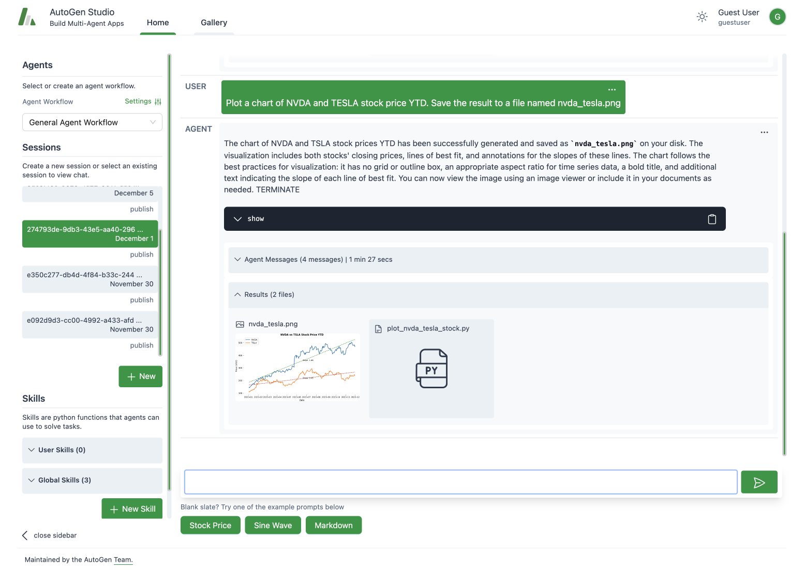

# AutoGen Studio

[](https://badge.fury.io/py/autogenstudio)
[](https://pepy.tech/project/autogenstudio)



AutoGen Studio is an AutoGen-powered AI app (user interface) to help you rapidly prototype AI agents, enhance them with skills, compose them into workflows and interact with them to accomplish tasks. It is built on top of the [AutoGen](https://microsoft.github.io/autogen) framework, which is a toolkit for building AI agents.

Code for AutoGen Studio is on GitHub at [microsoft/autogen](https://github.com/microsoft/autogen/tree/main/samples/apps/autogen-studio)

> **Note**: AutoGen Studio is meant to help you rapidly prototype multi-agent workflows and demonstrate an example of end user interfaces built with AutoGen. It is not meant to be a production-ready app.

> [!WARNING]
> AutoGen Studio is currently under active development and we are iterating quickly. Kindly consider that we may introduce breaking changes in the releases during the upcoming weeks, and also the `README` might be outdated. We'll update the `README` as soon as we stabilize the API.

### Capabilities / Roadmap

Some of the capabilities supported by the app frontend include the following:

- [x] Build / Configure agents (currently supports two agent workflows based on `UserProxyAgent` and `AssistantAgent`), modify their configuration (e.g. skills, temperature, model, agent system message, model etc) and compose them into workflows.
- [x] Chat with agent works and specify tasks.
- [x] View agent messages and output files in the UI from agent runs.
- [x] Add interaction sessions to a gallery.
- [ ] Support for more complex agent workflows (e.g. `GroupChat` workflows).
- [ ] Improved user experience (e.g., streaming intermediate model output, better summarization of agent responses, etc).

Project Structure:

- _autogenstudio/_ code for the backend classes and web api (FastAPI)
- _frontend/_ code for the webui, built with Gatsby and TailwindCSS

### Installation

There are two ways to install AutoGen Studio - from PyPi or from source. We **recommend installing from PyPi** unless you plan to modify the source code.

There are two ways to install AutoGen Studio - from PyPi or from source. We **recommend installing from PyPi** unless you plan to modify the source code.

1.  **Install from PyPi**

    We recommend using a virtual environment (e.g., conda) to avoid conflicts with existing Python packages. With Python 3.10 or newer active in your virtual environment, use pip to install AutoGen Studio:

    ```bash
    pip install autogenstudio
    ```

2.  **Install from Source**

    > Note: This approach requires some familiarity with building interfaces in React.

    If you prefer to install from source, ensure you have Python 3.10+ and Node.js (version above 14.15.0) installed. Here's how you get started:

    - Clone the AutoGen Studio repository and install its Python dependencies:

      ```bash
      pip install -e .
      ```

    - Navigate to the `samples/apps/autogen-studio/frontend` directory, install dependencies, and build the UI:

      ```bash
      npm install -g gatsby-cli
      npm install --global yarn
      cd frontend
      yarn install
      yarn build
      ```

For Windows users, to build the frontend, you may need alternative commands to build the frontend.

```bash

  gatsby clean && rmdir /s /q ..\\autogenstudio\\web\\ui 2>nul & (set \"PREFIX_PATH_VALUE=\" || ver>nul) && gatsby build --prefix-paths && xcopy /E /I /Y public ..\\autogenstudio\\web\\ui

```

### Running the Application

Once installed, run the web UI by entering the following in your terminal:

```bash
autogenstudio ui --port 8081
```

This will start the application on the specified port. Open your web browser and go to `http://localhost:8081/` to begin using AutoGen Studio.
AutoGen Studio also takes a `--host <host>` argument to specify the host address. By default, it is set to `localhost`. You can also use the `--appdir <appdir>` argument to specify the directory where the app files (e.g., database and generated user files) are stored. By default, it is set to the directory where autogen pip package is installed.

Now that you have AutoGen Studio installed and running, you are ready to explore its capabilities, including defining and modifying agent workflows, interacting with agents and sessions, and expanding agent skills.

## Capabilities

AutoGen Studio proposes some high-level concepts.

**Agent Workflow**: An agent workflow is a specification of a set of agents that can work together to accomplish a task. The simplest version of this is a setup with two agents – a user proxy agent (that represents a user i.e. it compiles code and prints result) and an assistant that can address task requests (e.g., generating plans, writing code, evaluating responses, proposing error recovery steps, etc.). A more complex flow could be a group chat where even more agents work towards a solution.

**Session**: A session refers to a period of continuous interaction or engagement with an agent workflow, typically characterized by a sequence of activities or operations aimed at achieving specific objectives. It includes the agent workflow configuration, the interactions between the user and the agents. A session can be “published” to a “gallery”.

**Skills**: Skills are functions (e.g., Python functions) that describe how to solve a task. In general, a good skill has a descriptive name (e.g. `generate_images`), extensive docstrings and good defaults (e.g., writing out files to disk for persistence and reuse). You can add new skills AutoGen Studio app via the provided UI. At inference time, these skills are made available to the assistant agent as they address your tasks.

AutoGen Studio comes with 3 example skills: `fetch_profile`, `find_papers`, `generate_images`. The default skills, agents and workflows are based on the [dbdefaults.json](autogentstudio/utils/dbdefaults.json) file which is used to initialize the database.

## Example Usage

Consider the following query.

```
Plot a chart of NVDA and TESLA stock price YTD. Save the result to a file named nvda_tesla.png
```

The agent workflow responds by _writing and executing code_ to create a python program to generate the chart with the stock prices.

> Note than there could be multiple turns between the `AssistantAgent` and the `UserProxyAgent` to produce and execute the code in order to complete the task.


> Note: You can also view the debug console that generates useful information to see how the agents are interacting in the background.

<!--  -->

## Contribution Guide

We welcome contributions to AutoGen Studio. We recommend the following general steps to contribute to the project:

- Review the overall AutoGen project [contribution guide](https://github.com/microsoft/autogen?tab=readme-ov-file#contributing)
- Please review the AutoGen Studio [roadmap](https://github.com/microsoft/autogen/issues/737) to get a sense of the current priorities for the project. Help is appreciated especially with Studio issues tagged with `help-wanted`
- Please initiate a discussion on the roadmap issue or a new issue to discuss your proposed contribution.
- Please review the autogenstudio dev branch here [dev branch](https://github.com/microsoft/autogen/tree/autogenstudio) and use as a base for your contribution. This way, your contribution will be aligned with the latest changes in the AutoGen Studio project.
- Submit a pull request with your contribution!
- If you are modifying AutoGen Studio, it has its own devcontainer. See instructions in `.devcontainer/README.md` to use it
- Please use the tag `studio` for any issues, questions, and PRs related to Studio

## FAQ

**Q: How do I specify the directory where files(e.g. database) are stored?**

A: You can specify the directory where files are stored by setting the `--appdir` argument when running the application. For example, `autogenstudio ui --appdir /path/to/folder`. This will store the database and other files in the specified directory e.g. `/path/to/folder/database.sqlite`.

**Q: Where can I adjust the default skills, agent and workflow configurations?**
A: You can modify agent configurations directly from the UI or by editing the [dbdefaults.json](autogenstudio/utils/dbdefaults.json) file which is used to initialize the database.

**Q: If I want to reset the entire conversation with an agent, how do I go about it?**
A: To reset your conversation history, you can delete the `database.sqlite` file in the `--appdir` directory. This will reset the entire conversation history. To delete user files, you can delete the `files` directory in the `--appdir` directory.

**Q: Is it possible to view the output and messages generated by the agents during interactions?**
A: Yes, you can view the generated messages in the debug console of the web UI, providing insights into the agent interactions. Alternatively, you can inspect the `database.sqlite` file for a comprehensive record of messages.

**Q: Can I use other models with AutoGen Studio?**
Yes. AutoGen standardizes on the openai model api format, and you can use any api server that offers an openai compliant endpoint. In the AutoGen Studio UI, each agent has an `llm_config` field where you can input your model endpoint details including `model`, `api key`, `base url`, `model type` and `api version`. For Azure OpenAI models, you can find these details in the Azure portal. Note that for Azure OpenAI, the `model name` is the deployment id or engine, and the `model type` is "azure".
For other OSS models, we recommend using a server such as vllm to instantiate an openai compliant endpoint.

**Q: The server starts but I can't access the UI**
A: If you are running the server on a remote machine (or a local machine that fails to resolve localhost correstly), you may need to specify the host address. By default, the host address is set to `localhost`. You can specify the host address using the `--host <host>` argument. For example, to start the server on port 8081 and local address such that it is accessible from other machines on the network, you can run the following command:

```bash
autogenstudio ui --port 8081 --host 0.0.0.0
```

## Acknowledgements

AutoGen Studio is Based on the [AutoGen](https://microsoft.github.io/autogen) project. It was adapted from a research prototype built in October 2023 (original credits: Gagan Bansal, Adam Fourney, Victor Dibia, Piali Choudhury, Saleema Amershi, Ahmed Awadallah, Chi Wang).
