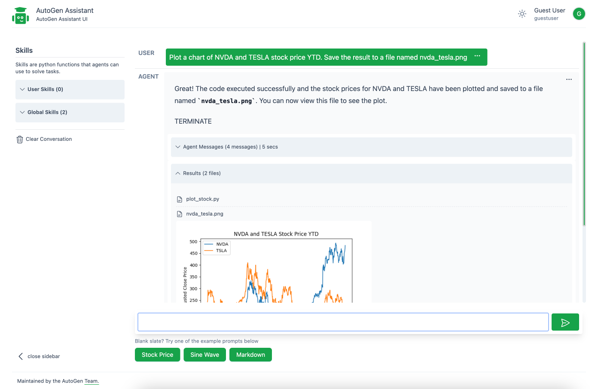
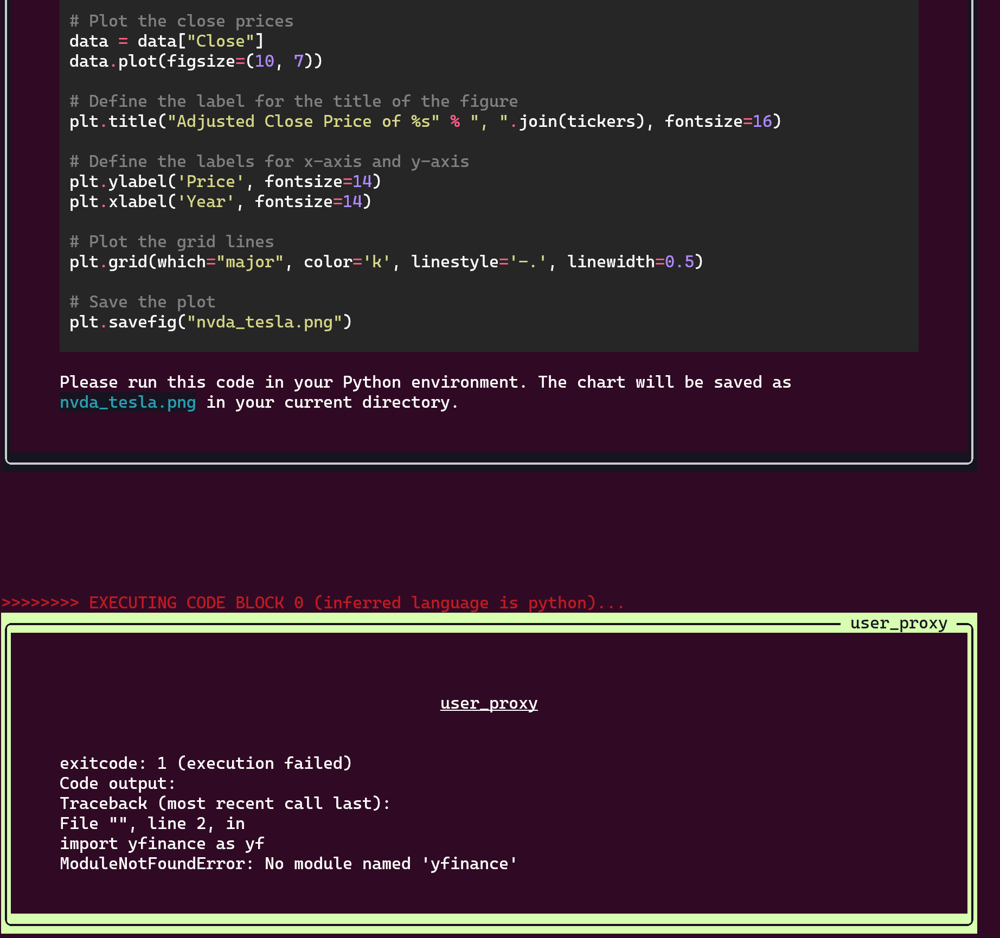

# AutoGen Research Assistant

AutoGen Research Assistant is an Autogen-powered AI research assistant that can converse with you to help you conduct research, write and execute code, run saved skills, learn new skills by demonstration, and adapt in response to your interactions.

Project Structure:

- _autogenra/_ code for the backend classes and web api (FastAPI)
- _frontend/_ code for the webui, built with Gatsby and Tailwind

## Getting Started

Install requirements:

```bash
pip install -e .
```

AutoGen requires access to an LLM. Please see the [AutoGen docs](https://microsoft.github.io/autogen/docs/FAQ#set-your-api-endpoints) on how to configure access to your LLM. We recommend setting up your `OPENAI_API_KEY` environment variable first and `OAI_CONFIG_LIST` environment variable to contain a list of OpenAI model configurations.

```bash
export OPENAI_API_KEY=<your_api_key>
```

### Build and Run Frontend UI

Note that your Gatsby requires node > 14.15.0 . You may need to [upgrade your node](https://stackoverflow.com/questions/10075990/upgrading-node-js-to-latest-version) version as needed.

```bash
npm install --global yarn
cd frontend
yarn install
yarn build
```

The command above will build the frontend ui and copy the build artifacts to the `autogenra` web ui folder. Note that you may have to run `npm install  --force --legacy-peer-deps` to force resolve some peer dependencies.

Run the web ui:

```bash
autogenra ui --port 8081
```

Navigate to <http://localhost:8081/> to view the web ui.

To update the web ui, navigate to the frontend directory, make changes and rebuild the ui.

## Capabilities

This demo focuses on the research assistant use case with some generalizations:

- **Skills**: The agent is provided with a list of skills that it can leverage while attempting to address a user's query. Each skill is a python function that may be in any file in a folder made availabe to the agents. We separate the concept of global skills available to all agents `backend/files/global_utlis_dir` and user level skills `backend/files/user/<user_hash>/utils_dir`, relevant in a multi user environment. Agents are aware skills as they are appended to the system message. A list of example skills is available in the `backend/global_utlis_dir` folder. Modify the file or create a new file with a function in the same directory to create new global skills.

- **Conversation Persistence**: Conversation history is persisted in an sqlite database `database.sqlite`.

- **Two Agent Workflow**: The default sample supports a two agent workflow where a user proxy agent and an assistant agent communicate to address user requests.

## Example Usage

Let us use a simple query demonstrating the capabilities of the research assistant.

```
Plot a chart of NVDA and TESLA stock price YTD. Save the result to a file named nvda_tesla.png
```

The agents responds by _writing and executing code_ to create a python program to generate the chart with the stock prices.

> Note than there could be multiple turns between the `AssistantAgent` and the `UserProxyAgent` to produce and execute the code in order to complete the task.



> Note: You can also view the debug console that generates useful information to see how the agents are interacting in the background.

<!--  -->

## FAQ

- How do I add more skills to the research assistant? This can be done by adding a new file with documented functions to `autogenra/web/skills/global` directory.
- How do I reset the conversation? You can reset the conversation by deleting the `database.sqlite` file. You can also delete user files by deleting the `autogenra/web/files/user/<user_id_md5hash>` folder.
- How do I view messages generated by agents? You can view the messages generated by the agents in the debug console. You can also view the messages in the `database.sqlite` file.

## Acknowledgements

Based on the [AutoGen](https://microsoft.github.io/autogen) project.
Adapted in October 2023 from a research prototype (original credits: Gagan Bansal, Adam Fourney, Victor Dibia, Piali Choudhury, Saleema Amershi, Ahmed Awadallah, Chi Wang)
