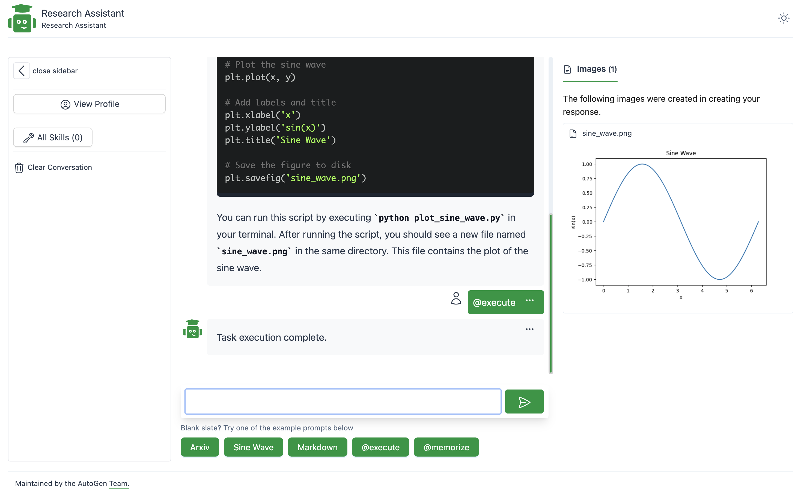
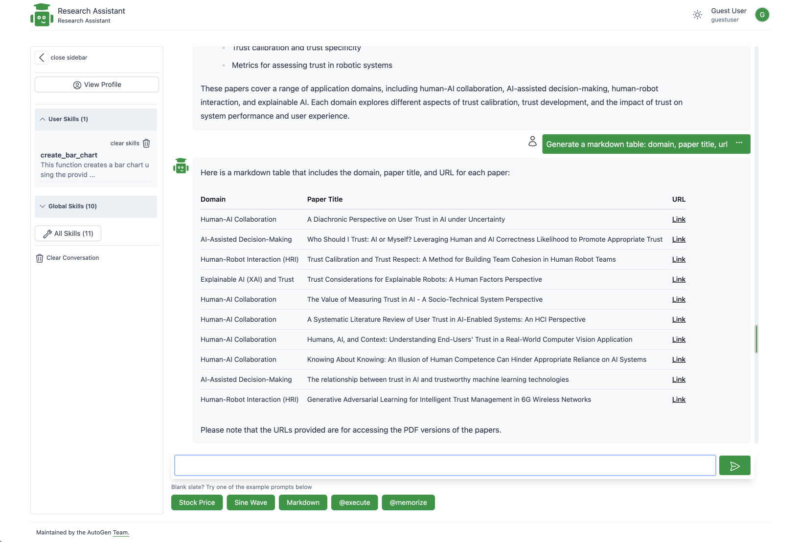

# ARA - AutoGen Research Assistant


ARA is an Autogen-powered AI research assistant that can converse with you to help you conduct research, write and execute code, run saved skills, learn new skills by demonstration, and adapt in response to your interactions.

Project Structure:

- _backend/_ code for the web api, served by FastAPI.
- _frontend/_ code for the webui, built with Gatsby and Tailwind

## Getting Started

Install requirements:

```bash
cd backend
pip install -r requirements.txt
```

AutoGen requires access to an LLM. Please see the [AutoGen docs](https://microsoft.github.io/autogen/docs/FAQ#set-your-api-endpoints) on how to configure access to your LLM. We recommend setting the `OAI_CONFIG_LIST` environment variable to point to your LLM config file.

Also, if you plan to use bing search, set the `BING_API_KEY`

```bash
export OAI_CONFIG_LIST=/path/to/OAI_CONFIG_LIST
export BING_API_KEY=<your bing api key>
```

Run the web ui:

```bash
cd backend
uvicorn main:app --reload --port 8000
```

Navigate to http://localhost:8000/ to view the web ui.

To update the web ui, navigate to the frontend directory, make changes and rebuild the ui.

## Capabilities

This demo focuses on the research assistant use case with some generalizations

- **Skills**: The agent is provided with a list of skills that it can leverage while attempting to address a user's query. Each skill is a python function that may be in any file in a folder made availabe to the agents. We separate the concept of global skills available to all agents `backend/files/global_utlis_dir` and user level skills `backend/files/user/<user_hash>/utils_dir`, relevant in a multi user environment. Agents are aware skills as they are appended to the system message. A list of example skills is available in the `backend/global_utlis_dir` folder. Modify the file or create a new file with a function in the same directory to create new global skills.

- **User Keywords**: The research assistant also accepts explicit keywords that trigger specific behaviors.
  - `@execute` : This app is designed such that code execution is an explicit request from the end user. For example, the agents are setup to not execute generated code by default. Rather, the user can respond with `@execute` to execute the most recent code block or make modifications.
  - `@memorize`: The app also supports an `@memorize` key word that runs a workflow where a new python skill is synthesized based on the recent conversation history. This is intended as an example of teachability where an agent can learn reusable skills.

## Example Usage

A set of example queries are shown below, with the intent of demonstrating the capabilities of the research assistant.

> Note that this specific workflow will require a model with large context length (gpt-4-32k recommended) as abstracts from multiple papers are retrieved and inserted into the conversation history.

```
Find arxiv papers that show how are people studying trust calibration in AI based systems
```

The agents respond by _writing code_ to conduct a literature search and utilizes an existing skill `find_relevant_papers` in the global skills dir `backend/files/global_utlis_dir/lit_review_mod.py`.

```python
# python code
from lit_reviewer_mod import find_relevant_papers

research_question = "How are people studying trust calibration in AI based systems?"
papers = find_relevant_papers(research_question, max_papers=10)

for i, paper in enumerate(papers):
    print(f"\nPaper {i+1}:")
    print(f"Title: {paper['title']}")
    print(f"Authors: {', '.join(paper['authors'])}")
    print(f"Published: {paper['published']}")
    print(f"Summary: {paper['summary']}")
    print(f"PDF URL: {paper['pdf_url']}")
```

In response, the user can type `@execute` which causes the code to be executed and the response returned.

Next, the user can request modifications to the code:

```
analyze the above abstracts, list 4 high level application domains studied by these papers. Add subdomains as necessary
```

The user can then ask for formatting updates:

```
Generate a markdown table: domain, paper title, url
```



```
Use this data to generate a bar chart of domains and number of papers in that domain. Save it to a file named barchart.png.
```

This generates code for the chart:

```python
import matplotlib.pyplot as plt

# Data
domains = ['Human-AI Collaboration', 'AI-Assisted Decision-Making', 'Human-Robot Interaction (HRI)', 'Explainable AI (XAI)']
num_papers = [4, 4, 1, 1]

# Create bar chart
plt.bar(domains, num_papers)
plt.xlabel('Domain')
plt.ylabel('Number of Papers')
plt.title('Number of Papers in Each Domain')

# Save the chart as an image file
plt.savefig('barchart.png')
```

The user can then execute the suggested code by typing `@execute`.


Following this, the user can also type `@memorize` which triggers a workflow that synthesizes a new skill function that captures the recent history of interactions. This new skill is saved in a file `backend/files/user/<user_hash>/utils_dir`.

## Acknowledgements

Based on the [AutoGen](https://microsoft.github.io/autogen) project.
Adapted in October 2023 from a research prototype (original credits: Gagan Bansal, Adam Fourney, Victor Dibia, Piali Choudhury, Saleema Amershi, Ahmed Awadallah, Chi Wang)
