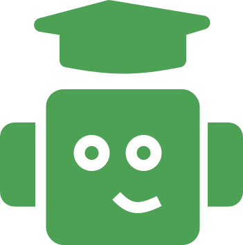
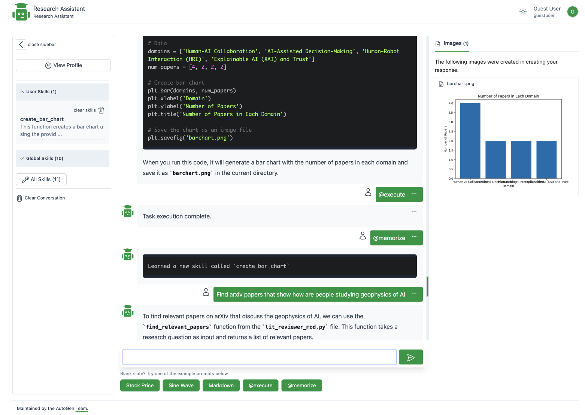

![ARA]

**TL;DR:**

* We introduce **ARA - AutoGen Research Assistant**, a React based web application so that users can start creating novel experiences with AutoGen agents. Think of ARA as a starter application to help you think about how to develop rich web experiences with the AutoGen framework.

* We showcase examples of `Skill Creation` to demonstrate basic teachability and later recalling the skills in subsequent chats to perform tasks.

* We showcase an example of `Personalization` to demonstrate basic adaption and using that to learn user perferences.

## Introduction

ARA is a conversational research assistant based on agents built using the Autogen framework. It is a basic chat based application designed to help maximize research tasks and help with problem-solving capabilities. The goal of ARA is to demonstarte how to build a web application with GATSBY, TailWind.

Here are a few tasks exploration ideas of what ARA can do for you:

1. **Conversational Partner:** ARA is a conversational assistant, capable of engaging in natural language dialogues with you. Whether you want to brainstorm ideas, discuss complex concepts, or simply have a friendly chat, ARA is there to listen and respond, it is powered by a workflow defined by the AutoGen agents.

2. **Research Facilitator:** ARA serves as a dedicated research assistant, assisting you in gathering and organizing information. It can search the web, sifting through data, and present you with concise summaries or sources, enabling you to make well-informed decisions and bolster your knowledge.

3. **Content Creation:** ARA can help with you with the creation of research artifcats like graphs and tables.

4. **Coding Companion:** ARA is powered by a agents than can produce and execute code.

5. **Skill Learning:** ARA can help you come up with user defined skills. You can explore creation of new new skills with the application and also use the system defined skills like literature review.

6. **Personalization:** ARA provides a simple implementation of personalization. Using the interface you can add a bio and the agents use this information to generate and adapt content based on your interest and previous conversations.

## Run It Yourself

ARA can be run as a standalone web application. All the conversation and data stays on your local machine.

Please use the [README.md](https://github.com/microsoft/autogen/blob/main/samples/apps/README.md) to get a jump start on the application.

## Capabilities

This demo focuses on the research assistant use case with some generalizations

* **Skills**: The agent is provided with a list of skills that it can leverage while attempting to address a user's query. Each skill is a python function that may be in any file in a folder made availabe to the agents. We separate the concept of global skills available to all agents `backend/files/global_utlis_dir` and user level skills `backend/files/user/<user_hash>/utils_dir`, relevant in a multi user environment. Agents are aware skills as they are appended to the system message. A list of example skills is available in the `backend/global_utlis_dir` folder. Modify the file or create a new file with a function in the same directory to create new global skills.

* **User Keywords**: The research assistant also accepts explicit keywords that trigger specific behaviors.
  * `@execute` : This app is designed such that code execution is an explicit request from the end user. For example, the agents are setup to not execute generated code by default. Rather, the user can respond with `@execute` to execute the most recent code block or make modifications.
  * `@memorize`: The app also supports an `@memorize` key word that runs a workflow where a new python skill is synthesized based on the recent conversation history. This is intended as an example of teachability where an agent can learn reusable skills.

## Example Usage

A set of example queries are shown below, with the intent of demonstrating the capabilities of the research assistant.

> Note that this specific workflow will require a model with large context length (gpt-4-32k recommended) as abstracts from multiple papers are retrieved and inserted into the conversation history.

```
Find arxiv papers that show how are people studying trust calibration in AI based systems
```

The agents respond by _writing code_ to conduct a literature search and utilizes an existing skill `find_relevant_papers` in the global skills dir `backend/files/global_utlis_dir/lit_review_mod.py`.

```python
# python code
from lit_reviewer_mod import find_relevant_papers

research_question = "How are people studying trust calibration in AI based systems?"
papers = find_relevant_papers(research_question, max_papers=10)

for i, paper in enumerate(papers):
    print(f"\nPaper {i+1}:")
    print(f"Title: {paper['title']}")
    print(f"Authors: {', '.join(paper['authors'])}")
    print(f"Published: {paper['published']}")
    print(f"Summary: {paper['summary']}")
    print(f"PDF URL: {paper['pdf_url']}")
```

In response, the user can type `@execute` which causes the code to be executed and the response returned.

Next, the user can request modifications to the code:

```
analyze the above abstracts, list 4 high level application domains studied by these papers. Add subdomains as necessary
```

The user can then ask for formatting updates:

```
Generate a markdown table: domain, paper title, url
```


```
Use this data to generate a bar chart of domains and number of papers in that domain. Save it to a file named barchart.png.
```

This generates code for the chart:

```python
import matplotlib.pyplot as plt

# Data
domains = ['Human-AI Collaboration', 'AI-Assisted Decision-Making', 'Human-Robot Interaction (HRI)', 'Explainable AI (XAI)']
num_papers = [4, 4, 1, 1]

# Create bar chart
plt.bar(domains, num_papers)
plt.xlabel('Domain')
plt.ylabel('Number of Papers')
plt.title('Number of Papers in Each Domain')

# Save the chart as an image file
plt.savefig('barchart.png')
```

The user can then execute the suggested code by typing `@execute`.



Following this, the user can also type `@memorize` which triggers a workflow that synthesizes a new skill function that captures the recent history of interactions. This new skill is saved in a file `backend/files/user/<user_hash>/utils_dir`.

## Planned improvements

## Conclusion

`ARA` is still under active research and development. For any problems you find or improvements you have in mind, please join our discussions in this repo and on our [Discord channel](https://discord.gg/pAbnFJrkgZ). We look forward to seeing how you and the rest of the community can use different agents and create new web based experiences with AutoGen!
