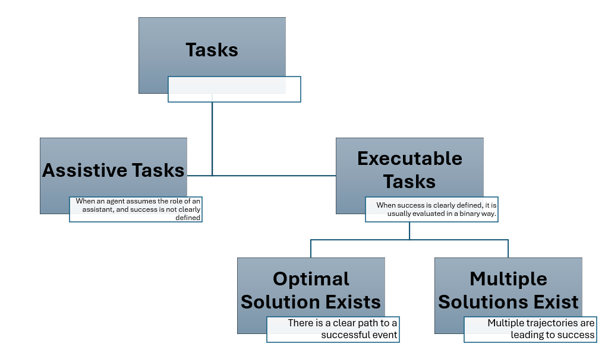

---
title:  AgentEval: Assessing Task Utility for LLM-powered Applications
authors: julianakiseleva, Narabzad
tags: [LLM, GPT, evaluation, task utility]
---


**TL;DR:**
* We introduce `AgentEval` — the first version of the framework to automatically assess task utility for an arbitrary application. It suggests criteria to explain task utility and then quantifies these criteria for logs of your system.
* We demonstrate the usage of our framework with the [Math Problems dataset](https://microsoft.github.io/autogen/blog/2023/06/28/MathChat)

## Run it yourself

Use the Jupyter notebook for a demonstration of `AgentEval` for [Math Problems dataset](https://microsoft.github.io/autogen/blog/2023/06/28/MathChat) -- [agenteval_cq_math.ipynb](https://github.com/microsoft/autogen/blob/main/notebook/agenteval_cq_math.ipynb)


## Introduction

The goal of AutoGen is to make it straightforward and easy to develop LLM-based multi-agent systems for an arbitrary application that helps the end users with their tasks. The next big step forward is what we all want to know: how the developed systems are performing, if they bring utility to our users, and, even more importantly, how we can improve them. Directly evaluating the multi-agent systems is tricky since current approaches mainly rely on success metrics, basically if the agent can accomplish the tasks. Moreover, the definition of success for a particular task is not always given. Introductions of LLMs bring us a lot of abilities that we are eager to convert into actual utilities for end users. In this blog post, we introduce `AgentEval` — the first version of the framework for assessing task utility in LLM-based applications.



Let's first look into an overview of the suggested task taxonomy that a multi-agent system can be designed for. In general, the tasks can be split into two types, namely:
* _Assistive Tasks_ - refer to instances when users utilize a system in an assistive manner, seeking suggestions rather than expecting the system to solve the task. For example, a user might request the system to generate an email. In many cases, this generated content serves as a template that the user will later edit. However, defining success precisely for such tasks is relatively complex.
* _Executable Tasks_ -refer to instances where we can clearly define whether a system solved the task or not. Consider agents that assist in accomplishing household tasks, where the definition of success is clear and measurable. This category can be further divided into two separate subcategories:
   * _The optimal solution exits_ -  there are tasks where only one solution is possible. For example, if you ask your assistant to turn on the light, the success of this task is clearly defined, and there is only one way to accomplish it.
   * _Multiple solutions exist_ - "Increasingly, we observe situations where multiple trajectories of agent behavior can lead to either success or failure. In such cases, it is crucial to differentiate between the various successful and unsuccessful trajectories. For example, when you ask the agent to suggest you a food recipe or tell you a joke.

In our AgentEval framework, we are currently focusing on  _Executable Tasks_.    

## AgentEval Framework

Our previous research on [assistive agents in Minecraft](https://github.com/microsoft/iglu-datasets) suggested that the most optimal way to obtain human judgments is to present humans with two agents side by side and ask for preferences. Interestingly, according to our earlier work, humans can develop criteria to explain why they prefer one agent over another. For example, 'the first agent was faster in execution,' or 'the second agent moves more naturally.' With this idea in mind, we designed AgentEval (shown in Fig. 1), where we employ LLMs to help us understand, verify, and assess the task *utility* for the multi-agent system. Namely:

* The goal of `CriticAgent` is to suggest the list of criteria $(c_1,\dots, c_n)$, that can be used to assess task utility. This is an example of how `CriticAgent` is defined using `Autogen`:


```python
critic = autogen.AssistantAgent(
    name="critic",
    llm_config={"config_list": config_list},
    system_message="""You are a helpful assistant. You suggest criteria for evaluating different tasks. They should be distinguishable, quantifiable, and not redundant.
    Convert the evaluation criteria into a dictionary where the keys are the criteria.
    The value of each key is a dictionary as follows {"description": criteria description, "accepted_values": possible accepted inputs for this key}
    Make sure the keys are criteria for assessing the given task. "accepted_values" include the acceptable inputs for each key that are fine-grained and preferably multi-graded levels. "description" includes the criterion description.
    Return only the dictionary."""
)
```

* The goal of `QuantifierAgent` is to quantify each of the suggested criteria in the following way: $(c_1=a_1, \dots, c_n=a_n)$, providing us with an idea of the utility of this system for the given task -- $U(t_i)$. Here is an example of how it can be defined:

```python
quantifier = autogen.AssistantAgent(
    name="quantifier",
    llm_config={"config_list": config_list},
    system_message = """You are a helpful assistant. You quantify the output of different tasks based on the given criteria.
    The criterion is given in a dictionary format where each key is a distinct criteria.
    The value of each key is a dictionary as follows {"description": criteria description , "accepted_values": possible accepted inputs for this key}
    You are going to quantify each of the criteria for a given task based on the task description.
    Return a dictionary where the keys are the criteria and the values are the assessed performance based on accepted values for each criteria.
    Return only the dictionary."""

)
```

## `AgentEval` Results based on math problems dataset

 As an example, after running CriticAgent, we obtained the following criteria to verify the results for math problem dataset:

| Criteria      | Description | Accepted Values|
|-----------|-----|----------------|
| Problem Interpretation      | Ability to correctly interpret the problem  | ["completely off", "slightly relevant", "relevant", "mostly accurate", "completely accurate"]|
| Mathematical Methodology      | Adequacy of the chosen mathematical or algorithmic methodology for the question  | ["inappropriate", "barely adequate", "adequate", "mostly effective", "completely effective"] |
| Calculation Correctness       | Accuracy of calculations made and solutions given  |   ["completely incorrect", "mostly incorrect", "neither", "mostly correct", "completely correct"]     |
| Explanation Clarity       | Clarity and comprehensibility of explanations, including language use and structure  | ["not at all clear", "slightly clear", "moderately clear", "very clear", "completely clear"] |
| Code Efficiency       |  Quality of code in terms of efficiency and elegance |["not at all efficient", "slightly efficient", "moderately efficient", "very efficient", "extremely efficient"] |
| Code Correctness      | Correctness of the provided code  |  ["completely incorrect", "mostly incorrect", "partly correct", "mostly correct", "completely correct"]
  |

Then, after running QuantifierAgent, we obtained the results presented in Fig. 3, where you can see three models: 
* AgentChat 
* ReAct 
* GPT-4 Vanilla Solver

Lighter colors represent estimates for failed cases, and brighter colors show how discovered criteria were quantified.


We note that while applying agentEval to math problems, the agent was not exposed to any ground truth information about the problem. As such, this figure illustrates an estimated performance of the three different agents, namely, Sutogen (blue), Gpt-4 (red), and ReAct (green). We observe that by comparing the performance of any of the three agents in successful cases (dark bars of any color) versus unsuccessful cases (lighter version of the same bar), we note that AgentEval was able to more accurately estimate the performance of successful cases than that of failed ones. This observation verifies AgentEval's ability for task utility prediction. Additionally, AgentEval allows us to go beyond just a binary definition of success, enabling a more in-depth comparison between successful and failed cases.

It's important not only to identify what is not working but also to recognize what and why actually went well.For example, Explanation Clarity turned out to be correlated with the length of the solution and  all models master _Task Understanding_ criteria.

## Limitations and future work
The current implementation of `AgentEval` has a number of limitations which are planning to overcome in the future:
* The list of criteria varies per run (unless you store a seed). We would recommend to run `CriticAgent` at least two times, and pick criteria you think is important for your domain. 
* The results of the `QuantifierAgent` can vary with each run, so we recommend conducting multiple runs to observe the extent of result variations.

To mitigate the limitations mentioned above, we are working on VerifierAgent, whose goal is to stabilize the results and provide additional explanations.

## Summary
`CriticAgent` and `QuantifierAgent` can be applied to the logs of any type of application, giving you an in-depth understanding of the utility your model brings to the user.


## Previous Research

```
@InProceedings{pmlr-v176-kiseleva22a,
  title = "Interactive Grounded Language Understanding in a Collaborative Environment: IGLU 2021",
  author = "Kiseleva, Julia and Li, Ziming and Aliannejadi, Mohammad and Mohanty, Shrestha and ter Hoeve, Maartje and Burtsev, Mikhail and Skrynnik, Alexey and Zholus, Artem and Panov, Aleksandr and Srinet, Kavya and Szlam, Arthur and Sun, Yuxuan and Hofmann, Katja and C{\^o}t{\'e}, Marc-Alexandre and Awadallah, Ahmed and Abdrazakov, Linar and Churin, Igor and Manggala, Putra and Naszadi, Kata and van der Meer, Michiel and Kim, Taewoon",
  booktitle = "Proceedings of the NeurIPS 2021 Competitions and Demonstrations Track",
  pages = "146--161",
  year = 2022,
  editor = "Kiela, Douwe and Ciccone, Marco and Caputo, Barbara",
  volume = 176,
  series = "Proceedings of Machine Learning Research",
  month = "06--14 Dec",
  publisher = "PMLR",
  pdf = 	 {https://proceedings.mlr.press/v176/kiseleva22a/kiseleva22a.pdf},
  url = 	 {https://proceedings.mlr.press/v176/kiseleva22a.html}.
}
```


```
@InProceedings{pmlr-v220-kiseleva22a,
  title = "Interactive Grounded Language Understanding in a Collaborative Environment: Retrospective on Iglu 2022 Competition",
  author = "Kiseleva, Julia and Skrynnik, Alexey and Zholus, Artem and Mohanty, Shrestha and Arabzadeh, Negar and C\^{o}t\'e, Marc-Alexandre and Aliannejadi, Mohammad and Teruel, Milagro and Li, Ziming and Burtsev, Mikhail and ter Hoeve, Maartje and Volovikova, Zoya and Panov, Aleksandr and Sun, Yuxuan and Srinet, Kavya and Szlam, Arthur and Awadallah, Ahmed and Rho, Seungeun and Kwon, Taehwan and Wontae Nam, Daniel and Bivort Haiek, Felipe and Zhang, Edwin and Abdrazakov, Linar and Qingyam, Guo and Zhang, Jason and Guo, Zhibin",
  booktitle = "Proceedings of the NeurIPS 2022 Competitions Track",
  pages = "204--216",
  year = 2022,
  editor = "Ciccone, Marco and Stolovitzky, Gustavo and Albrecht, Jacob",
  volume = 220,
  series = "Proceedings of Machine Learning Research",
  month = "28 Nov--09 Dec",
  publisher = "PMLR",
  pdf = "https://proceedings.mlr.press/v220/kiseleva22a/kiseleva22a.pdf",
  url = "https://proceedings.mlr.press/v220/kiseleva22a.html".
}
```
