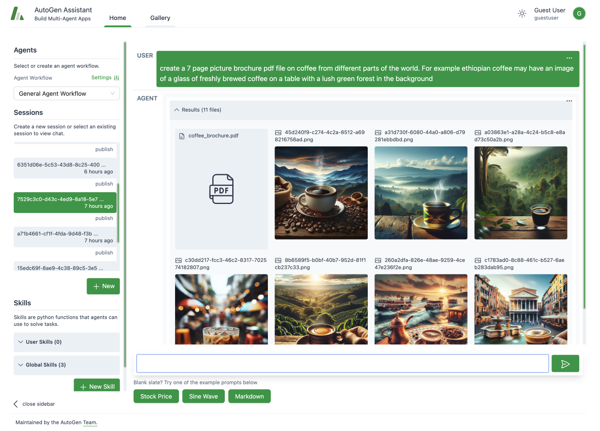
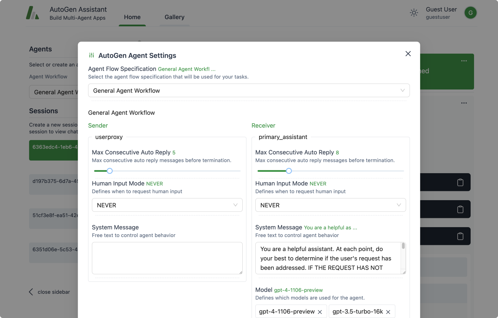
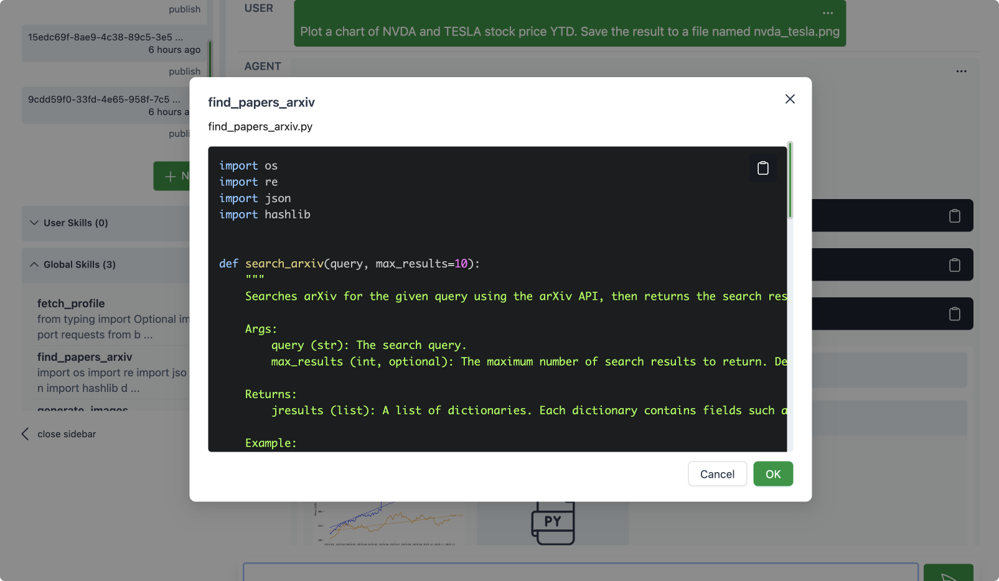

<p align="center"><em>AutoGen Assistant solving a task with multiple agents that generate a pdf document.</em></p>

## TLDR

To help you rapidly prototype multi-agent solutions for your tasks, we are introducing AutoGen Assistant, an interface powered by [AutoGen](https://github.com/microsoft/autogen/tree/main/autogen). It allows you to:

- Declaratively define and modify agents and multi-agent workflows through a point and click, drag and drop interface (e.g., you can select the parameters of two agents that will communicate to solve your task).
- Use our UI to create chat sessions with the specified agents and view results (e.g., view chat history, generated files, and time taken).
- Explicitly add skills to your agents and accomplish more tasks.
- Publish your sessions to a local gallery.

AutoGen Assistant is [open source](https://github.com/microsoft/autogen/tree/main/samples/apps/autogen-assistant), give it a try!

## Introduction

The accelerating pace of technology has ushered us into an era where digital assistants (or agents) are becoming integral to our lives. [AutoGen](https://github.com/microsoft/autogen/tree/main/autogen) has emerged as a leading framework for orchestrating the power of agents. In the spirit of expanding this frontier and democratizing this capability, we are thrilled to introduce a new user-friendly interface: the **AutoGen Assistant**. Built upon the leading foundation of AutoGen and robust, modern web technologies like React.

With the AutoGen Assistant, users can rapidly create, manage, and interact with agents that can learn, adapt, and collaborate. As we release this interface into the open-source community, our ambition is not only to enhance productivity but to inspire a level of personalized interaction between humans and agents.

## Getting Started with AutoGen Assistant

The following guide will help you get the AutoGen Assistant up and running on your system.

### Configuring an LLM Provider

Before you install AutoGen Assistant, you need access to a language model. You can get this set up by following the steps in the AutoGen documentation [here](https://microsoft.github.io/autogen/docs/FAQ#set-your-api-endpoints). Configure your environment with either `OPENAI_API_KEY` or `AZURE_OPENAI_API_KEY`.


For example, in your terminal, you would set the API key like this:

```bash
export OPENAI_API_KEY=<your_api_key>
```

You can also specify the model directly in the agent's configuration as shown below.

```python
llm_config = LLMConfig(
    config_list=[{
        "model": "gpt-4",
        "api_key": "<azure_api_key>",
        "a": "<azure apis base>",
        "api_type": "azure",
        "api_version": "2023-06-01-preview"
    }],
    temperature=0,
)
```


### Installation

1. **Install from PyPi**

   We recommend using a virtual environment (e.g., conda) to avoid conflicts with existing Python packages. With Python 3.10 or newer active in your virtual environment, use pip to install AutoGen Assistant:

   ```bash
   pip install autogenra
   ```

2. **Install from Source**

   > Note: This approach requires some familiarity with building interfaces in React.

   If you prefer to install from source, ensure you have Python 3.10+ and Node.js (version above 14.15.0) installed. Here's how you get started:

   - Clone the AutoGen Assistant repository and install its Python dependencies:

     ```bash
     pip install -e .
     ```

   - Navigate to the `samples/apps/autogen-assistant/frontend` directory, install dependencies, and build the UI:

     ```bash
     npm install -g gatsby-cli
     npm install --global yarn
     cd frontend
     yarn install
     yarn build
     ```

   For Windows users, to build the frontend, you may need alternative commands provided in the [autogen assistant readme](https://github.com/microsoft/autogen/tree/main/samples/apps/autogen-assistant).
   For Windows users, to build the frontend, you may need alternative commands provided in the [AutoGen Assistant readme](https://github.com/microsoft/autogen/tree/main/samples/apps/autogen-assistant).
### Running the Application

Once installed, run the web UI by entering the following in your terminal:

```bash
autogenra ui --port 8081
```

This will start the application on the specified port. Open your web browser and go to `http://localhost:8081/` to begin using AutoGen Assistant.

Now that you have AutoGen Assistant installed and running, you are ready to explore its capabilities, including defining and modifying agent workflows, interacting with agents and sessions, and expanding agent skills.

## What Can You Do with the AutoGen Assistant?

The AutoGen Assistant proposes some high-level concepts that help compose agents to solve tasks.


**Agent Workflow**: An agent workflow is a specification of a set of agents that can work together to accomplish a task. The simplest version of this is a setup with two agents – a user proxy agent (that represents a user i.e. it compiles code and prints result) and an assistant that can address task requests (e.g., generating plans, writing code, evaluating responses, proposing error recovery steps, etc.). A more complex flow could be a group chat where even more agents work towards a solution.




**Session**: A session refers to a period of continuous interaction or engagement with an agent workflow, typically characterized by a sequence of activities or operations aimed at achieving specific objectives. It includes the agent workflow configuration, the interactions between the user and the agents. A session can be “published” to a “gallery”.

**Skills**: Skills are functions (e.g., Python functions) that describe how to solve a task. In general, a good skill has a descriptive name (e.g. `generate_images`), extensive docstrings and good defaults (e.g., writing out files to disk for persistence and reuse). You can add new skills to the AutoGen Assistant via the provided UI. At inference time, these skills are made available to the assistant agent as they address your tasks.

AutoGen Assistant comes with 3 example skills: `fetch_profile`, `find_papers`, `generate_images`. Please feel free to review the repo to learn more about how they work.




## The AutoGen Assistant API

While the AutoGen Assistant is a web interface, it is powered by an underlying python API that is reusable and modular. Importantly, we have implemented an API where agent workflows can be declaratively specified (in JSON), loaded and run. An example of the current API is shown below. Please consult the repo for latest updates.

```python
import json
from autogenra import AutoGenWorkFlowManager, FlowConfig

# load an agent specification in JSON
agent_spec = json.load(open('agent_spec.json'))

# Create an AutoGen Workflow Configuration from the agent specification
agent_work_flow_config = FlowConfig(**agent_spec)

# Create a Workflow from the configuration
agent_work_flow = AutoGenWorkFlowManager(agent_work_flow_config)

# Run the workflow on a task
task_query = "What is the height of the Eiffel Tower?"
agent_work_flow.run(message=task_query)
```

## Road Map and Next Steps

As we continue to develop and refine the AutoGen Assistant, the road map below outlines an array of enhancements and new features planned for future releases. Here's what users can look forward to:

- **Complex Agent Workflows**: We're working on integrating support for more sophisticated agent workflows, such as `GroupChat`, allowing for richer interaction between multiple agents or dynamic topologies.
- **Improved User Experience**: This includes features like streaming intermediate model output for real-time feedback, better summarization of agent responses, information on costs of each interaction. We will also invest in improving the workflow for composing and reusing agents. We will also explore support for more interactive human in the loop feedback to agents.
- **Expansion of Agent Skills**: We will work towards improving the workflow for authoring, composing and reusing agent skills.
- **Community Features**: Facilitation of sharing and collaboration within the AutoGen Assistant user community is a key goal. We're exploring options for sharing sessions and results more easily among users and contributing to a shared repository of skills, agents, and agent workflows.

## FAQs

**Q: How can I add more skills to the AutoGen Assistant?**
A: You can extend the capabilities of your agents by adding new Python functions. The AutoGen Assistant interface also lets you directly paste functions that can be reused in the agent workflow.

**Q: Where can I adjust the agent configurations and settings?**
A: You can modify agent configurations directly from the UI or by editing the default configurations in the `utils.py` file under the `get_default_agent_config()` method (assuming you are building your own UI).

**Q: If I want to reset the conversation with an agent, how do I go about it?**
A: To reset your conversation history, you can delete the `database.sqlite` file. If you need to clear user-specific data, remove the relevant `autogenra/web/files/user/<user_id_md5hash>` folder.

**Q: Is it possible to view the output and messages generated by the agents during interactions?**
A: Yes, you can view the generated messages in the debug console of the web UI, providing insights into the agent interactions. Alternatively, you can inspect the `database.sqlite` file for a comprehensive record of messages.

**Q: Where can I find documentation and support for AutoGen Assistant?**
A: Our GitHub repository hosts comprehensive documentation, including a detailed getting-started guide and an FAQ section. For additional support, you can raise issues on the repository or reach out to the community on forums and discussion boards associated with the project.
