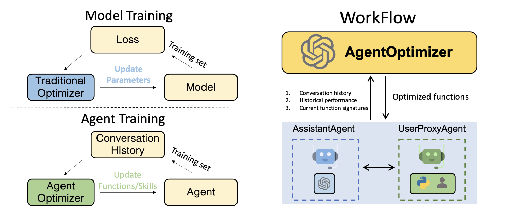

**TL;DR:**
Introducing **AgentOptimizer**, a new class for training LLM agents in the era of LLMs as a service.
**AgentOptimizer** is able to prompt autogen agents to iteratively optimize its function/skills according to the historical conversation and performance.
Checkout one implementation for **AgentOptimizer** on [MATH](https://github.com/hendrycks/math) dataset
[here](https://github.com/microsoft/autogen/blob/main/notebook/agentchat_agentoptimizer.ipynb).

Paper is coming soon!

## Introduction
In traditional ML pipeline, we train a model by updating its weights according to the loss on the training set, while in the era of LLM agents, how should we train an agent?
Here, we take an initial step towards the agent training.
Inspired by the [function calling](https://platform.openai.com/docs/guides/function-calling) capabilities provided by OpenAI,
we draw an analogy between model weights and agent functions/skills, and update an agent’s functions/skills based on its historical performance on a training set.
Specifically, we propose to use the function calling capabilities to formulate the actions that optimize the agents’ functions as a set of function calls,
to support iteratively **adding, revising, and removing** existing functions.
As an agentic way of training an agent, our approach helps enhance the agents’ abilities without requiring access to the LLMs weights.

## AgentOptimizer

**AgentOptimizer** is a class designed to optimize the agents by improving their function calls.
It contains two core methods:

1. `step()`: `step()` takes three inputs, including the previous conversation history (history), the statistical information of solving previous problems (statistic), and the current functions (current_functions).

```python
actions, updated_functions = AgentOptimizer.step(history, statistic, current_functions)
```

It has two outputs `actions` and `updated_functions`. `actions` is a series of actions to manipulate the current functions. And `updated_functions` is the updated functions after the actions are applied (including code implementation).

2. `update_function_call()`:
This method takes the agents and actions as input. It updates the functions registered in these agents according to the actions from `step()`.
For AssistantAgent, it first uses [update_function_signature](https://microsoft.github.io/autogen/docs/reference/agentchat/conversable_agent/#update_function_signature) to update the function signatures.
Then, it updates the functions in the MathUserproxyAgent with the corresponding code implementation gained from `step()`.

Sometimes, the function signatures (JSON schema) returned by the `step()` may not be valid, and the generated code may also face syntax errors.
**AgentOptimizer** includes mechanisms to check the (1) validity of the function signatures and (2) code implementation before updating the functions.
Moreover, it also includes mechanisms to check whether each action is feasible, such as avoiding the removal of a function that is not in the current functions due to hallucination.

## Pseudocode for the optimization process

The optimization process is as follows:

```python
for - in range(EPOCH):
    history, statistic, current_functions = solve_problems(train_problems)
    actions, updated_functions = AgentOptimizer.step(history, statistic, current_functions)
    AgentOptimizer.update_function_call(actions)
```

Given a prepared training dataset, the agents iteratively solve problems from the training set to obtain conversation history and statistical information.
The functions are then improved using AgentOptimizer.
Each iteration can be regarded as one training step analogous to traditional machine learning, with the optimization elements being the functions that agents have.
After EPOCH iterations, the agents are expected to obtain better functions that may be used in future tasks


## The implementation technology behind the AgentOptimizer

To obtain stable and structured function signatures and code implementations from AgentOptimizer,
we leverage the function calling capabilities provided by OpenAI to formulate the actions that manipulate the functions as a set of function calls.
Specifically, we introduce three function calls to manipulate the current functions at each step: `add_function`, `remove_function`, and `revise_function`.
These calls add, remove, and revise functions in the existing function list, respectively.
This practice could fully leverages the function calling capabilities of GPT-4 and outputs structured functions with more stable signatures and code implementation.
Below is the JSON schema of these function calls:

1. `add_function`: Add one new function that may be used in the future tasks.
```python
ADD_FUNC = {
    "type": "function",
    "function": {
        "name": "add_function",
        "description": "Add a function in the context of the conversation. Necessary Python packages must be declared. The name of the function MUST be the same with the function name in the code you generated.",
        "parameters": {
            "type": "object",
            "properties": {
                "name": {
                    "type": "string",
                    "description": "The name of the function in the code implementation."
                },
                "description": {
                    "type": "string",
                    "description": "A short description of the function."
                },
                "arguments": {
                    "type": "string",
                    "description": "JSON schema of arguments encoded as a string. Please note that the JSON schema only supports specific types including string, integer, object, array, boolean. (do not have float type) For example: { \"url\": { \"type\": \"string\", \"description\": \"The URL\", }}. Please avoid the error 'array schema missing items' when using array type."
                },
                "packages": {
                    "type": "string",
                    "description": "A list of package names imported by the function, and that need to be installed with pip prior to invoking the function. This solves ModuleNotFoundError. It should be string, not list."
                },
                "code": {
                    "type": "string",
                    "description": "The implementation in Python. Do not include the function declaration."
                }
            },
            "required": ["name", "description", "arguments", "packages", "code"]
        }
    }
}
```

2. `revise_function`: Revise one existing function (code implementation, function signature) in the current function list according to the conversation history and performance.
```python
REVISE_FUNC = {
    "type": "function",
    "function": {
        "name": "revise_function",
        "description": "Revise a function in the context of the conversation. Necessary Python packages must be declared. The name of the function MUST be the same with the function name in the code you generated.",
        "parameters": {
            "type": "object",
            "properties": {
                "name": {
                    "type": "string",
                    "description": "The name of the function in the code implementation."
                },
                "description": {
                    "type": "string",
                    "description": "A short description of the function."
                },
                "arguments": {
                    "type": "string",
                    "description": "JSON schema of arguments encoded as a string. Please note that the JSON schema only supports specific types including string, integer, object, array, boolean. (do not have float type) For example: { \"url\": { \"type\": \"string\", \"description\": \"The URL\", }}. Please avoid the error 'array schema missing items' when using array type."
                },
                "packages": {
                    "type": "string",
                    "description": "A list of package names imported by the function, and that need to be installed with pip prior to invoking the function. This solves ModuleNotFoundError. It should be string, not list."
                },
                "code": {
                    "type": "string",
                    "description": "The implementation in Python. Do not include the function declaration."
                }
            },
            "required": ["name", "description", "arguments", "packages", "code"]
        }
    }
}
```

3. `remove_function`: Remove one existing function in the current function list. It is used to remove the functions that are not useful (redundant) in the future tasks.
```python
REMOVE_FUNC = {
    "type": "function",
    "function": {
        "name": "remove_function",
        "description": "Remove one function in the context of the conversation. Once remove one function, the assistant will not use this function in future conversation.",
        "parameters": {
            "type": "object",
            "properties": {
                "name": {
                    "type": "string",
                    "description": "The name of the function in the code implementation."
                }
            },
            "required": ["name"]
        }
    }
}
```


## Limitation & Future work

1. Unlike gradient descent in traditional machine learning training processes, each optimization step does not necessarily lead to better performance on the training set.
When the training epoch is small, the agent’s performance may even decrease. One urgent task is to design a better mechanism to guide the optimization process.
2. The [Current implementation](https://github.com/microsoft/autogen/blob/main/notebook/agentchat_agentoptimizer.ipynb) of AgentOptimizer is mainly for illustration purpose and is just a proof of concept.
It is not formally integrated into the autogen with a general interface like optimizing any kinds of agents in any tasks.
Currently, it only supports optimizing the multi-agent system in solving problems from [MATH](https://github.com/hendrycks/math) dataset. We will integrate it into autogen with more general interface in the future.
