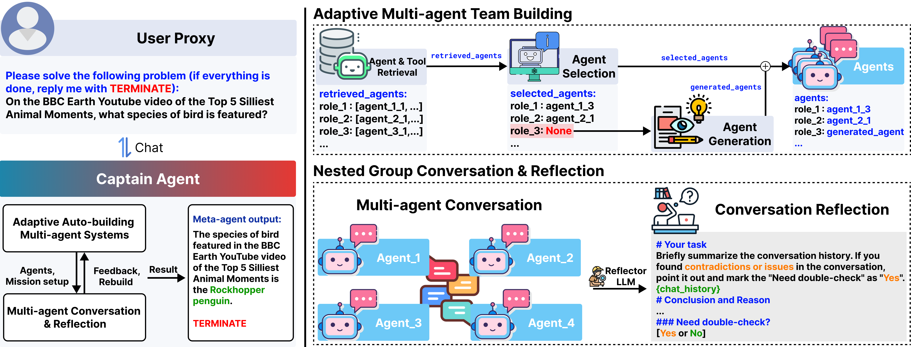
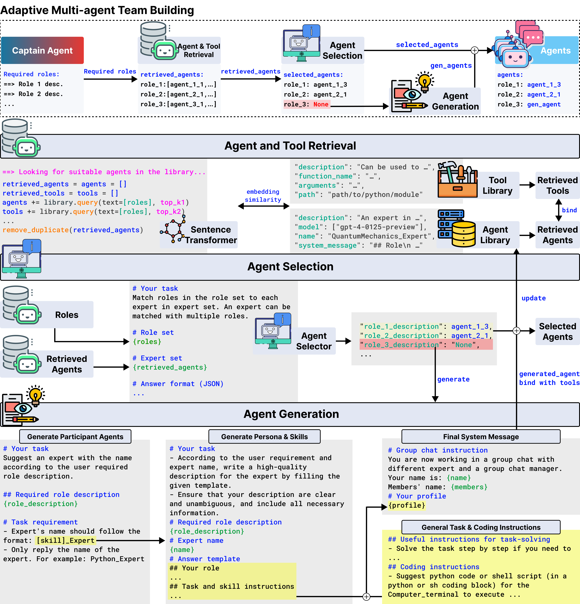
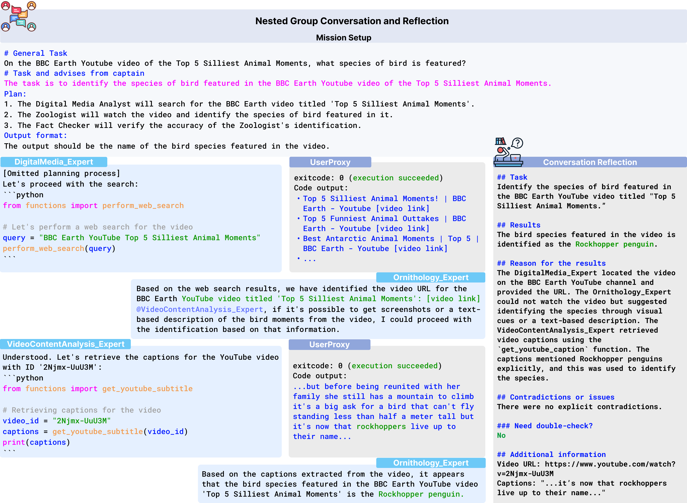

**TL;DR**
- We introduce Captain Agent, an agent equipped with the capability to adaptively assemble a team of agents through retrieval-selection-generation process to handle complex tasks via nested chat.
- Captain Agent supports all types of `ConversableAgents` implemented in Autogen.


# Introduction

In this blog, we introduce **Captain Agent**, an agent that can automatically build a team of agents to fulfill diverse, complex task requirements. 
We design a two-step workflow for Captain Agent to build a high quality team and solve the problem:
- (**Step 1**) Captain Agent will first identify a subtask instructed by our prompt, list several roles needed for this subtask, and then create a team of agents accordingly by retrieval, selection, and generation. Each of these will be equipped with predefined tools retrieved from the tool library.

- (**Step 2**) this team of agents will attempt to solve the subtask via conversation with the free-form tool using. Once it's done, a reflector LLM will provide Captain Agent with a reflection report for it to decide whether to adjust the team or subtask instruction or to terminate and output the results.


Below is the instruction on how to use Captain Agent in AutoGen.

# Basic Example

## Step 1: preparation


# Further Reading
Please refer to our [paper](https://arxiv.org/pdf/2405.19425) for more details about Captain Agent and our new team-building paradigm: adaptive build.

If you find this blog useful, please consider citing:
```
@misc{song2024adaptiveinconversationteambuilding,
      title={Adaptive In-conversation Team Building for Language Model Agents}, 
      author={Linxin Song and Jiale Liu and Jieyu Zhang and Shaokun Zhang and Ao Luo and Shijian Wang and Qingyun Wu and Chi Wang},
      year={2024},
      eprint={2405.19425},
      archivePrefix={arXiv},
      primaryClass={cs.CL},
      url={https://arxiv.org/abs/2405.19425}, 
}
```