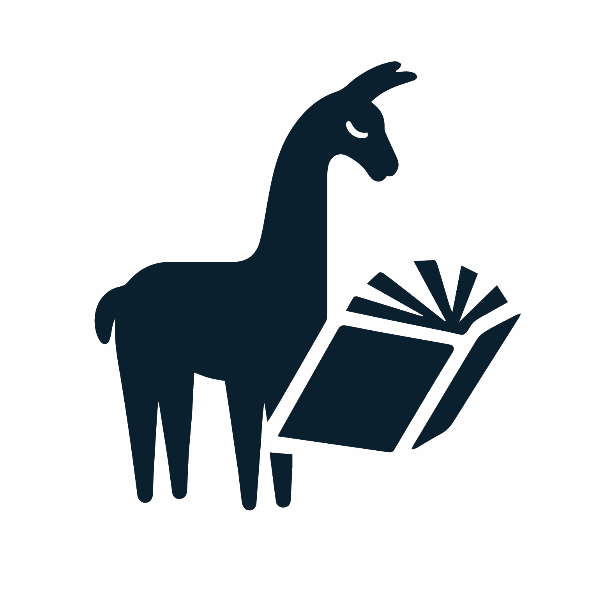

# Ecosystem
This page lists libraries that have integrations with Autogen for LLM applications using multiple agents in alphabetical order. Including your own integration to this list is highly encouraged. Simply open a pull request with a few lines of text, see the dropdown below for more information.

## MemGPT + AutoGen

MemGPT enables LLMs to manage their own memory and overcome limited context windows. You can use MemGPT to create perpetual chatbots that learn about you and modify their own personalities over time. You can connect MemGPT to your own local filesystems and databases, as well as connect MemGPT to your own tools and APIs. The MemGPT + AutoGen integration allows you to equip any AutoGen agent with MemGPT capabilities.

- [MemGPT + AutoGen Documentation with Code Examples](https://memgpt.readthedocs.io/en/latest/autogen/)
