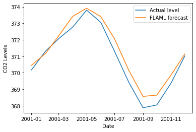

# AutoML - Time Series Forecast

### Prerequisites

Install the [ts_forecast] option.
```bash
pip install "flaml[ts_forecast]"
```

### Simple NumPy Example

```python
import numpy as np
from flaml import AutoML

X_train = np.arange('2014-01', '2022-01', dtype='datetime64[M]')
y_train = np.random.random(size=84)
automl = AutoML()
automl.fit(X_train=X_train[:84],  # a single column of timestamp
           y_train=y_train,  # value for each timestamp
           period=12,  # time horizon to forecast, e.g., 12 months
           task='ts_forecast', time_budget=15,  # time budget in seconds
           log_file_name="ts_forecast.log",
           eval_method="holdout",
          )
print(automl.predict(X_train[84:]))
```

#### Sample output

```
[flaml.automl: 01-21 08:01:20] {2018} INFO - task = ts_forecast
[flaml.automl: 01-21 08:01:20] {2020} INFO - Data split method: time
[flaml.automl: 01-21 08:01:20] {2024} INFO - Evaluation method: holdout
[flaml.automl: 01-21 08:01:20] {2124} INFO - Minimizing error metric: mape
[flaml.automl: 01-21 08:01:21] {2181} INFO - List of ML learners in AutoML Run: ['lgbm', 'rf', 'xgboost', 'extra_tree', 'xgb_limitdepth', 'prophet', 'arima', 'sarimax']
[flaml.automl: 01-21 08:01:21] {2434} INFO - iteration 0, current learner lgbm
[flaml.automl: 01-21 08:01:21] {2547} INFO - Estimated sufficient time budget=1429s. Estimated necessary time budget=1s.
[flaml.automl: 01-21 08:01:21] {2594} INFO -  at 0.9s,  estimator lgbm's best error=0.9811,     best estimator lgbm's best error=0.9811
[flaml.automl: 01-21 08:01:21] {2434} INFO - iteration 1, current learner lgbm
[flaml.automl: 01-21 08:01:21] {2594} INFO -  at 0.9s,  estimator lgbm's best error=0.9811,     best estimator lgbm's best error=0.9811
[flaml.automl: 01-21 08:01:21] {2434} INFO - iteration 2, current learner lgbm
[flaml.automl: 01-21 08:01:21] {2594} INFO -  at 0.9s,  estimator lgbm's best error=0.9811,     best estimator lgbm's best error=0.9811
[flaml.automl: 01-21 08:01:21] {2434} INFO - iteration 3, current learner lgbm
[flaml.automl: 01-21 08:01:21] {2594} INFO -  at 1.0s,  estimator lgbm's best error=0.9811,     best estimator lgbm's best error=0.9811
[flaml.automl: 01-21 08:01:21] {2434} INFO - iteration 4, current learner lgbm
[flaml.automl: 01-21 08:01:21] {2594} INFO -  at 1.0s,  estimator lgbm's best error=0.9811,     best estimator lgbm's best error=0.9811
[flaml.automl: 01-21 08:01:21] {2434} INFO - iteration 5, current learner lgbm
[flaml.automl: 01-21 08:01:21] {2594} INFO -  at 1.0s,  estimator lgbm's best error=0.9811,     best estimator lgbm's best error=0.9811
[flaml.automl: 01-21 08:01:21] {2434} INFO - iteration 6, current learner lgbm
[flaml.automl: 01-21 08:01:21] {2594} INFO -  at 1.0s,  estimator lgbm's best error=0.9652,     best estimator lgbm's best error=0.9652
[flaml.automl: 01-21 08:01:21] {2434} INFO - iteration 7, current learner lgbm
[flaml.automl: 01-21 08:01:21] {2594} INFO -  at 1.0s,  estimator lgbm's best error=0.9466,     best estimator lgbm's best error=0.9466
[flaml.automl: 01-21 08:01:21] {2434} INFO - iteration 8, current learner lgbm
[flaml.automl: 01-21 08:01:21] {2594} INFO -  at 1.0s,  estimator lgbm's best error=0.9466,     best estimator lgbm's best error=0.9466
[flaml.automl: 01-21 08:01:21] {2434} INFO - iteration 9, current learner lgbm
[flaml.automl: 01-21 08:01:22] {2594} INFO -  at 1.1s,  estimator lgbm's best error=0.9466,     best estimator lgbm's best error=0.9466
[flaml.automl: 01-21 08:01:22] {2434} INFO - iteration 10, current learner lgbm
[flaml.automl: 01-21 08:01:22] {2594} INFO -  at 1.1s,  estimator lgbm's best error=0.9466,     best estimator lgbm's best error=0.9466
[flaml.automl: 01-21 08:01:22] {2434} INFO - iteration 11, current learner lgbm
[flaml.automl: 01-21 08:01:22] {2594} INFO -  at 1.1s,  estimator lgbm's best error=0.9466,     best estimator lgbm's best error=0.9466
[flaml.automl: 01-21 08:01:22] {2434} INFO - iteration 12, current learner lgbm
[flaml.automl: 01-21 08:01:22] {2594} INFO -  at 1.1s,  estimator lgbm's best error=0.9466,     best estimator lgbm's best error=0.9466
[flaml.automl: 01-21 08:01:22] {2434} INFO - iteration 13, current learner lgbm
[flaml.automl: 01-21 08:01:22] {2594} INFO -  at 1.1s,  estimator lgbm's best error=0.9466,     best estimator lgbm's best error=0.9466
[flaml.automl: 01-21 08:01:22] {2434} INFO - iteration 14, current learner lgbm
[flaml.automl: 01-21 08:01:22] {2594} INFO -  at 1.1s,  estimator lgbm's best error=0.9466,     best estimator lgbm's best error=0.9466
[flaml.automl: 01-21 08:01:22] {2434} INFO - iteration 15, current learner lgbm
[flaml.automl: 01-21 08:01:22] {2594} INFO -  at 1.2s,  estimator lgbm's best error=0.9466,     best estimator lgbm's best error=0.9466
[flaml.automl: 01-21 08:01:22] {2434} INFO - iteration 16, current learner lgbm
[flaml.automl: 01-21 08:01:22] {2594} INFO -  at 1.2s,  estimator lgbm's best error=0.9466,     best estimator lgbm's best error=0.9466
[flaml.automl: 01-21 08:01:22] {2434} INFO - iteration 17, current learner lgbm
[flaml.automl: 01-21 08:01:22] {2594} INFO -  at 1.2s,  estimator lgbm's best error=0.9466,     best estimator lgbm's best error=0.9466
[flaml.automl: 01-21 08:01:22] {2434} INFO - iteration 18, current learner rf
[flaml.automl: 01-21 08:01:22] {2594} INFO -  at 1.2s,  estimator rf's best error=1.0994,       best estimator lgbm's best error=0.9466
[flaml.automl: 01-21 08:01:22] {2434} INFO - iteration 19, current learner rf
[flaml.automl: 01-21 08:01:22] {2594} INFO -  at 1.2s,  estimator rf's best error=1.0848,       best estimator lgbm's best error=0.9466
[flaml.automl: 01-21 08:01:22] {2434} INFO - iteration 20, current learner xgboost
[flaml.automl: 01-21 08:01:22] {2594} INFO -  at 1.3s,  estimator xgboost's best error=1.0271,  best estimator lgbm's best error=0.9466
[flaml.automl: 01-21 08:01:22] {2434} INFO - iteration 21, current learner rf
[flaml.automl: 01-21 08:01:22] {2594} INFO -  at 1.3s,  estimator rf's best error=1.0848,       best estimator lgbm's best error=0.9466
[flaml.automl: 01-21 08:01:22] {2434} INFO - iteration 22, current learner xgboost
[flaml.automl: 01-21 08:01:22] {2594} INFO -  at 1.3s,  estimator xgboost's best error=1.0015,  best estimator lgbm's best error=0.9466
[flaml.automl: 01-21 08:01:22] {2434} INFO - iteration 23, current learner xgboost
[flaml.automl: 01-21 08:01:22] {2594} INFO -  at 1.3s,  estimator xgboost's best error=1.0015,  best estimator lgbm's best error=0.9466
[flaml.automl: 01-21 08:01:22] {2434} INFO - iteration 24, current learner xgboost
[flaml.automl: 01-21 08:01:22] {2594} INFO -  at 1.3s,  estimator xgboost's best error=1.0015,  best estimator lgbm's best error=0.9466
[flaml.automl: 01-21 08:01:22] {2434} INFO - iteration 25, current learner extra_tree
[flaml.automl: 01-21 08:01:22] {2594} INFO -  at 1.3s,  estimator extra_tree's best error=1.0130,       best estimator lgbm's best error=0.9466
[flaml.automl: 01-21 08:01:22] {2434} INFO - iteration 26, current learner extra_tree
[flaml.automl: 01-21 08:01:22] {2594} INFO -  at 1.4s,  estimator extra_tree's best error=1.0130,       best estimator lgbm's best error=0.9466
[flaml.automl: 01-21 08:01:22] {2434} INFO - iteration 27, current learner extra_tree
[flaml.automl: 01-21 08:01:22] {2594} INFO -  at 1.4s,  estimator extra_tree's best error=1.0130,       best estimator lgbm's best error=0.9466
[flaml.automl: 01-21 08:01:22] {2434} INFO - iteration 28, current learner extra_tree
[flaml.automl: 01-21 08:01:22] {2594} INFO -  at 1.4s,  estimator extra_tree's best error=1.0130,       best estimator lgbm's best error=0.9466
[flaml.automl: 01-21 08:01:22] {2434} INFO - iteration 29, current learner extra_tree
[flaml.automl: 01-21 08:01:22] {2594} INFO -  at 1.4s,  estimator extra_tree's best error=0.9499,       best estimator lgbm's best error=0.9466
[flaml.automl: 01-21 08:01:22] {2434} INFO - iteration 30, current learner lgbm
[flaml.automl: 01-21 08:01:22] {2594} INFO -  at 1.5s,  estimator lgbm's best error=0.9466,     best estimator lgbm's best error=0.9466
[flaml.automl: 01-21 08:01:22] {2434} INFO - iteration 31, current learner lgbm
[flaml.automl: 01-21 08:01:22] {2594} INFO -  at 1.5s,  estimator lgbm's best error=0.9466,     best estimator lgbm's best error=0.9466
[flaml.automl: 01-21 08:01:22] {2434} INFO - iteration 32, current learner lgbm
[flaml.automl: 01-21 08:01:22] {2594} INFO -  at 1.5s,  estimator lgbm's best error=0.9466,     best estimator lgbm's best error=0.9466
[flaml.automl: 01-21 08:01:22] {2434} INFO - iteration 33, current learner extra_tree
[flaml.automl: 01-21 08:01:22] {2594} INFO -  at 1.5s,  estimator extra_tree's best error=0.9499,       best estimator lgbm's best error=0.9466
[flaml.automl: 01-21 08:01:22] {2434} INFO - iteration 34, current learner lgbm
[flaml.automl: 01-21 08:01:22] {2594} INFO -  at 1.5s,  estimator lgbm's best error=0.9466,     best estimator lgbm's best error=0.9466
[flaml.automl: 01-21 08:01:22] {2434} INFO - iteration 35, current learner xgboost
[flaml.automl: 01-21 08:01:22] {2594} INFO -  at 1.5s,  estimator xgboost's best error=1.0015,  best estimator lgbm's best error=0.9466
[flaml.automl: 01-21 08:01:22] {2434} INFO - iteration 36, current learner extra_tree
[flaml.automl: 01-21 08:01:22] {2594} INFO -  at 1.6s,  estimator extra_tree's best error=0.9499,       best estimator lgbm's best error=0.9466
[flaml.automl: 01-21 08:01:22] {2434} INFO - iteration 37, current learner extra_tree
[flaml.automl: 01-21 08:01:22] {2594} INFO -  at 1.6s,  estimator extra_tree's best error=0.9499,       best estimator lgbm's best error=0.9466
[flaml.automl: 01-21 08:01:22] {2434} INFO - iteration 38, current learner extra_tree
[flaml.automl: 01-21 08:01:22] {2594} INFO -  at 1.6s,  estimator extra_tree's best error=0.9499,       best estimator lgbm's best error=0.9466
[flaml.automl: 01-21 08:01:22] {2434} INFO - iteration 39, current learner xgboost
[flaml.automl: 01-21 08:01:22] {2594} INFO -  at 1.6s,  estimator xgboost's best error=1.0015,  best estimator lgbm's best error=0.9466
[flaml.automl: 01-21 08:01:22] {2434} INFO - iteration 40, current learner extra_tree
[flaml.automl: 01-21 08:01:22] {2594} INFO -  at 1.6s,  estimator extra_tree's best error=0.9499,       best estimator lgbm's best error=0.9466
[flaml.automl: 01-21 08:01:22] {2434} INFO - iteration 41, current learner extra_tree
[flaml.automl: 01-21 08:01:22] {2594} INFO -  at 1.7s,  estimator extra_tree's best error=0.9499,       best estimator lgbm's best error=0.9466
[flaml.automl: 01-21 08:01:22] {2434} INFO - iteration 42, current learner lgbm
[flaml.automl: 01-21 08:01:22] {2594} INFO -  at 1.7s,  estimator lgbm's best error=0.9466,     best estimator lgbm's best error=0.9466
[flaml.automl: 01-21 08:01:22] {2434} INFO - iteration 43, current learner extra_tree
[flaml.automl: 01-21 08:01:22] {2594} INFO -  at 1.7s,  estimator extra_tree's best error=0.9499,       best estimator lgbm's best error=0.9466
[flaml.automl: 01-21 08:01:22] {2434} INFO - iteration 44, current learner xgb_limitdepth
[flaml.automl: 01-21 08:01:22] {2594} INFO -  at 1.7s,  estimator xgb_limitdepth's best error=1.5815,   best estimator lgbm's best error=0.9466
[flaml.automl: 01-21 08:01:22] {2434} INFO - iteration 45, current learner xgb_limitdepth
[flaml.automl: 01-21 08:01:22] {2594} INFO -  at 1.8s,  estimator xgb_limitdepth's best error=0.9683,   best estimator lgbm's best error=0.9466
[flaml.automl: 01-21 08:01:22] {2434} INFO - iteration 46, current learner xgb_limitdepth
[flaml.automl: 01-21 08:01:22] {2594} INFO -  at 1.8s,  estimator xgb_limitdepth's best error=0.9683,   best estimator lgbm's best error=0.9466
[flaml.automl: 01-21 08:01:22] {2434} INFO - iteration 47, current learner xgb_limitdepth
[flaml.automl: 01-21 08:01:22] {2594} INFO -  at 1.8s,  estimator xgb_limitdepth's best error=0.9683,   best estimator lgbm's best error=0.9466
[flaml.automl: 01-21 08:01:22] {2434} INFO - iteration 48, current learner xgb_limitdepth
[flaml.automl: 01-21 08:01:22] {2594} INFO -  at 1.9s,  estimator xgb_limitdepth's best error=0.9683,   best estimator lgbm's best error=0.9466
[flaml.automl: 01-21 08:01:22] {2434} INFO - iteration 49, current learner lgbm
[flaml.automl: 01-21 08:01:22] {2594} INFO -  at 1.9s,  estimator lgbm's best error=0.9466,     best estimator lgbm's best error=0.9466
[flaml.automl: 01-21 08:01:22] {2434} INFO - iteration 50, current learner extra_tree
[flaml.automl: 01-21 08:01:22] {2594} INFO -  at 1.9s,  estimator extra_tree's best error=0.9499,       best estimator lgbm's best error=0.9466
[flaml.automl: 01-21 08:01:22] {2434} INFO - iteration 51, current learner xgb_limitdepth
[flaml.automl: 01-21 08:01:22] {2594} INFO -  at 1.9s,  estimator xgb_limitdepth's best error=0.9683,   best estimator lgbm's best error=0.9466
[flaml.automl: 01-21 08:01:22] {2434} INFO - iteration 52, current learner xgboost
[flaml.automl: 01-21 08:01:22] {2594} INFO -  at 2.0s,  estimator xgboost's best error=1.0015,  best estimator lgbm's best error=0.9466
[flaml.automl: 01-21 08:01:22] {2434} INFO - iteration 53, current learner xgboost
[flaml.automl: 01-21 08:01:22] {2594} INFO -  at 2.0s,  estimator xgboost's best error=1.0015,  best estimator lgbm's best error=0.9466
[flaml.automl: 01-21 08:01:22] {2434} INFO - iteration 54, current learner lgbm
[flaml.automl: 01-21 08:01:22] {2594} INFO -  at 2.0s,  estimator lgbm's best error=0.9466,     best estimator lgbm's best error=0.9466
[flaml.automl: 01-21 08:01:22] {2434} INFO - iteration 55, current learner lgbm
[flaml.automl: 01-21 08:01:22] {2594} INFO -  at 2.0s,  estimator lgbm's best error=0.9466,     best estimator lgbm's best error=0.9466
[flaml.automl: 01-21 08:01:22] {2434} INFO - iteration 56, current learner xgb_limitdepth
[flaml.automl: 01-21 08:01:22] {2594} INFO -  at 2.0s,  estimator xgb_limitdepth's best error=0.9683,   best estimator lgbm's best error=0.9466
[flaml.automl: 01-21 08:01:22] {2434} INFO - iteration 57, current learner rf
[flaml.automl: 01-21 08:01:22] {2594} INFO -  at 2.0s,  estimator rf's best error=1.0848,       best estimator lgbm's best error=0.9466
[flaml.automl: 01-21 08:01:22] {2434} INFO - iteration 58, current learner xgboost
[flaml.automl: 01-21 08:01:23] {2594} INFO -  at 2.1s,  estimator xgboost's best error=1.0015,  best estimator lgbm's best error=0.9466
[flaml.automl: 01-21 08:01:23] {2434} INFO - iteration 59, current learner extra_tree
[flaml.automl: 01-21 08:01:23] {2594} INFO -  at 2.1s,  estimator extra_tree's best error=0.9499,       best estimator lgbm's best error=0.9466
[flaml.automl: 01-21 08:01:23] {2434} INFO - iteration 60, current learner lgbm
[flaml.automl: 01-21 08:01:23] {2594} INFO -  at 2.1s,  estimator lgbm's best error=0.9466,     best estimator lgbm's best error=0.9466
[flaml.automl: 01-21 08:01:23] {2434} INFO - iteration 61, current learner extra_tree
[flaml.automl: 01-21 08:01:23] {2594} INFO -  at 2.1s,  estimator extra_tree's best error=0.9499,       best estimator lgbm's best error=0.9466
[flaml.automl: 01-21 08:01:23] {2434} INFO - iteration 62, current learner lgbm
[flaml.automl: 01-21 08:01:23] {2594} INFO -  at 2.1s,  estimator lgbm's best error=0.9466,     best estimator lgbm's best error=0.9466
[flaml.automl: 01-21 08:01:23] {2434} INFO - iteration 63, current learner xgb_limitdepth
[flaml.automl: 01-21 08:01:23] {2594} INFO -  at 2.2s,  estimator xgb_limitdepth's best error=0.9683,   best estimator lgbm's best error=0.9466
[flaml.automl: 01-21 08:01:23] {2434} INFO - iteration 64, current learner prophet
[flaml.automl: 01-21 08:01:25] {2594} INFO -  at 4.2s,  estimator prophet's best error=1.5706,  best estimator lgbm's best error=0.9466
[flaml.automl: 01-21 08:01:25] {2434} INFO - iteration 65, current learner arima
[flaml.automl: 01-21 08:01:25] {2594} INFO -  at 4.2s,  estimator arima's best error=0.5693,    best estimator arima's best error=0.5693
[flaml.automl: 01-21 08:01:25] {2434} INFO - iteration 66, current learner arima
[flaml.automl: 01-21 08:01:25] {2594} INFO -  at 4.4s,  estimator arima's best error=0.5693,    best estimator arima's best error=0.5693
[flaml.automl: 01-21 08:01:25] {2434} INFO - iteration 67, current learner sarimax
[flaml.automl: 01-21 08:01:25] {2594} INFO -  at 4.4s,  estimator sarimax's best error=0.5693,  best estimator arima's best error=0.5693
[flaml.automl: 01-21 08:01:25] {2434} INFO - iteration 68, current learner xgb_limitdepth
[flaml.automl: 01-21 08:01:25] {2594} INFO -  at 4.5s,  estimator xgb_limitdepth's best error=0.9683,   best estimator arima's best error=0.5693
[flaml.automl: 01-21 08:01:25] {2434} INFO - iteration 69, current learner sarimax
[flaml.automl: 01-21 08:01:25] {2594} INFO -  at 4.6s,  estimator sarimax's best error=0.5693,  best estimator arima's best error=0.5693
[flaml.automl: 01-21 08:01:25] {2434} INFO - iteration 70, current learner sarimax
[flaml.automl: 01-21 08:01:25] {2594} INFO -  at 4.6s,  estimator sarimax's best error=0.5693,  best estimator arima's best error=0.5693
[flaml.automl: 01-21 08:01:25] {2434} INFO - iteration 71, current learner arima
[flaml.automl: 01-21 08:01:25] {2594} INFO -  at 4.6s,  estimator arima's best error=0.5693,    best estimator arima's best error=0.5693
[flaml.automl: 01-21 08:01:25] {2434} INFO - iteration 72, current learner xgb_limitdepth
[flaml.automl: 01-21 08:01:25] {2594} INFO -  at 4.6s,  estimator xgb_limitdepth's best error=0.9683,   best estimator arima's best error=0.5693
[flaml.automl: 01-21 08:01:25] {2434} INFO - iteration 73, current learner arima
[flaml.automl: 01-21 08:01:25] {2594} INFO -  at 4.7s,  estimator arima's best error=0.5693,    best estimator arima's best error=0.5693
[flaml.automl: 01-21 08:01:25] {2434} INFO - iteration 74, current learner sarimax
[flaml.automl: 01-21 08:01:25] {2594} INFO -  at 4.7s,  estimator sarimax's best error=0.5693,  best estimator arima's best error=0.5693
[flaml.automl: 01-21 08:01:25] {2434} INFO - iteration 75, current learner arima
[flaml.automl: 01-21 08:01:25] {2594} INFO -  at 4.8s,  estimator arima's best error=0.5693,    best estimator arima's best error=0.5693
[flaml.automl: 01-21 08:01:25] {2434} INFO - iteration 76, current learner sarimax
[flaml.automl: 01-21 08:01:25] {2594} INFO -  at 4.9s,  estimator sarimax's best error=0.5693,  best estimator arima's best error=0.5693
[flaml.automl: 01-21 08:01:25] {2434} INFO - iteration 77, current learner arima
[flaml.automl: 01-21 08:01:25] {2594} INFO -  at 5.0s,  estimator arima's best error=0.5693,    best estimator arima's best error=0.5693
[flaml.automl: 01-21 08:01:25] {2434} INFO - iteration 78, current learner sarimax
[flaml.automl: 01-21 08:01:26] {2594} INFO -  at 5.1s,  estimator sarimax's best error=0.5693,  best estimator arima's best error=0.5693
[flaml.automl: 01-21 08:01:26] {2434} INFO - iteration 79, current learner xgb_limitdepth
[flaml.automl: 01-21 08:01:26] {2594} INFO -  at 5.1s,  estimator xgb_limitdepth's best error=0.9683,   best estimator arima's best error=0.5693
[flaml.automl: 01-21 08:01:26] {2434} INFO - iteration 80, current learner xgb_limitdepth
[flaml.automl: 01-21 08:01:26] {2594} INFO -  at 5.1s,  estimator xgb_limitdepth's best error=0.9683,   best estimator arima's best error=0.5693
[flaml.automl: 01-21 08:01:26] {2434} INFO - iteration 81, current learner sarimax
[flaml.automl: 01-21 08:01:26] {2594} INFO -  at 5.1s,  estimator sarimax's best error=0.5693,  best estimator arima's best error=0.5693
[flaml.automl: 01-21 08:01:26] {2434} INFO - iteration 82, current learner prophet
[flaml.automl: 01-21 08:01:27] {2594} INFO -  at 6.6s,  estimator prophet's best error=1.4076,  best estimator arima's best error=0.5693
[flaml.automl: 01-21 08:01:27] {2434} INFO - iteration 83, current learner xgb_limitdepth
[flaml.automl: 01-21 08:01:27] {2594} INFO -  at 6.6s,  estimator xgb_limitdepth's best error=0.9683,   best estimator arima's best error=0.5693
[flaml.automl: 01-21 08:01:27] {2434} INFO - iteration 84, current learner sarimax
[flaml.automl: 01-21 08:01:27] {2594} INFO -  at 6.6s,  estimator sarimax's best error=0.5693,  best estimator arima's best error=0.5693
[flaml.automl: 01-21 08:01:27] {2434} INFO - iteration 85, current learner xgb_limitdepth
[flaml.automl: 01-21 08:01:27] {2594} INFO -  at 6.6s,  estimator xgb_limitdepth's best error=0.9683,   best estimator arima's best error=0.5693
[flaml.automl: 01-21 08:01:27] {2434} INFO - iteration 86, current learner sarimax
[flaml.automl: 01-21 08:01:27] {2594} INFO -  at 6.8s,  estimator sarimax's best error=0.5693,  best estimator arima's best error=0.5693
[flaml.automl: 01-21 08:01:27] {2434} INFO - iteration 87, current learner arima
[flaml.automl: 01-21 08:01:27] {2594} INFO -  at 6.8s,  estimator arima's best error=0.5693,    best estimator arima's best error=0.5693
[flaml.automl: 01-21 08:01:27] {2434} INFO - iteration 88, current learner sarimax
[flaml.automl: 01-21 08:01:27] {2594} INFO -  at 6.9s,  estimator sarimax's best error=0.5693,  best estimator arima's best error=0.5693
[flaml.automl: 01-21 08:01:27] {2434} INFO - iteration 89, current learner arima
[flaml.automl: 01-21 08:01:27] {2594} INFO -  at 6.9s,  estimator arima's best error=0.5693,    best estimator arima's best error=0.5693
[flaml.automl: 01-21 08:01:27] {2434} INFO - iteration 90, current learner arima
[flaml.automl: 01-21 08:01:27] {2594} INFO -  at 7.0s,  estimator arima's best error=0.5693,    best estimator arima's best error=0.5693
[flaml.automl: 01-21 08:01:27] {2434} INFO - iteration 91, current learner xgb_limitdepth
[flaml.automl: 01-21 08:01:27] {2594} INFO -  at 7.0s,  estimator xgb_limitdepth's best error=0.9683,   best estimator arima's best error=0.5693
[flaml.automl: 01-21 08:01:27] {2434} INFO - iteration 92, current learner xgb_limitdepth
[flaml.automl: 01-21 08:01:27] {2594} INFO -  at 7.0s,  estimator xgb_limitdepth's best error=0.9683,   best estimator arima's best error=0.5693
[flaml.automl: 01-21 08:01:27] {2434} INFO - iteration 93, current learner sarimax
[flaml.automl: 01-21 08:01:28] {2594} INFO -  at 7.0s,  estimator sarimax's best error=0.5600,  best estimator sarimax's best error=0.5600
[flaml.automl: 01-21 08:01:28] {2434} INFO - iteration 94, current learner xgb_limitdepth
[flaml.automl: 01-21 08:01:28] {2594} INFO -  at 7.1s,  estimator xgb_limitdepth's best error=0.9683,   best estimator sarimax's best error=0.5600
[flaml.automl: 01-21 08:01:28] {2434} INFO - iteration 95, current learner sarimax
[flaml.automl: 01-21 08:01:28] {2594} INFO -  at 7.2s,  estimator sarimax's best error=0.5600,  best estimator sarimax's best error=0.5600
[flaml.automl: 01-21 08:01:28] {2434} INFO - iteration 96, current learner arima
[flaml.automl: 01-21 08:01:28] {2594} INFO -  at 7.2s,  estimator arima's best error=0.5693,    best estimator sarimax's best error=0.5600
[flaml.automl: 01-21 08:01:28] {2434} INFO - iteration 97, current learner arima
[flaml.automl: 01-21 08:01:28] {2594} INFO -  at 7.2s,  estimator arima's best error=0.5693,    best estimator sarimax's best error=0.5600
[flaml.automl: 01-21 08:01:28] {2434} INFO - iteration 98, current learner extra_tree
[flaml.automl: 01-21 08:01:28] {2594} INFO -  at 7.3s,  estimator extra_tree's best error=0.9499,       best estimator sarimax's best error=0.5600
[flaml.automl: 01-21 08:01:28] {2434} INFO - iteration 99, current learner sarimax
[flaml.automl: 01-21 08:01:28] {2594} INFO -  at 7.3s,  estimator sarimax's best error=0.5600,  best estimator sarimax's best error=0.5600
[flaml.automl: 01-21 08:01:28] {2434} INFO - iteration 100, current learner xgb_limitdepth
[flaml.automl: 01-21 08:01:28] {2594} INFO -  at 7.3s,  estimator xgb_limitdepth's best error=0.9683,   best estimator sarimax's best error=0.5600
```

### Univariate time series

```python
import statsmodels.api as sm

data = sm.datasets.co2.load_pandas().data
# data is given in weeks, but the task is to predict monthly, so use monthly averages instead
data = data['co2'].resample('MS').mean()
data = data.bfill().ffill()  # makes sure there are no missing values
data = data.to_frame().reset_index()
num_samples = data.shape[0]
time_horizon = 12
split_idx = num_samples - time_horizon
train_df = data[:split_idx]  # train_df is a dataframe with two columns: timestamp and label
X_test = data[split_idx:]['index'].to_frame()  # X_test is a dataframe with dates for prediction
y_test = data[split_idx:]['co2']  # y_test is a series of the values corresponding to the dates for prediction

from flaml import AutoML

automl = AutoML()
settings = {
    "time_budget": 10,  # total running time in seconds
    "metric": 'mape',  # primary metric for validation: 'mape' is generally used for forecast tasks
    "task": 'ts_forecast',  # task type
    "log_file_name": 'CO2_forecast.log',  # flaml log file
    "eval_method": "holdout",  # validation method can be chosen from ['auto', 'holdout', 'cv']
    "seed": 7654321,  # random seed
}

automl.fit(dataframe=train_df,  # training data
           label='co2',  # label column
           period=time_horizon,  # key word argument 'period' must be included for forecast task)
           **settings)
```

#### Sample output

```
[flaml.automl: 01-21 07:54:04] {2018} INFO - task = ts_forecast
[flaml.automl: 01-21 07:54:04] {2020} INFO - Data split method: time
[flaml.automl: 01-21 07:54:04] {2024} INFO - Evaluation method: holdout
[flaml.automl: 01-21 07:54:04] {2124} INFO - Minimizing error metric: mape
Importing plotly failed. Interactive plots will not work.
[flaml.automl: 01-21 07:54:04] {2181} INFO - List of ML learners in AutoML Run: ['lgbm', 'rf', 'xgboost', 'extra_tree', 'xgb_limitdepth', 'prophet', 'arima', 'sarimax']
[flaml.automl: 01-21 07:54:04] {2434} INFO - iteration 0, current learner lgbm
[flaml.automl: 01-21 07:54:05] {2547} INFO - Estimated sufficient time budget=2145s. Estimated necessary time budget=2s.
[flaml.automl: 01-21 07:54:05] {2594} INFO -  at 0.9s,  estimator lgbm's best error=0.0621,     best estimator lgbm's best error=0.0621
[flaml.automl: 01-21 07:54:05] {2434} INFO - iteration 1, current learner lgbm
[flaml.automl: 01-21 07:54:05] {2594} INFO -  at 1.0s,  estimator lgbm's best error=0.0574,     best estimator lgbm's best error=0.0574
[flaml.automl: 01-21 07:54:05] {2434} INFO - iteration 2, current learner lgbm
[flaml.automl: 01-21 07:54:05] {2594} INFO -  at 1.0s,  estimator lgbm's best error=0.0464,     best estimator lgbm's best error=0.0464
[flaml.automl: 01-21 07:54:05] {2434} INFO - iteration 3, current learner lgbm
[flaml.automl: 01-21 07:54:05] {2594} INFO -  at 1.0s,  estimator lgbm's best error=0.0464,     best estimator lgbm's best error=0.0464
[flaml.automl: 01-21 07:54:05] {2434} INFO - iteration 4, current learner lgbm
[flaml.automl: 01-21 07:54:05] {2594} INFO -  at 1.0s,  estimator lgbm's best error=0.0365,     best estimator lgbm's best error=0.0365
[flaml.automl: 01-21 07:54:05] {2434} INFO - iteration 5, current learner lgbm
[flaml.automl: 01-21 07:54:05] {2594} INFO -  at 1.1s,  estimator lgbm's best error=0.0192,     best estimator lgbm's best error=0.0192
[flaml.automl: 01-21 07:54:05] {2434} INFO - iteration 6, current learner lgbm
[flaml.automl: 01-21 07:54:05] {2594} INFO -  at 1.1s,  estimator lgbm's best error=0.0192,     best estimator lgbm's best error=0.0192
[flaml.automl: 01-21 07:54:05] {2434} INFO - iteration 7, current learner lgbm
[flaml.automl: 01-21 07:54:05] {2594} INFO -  at 1.1s,  estimator lgbm's best error=0.0192,     best estimator lgbm's best error=0.0192
[flaml.automl: 01-21 07:54:05] {2434} INFO - iteration 8, current learner lgbm
[flaml.automl: 01-21 07:54:05] {2594} INFO -  at 1.2s,  estimator lgbm's best error=0.0110,     best estimator lgbm's best error=0.0110
[flaml.automl: 01-21 07:54:05] {2434} INFO - iteration 9, current learner lgbm
[flaml.automl: 01-21 07:54:05] {2594} INFO -  at 1.2s,  estimator lgbm's best error=0.0110,     best estimator lgbm's best error=0.0110
[flaml.automl: 01-21 07:54:05] {2434} INFO - iteration 10, current learner lgbm
[flaml.automl: 01-21 07:54:05] {2594} INFO -  at 1.2s,  estimator lgbm's best error=0.0036,     best estimator lgbm's best error=0.0036
[flaml.automl: 01-21 07:54:05] {2434} INFO - iteration 11, current learner lgbm
[flaml.automl: 01-21 07:54:05] {2594} INFO -  at 1.4s,  estimator lgbm's best error=0.0023,     best estimator lgbm's best error=0.0023
[flaml.automl: 01-21 07:54:05] {2434} INFO - iteration 12, current learner lgbm
[flaml.automl: 01-21 07:54:05] {2594} INFO -  at 1.4s,  estimator lgbm's best error=0.0023,     best estimator lgbm's best error=0.0023
[flaml.automl: 01-21 07:54:05] {2434} INFO - iteration 13, current learner lgbm
[flaml.automl: 01-21 07:54:05] {2594} INFO -  at 1.5s,  estimator lgbm's best error=0.0021,     best estimator lgbm's best error=0.0021
[flaml.automl: 01-21 07:54:05] {2434} INFO - iteration 14, current learner lgbm
[flaml.automl: 01-21 07:54:05] {2594} INFO -  at 1.6s,  estimator lgbm's best error=0.0021,     best estimator lgbm's best error=0.0021
[flaml.automl: 01-21 07:54:05] {2434} INFO - iteration 15, current learner lgbm
[flaml.automl: 01-21 07:54:05] {2594} INFO -  at 1.7s,  estimator lgbm's best error=0.0020,     best estimator lgbm's best error=0.0020
[flaml.automl: 01-21 07:54:05] {2434} INFO - iteration 16, current learner lgbm
[flaml.automl: 01-21 07:54:05] {2594} INFO -  at 1.8s,  estimator lgbm's best error=0.0017,     best estimator lgbm's best error=0.0017
[flaml.automl: 01-21 07:54:05] {2434} INFO - iteration 17, current learner lgbm
[flaml.automl: 01-21 07:54:06] {2594} INFO -  at 1.9s,  estimator lgbm's best error=0.0017,     best estimator lgbm's best error=0.0017
[flaml.automl: 01-21 07:54:06] {2434} INFO - iteration 18, current learner lgbm
[flaml.automl: 01-21 07:54:06] {2594} INFO -  at 2.0s,  estimator lgbm's best error=0.0017,     best estimator lgbm's best error=0.0017
[flaml.automl: 01-21 07:54:06] {2434} INFO - iteration 19, current learner lgbm
[flaml.automl: 01-21 07:54:06] {2594} INFO -  at 2.1s,  estimator lgbm's best error=0.0017,     best estimator lgbm's best error=0.0017
[flaml.automl: 01-21 07:54:06] {2434} INFO - iteration 20, current learner rf
[flaml.automl: 01-21 07:54:06] {2594} INFO -  at 2.1s,  estimator rf's best error=0.0228,       best estimator lgbm's best error=0.0017
[flaml.automl: 01-21 07:54:06] {2434} INFO - iteration 21, current learner rf
[flaml.automl: 01-21 07:54:06] {2594} INFO -  at 2.1s,  estimator rf's best error=0.0210,       best estimator lgbm's best error=0.0017
[flaml.automl: 01-21 07:54:06] {2434} INFO - iteration 22, current learner xgboost
[flaml.automl: 01-21 07:54:06] {2594} INFO -  at 2.2s,  estimator xgboost's best error=0.6738,  best estimator lgbm's best error=0.0017
[flaml.automl: 01-21 07:54:06] {2434} INFO - iteration 23, current learner xgboost
[flaml.automl: 01-21 07:54:06] {2594} INFO -  at 2.2s,  estimator xgboost's best error=0.6738,  best estimator lgbm's best error=0.0017
[flaml.automl: 01-21 07:54:06] {2434} INFO - iteration 24, current learner xgboost
[flaml.automl: 01-21 07:54:06] {2594} INFO -  at 2.2s,  estimator xgboost's best error=0.1717,  best estimator lgbm's best error=0.0017
[flaml.automl: 01-21 07:54:06] {2434} INFO - iteration 25, current learner xgboost
[flaml.automl: 01-21 07:54:06] {2594} INFO -  at 2.3s,  estimator xgboost's best error=0.0249,  best estimator lgbm's best error=0.0017
[flaml.automl: 01-21 07:54:06] {2434} INFO - iteration 26, current learner xgboost
[flaml.automl: 01-21 07:54:06] {2594} INFO -  at 2.3s,  estimator xgboost's best error=0.0249,  best estimator lgbm's best error=0.0017
[flaml.automl: 01-21 07:54:06] {2434} INFO - iteration 27, current learner xgboost
[flaml.automl: 01-21 07:54:06] {2594} INFO -  at 2.3s,  estimator xgboost's best error=0.0242,  best estimator lgbm's best error=0.0017
[flaml.automl: 01-21 07:54:06] {2434} INFO - iteration 28, current learner extra_tree
[flaml.automl: 01-21 07:54:06] {2594} INFO -  at 2.4s,  estimator extra_tree's best error=0.0245,       best estimator lgbm's best error=0.0017
[flaml.automl: 01-21 07:54:06] {2434} INFO - iteration 29, current learner extra_tree
[flaml.automl: 01-21 07:54:06] {2594} INFO -  at 2.4s,  estimator extra_tree's best error=0.0160,       best estimator lgbm's best error=0.0017
[flaml.automl: 01-21 07:54:06] {2434} INFO - iteration 30, current learner lgbm
[flaml.automl: 01-21 07:54:06] {2594} INFO -  at 2.5s,  estimator lgbm's best error=0.0017,     best estimator lgbm's best error=0.0017
[flaml.automl: 01-21 07:54:06] {2434} INFO - iteration 31, current learner lgbm
[flaml.automl: 01-21 07:54:06] {2594} INFO -  at 2.6s,  estimator lgbm's best error=0.0017,     best estimator lgbm's best error=0.0017
[flaml.automl: 01-21 07:54:06] {2434} INFO - iteration 32, current learner rf
[flaml.automl: 01-21 07:54:06] {2594} INFO -  at 2.6s,  estimator rf's best error=0.0210,       best estimator lgbm's best error=0.0017
[flaml.automl: 01-21 07:54:06] {2434} INFO - iteration 33, current learner extra_tree
[flaml.automl: 01-21 07:54:06] {2594} INFO -  at 2.6s,  estimator extra_tree's best error=0.0160,       best estimator lgbm's best error=0.0017
[flaml.automl: 01-21 07:54:06] {2434} INFO - iteration 34, current learner lgbm
[flaml.automl: 01-21 07:54:06] {2594} INFO -  at 2.8s,  estimator lgbm's best error=0.0017,     best estimator lgbm's best error=0.0017
[flaml.automl: 01-21 07:54:06] {2434} INFO - iteration 35, current learner extra_tree
[flaml.automl: 01-21 07:54:06] {2594} INFO -  at 2.8s,  estimator extra_tree's best error=0.0158,       best estimator lgbm's best error=0.0017
[flaml.automl: 01-21 07:54:06] {2434} INFO - iteration 36, current learner xgb_limitdepth
[flaml.automl: 01-21 07:54:07] {2594} INFO -  at 2.8s,  estimator xgb_limitdepth's best error=0.0447,   best estimator lgbm's best error=0.0017
[flaml.automl: 01-21 07:54:07] {2434} INFO - iteration 37, current learner xgb_limitdepth
[flaml.automl: 01-21 07:54:07] {2594} INFO -  at 2.9s,  estimator xgb_limitdepth's best error=0.0447,   best estimator lgbm's best error=0.0017
[flaml.automl: 01-21 07:54:07] {2434} INFO - iteration 38, current learner xgb_limitdepth
[flaml.automl: 01-21 07:54:07] {2594} INFO -  at 2.9s,  estimator xgb_limitdepth's best error=0.0029,   best estimator lgbm's best error=0.0017
[flaml.automl: 01-21 07:54:07] {2434} INFO - iteration 39, current learner xgb_limitdepth
[flaml.automl: 01-21 07:54:07] {2594} INFO -  at 3.0s,  estimator xgb_limitdepth's best error=0.0018,   best estimator lgbm's best error=0.0017
[flaml.automl: 01-21 07:54:07] {2434} INFO - iteration 40, current learner xgb_limitdepth
[flaml.automl: 01-21 07:54:07] {2594} INFO -  at 3.1s,  estimator xgb_limitdepth's best error=0.0018,   best estimator lgbm's best error=0.0017
[flaml.automl: 01-21 07:54:07] {2434} INFO - iteration 41, current learner xgb_limitdepth
[flaml.automl: 01-21 07:54:07] {2594} INFO -  at 3.1s,  estimator xgb_limitdepth's best error=0.0018,   best estimator lgbm's best error=0.0017
[flaml.automl: 01-21 07:54:07] {2434} INFO - iteration 42, current learner xgb_limitdepth
[flaml.automl: 01-21 07:54:07] {2594} INFO -  at 3.3s,  estimator xgb_limitdepth's best error=0.0018,   best estimator lgbm's best error=0.0017
[flaml.automl: 01-21 07:54:07] {2434} INFO - iteration 43, current learner prophet
[flaml.automl: 01-21 07:54:09] {2594} INFO -  at 5.5s,  estimator prophet's best error=0.0008,  best estimator prophet's best error=0.0008
[flaml.automl: 01-21 07:54:09] {2434} INFO - iteration 44, current learner arima
[flaml.automl: 01-21 07:54:10] {2594} INFO -  at 6.1s,  estimator arima's best error=0.0047,    best estimator prophet's best error=0.0008
[flaml.automl: 01-21 07:54:10] {2434} INFO - iteration 45, current learner sarimax
[flaml.automl: 01-21 07:54:10] {2594} INFO -  at 6.4s,  estimator sarimax's best error=0.0047,  best estimator prophet's best error=0.0008
[flaml.automl: 01-21 07:54:10] {2434} INFO - iteration 46, current learner lgbm
[flaml.automl: 01-21 07:54:10] {2594} INFO -  at 6.5s,  estimator lgbm's best error=0.0017,     best estimator prophet's best error=0.0008
[flaml.automl: 01-21 07:54:10] {2434} INFO - iteration 47, current learner sarimax
[flaml.automl: 01-21 07:54:10] {2594} INFO -  at 6.6s,  estimator sarimax's best error=0.0047,  best estimator prophet's best error=0.0008
[flaml.automl: 01-21 07:54:10] {2434} INFO - iteration 48, current learner sarimax
[flaml.automl: 01-21 07:54:11] {2594} INFO -  at 6.9s,  estimator sarimax's best error=0.0047,  best estimator prophet's best error=0.0008
[flaml.automl: 01-21 07:54:11] {2434} INFO - iteration 49, current learner arima
[flaml.automl: 01-21 07:54:11] {2594} INFO -  at 6.9s,  estimator arima's best error=0.0047,    best estimator prophet's best error=0.0008
[flaml.automl: 01-21 07:54:11] {2434} INFO - iteration 50, current learner xgb_limitdepth
[flaml.automl: 01-21 07:54:11] {2594} INFO -  at 7.0s,  estimator xgb_limitdepth's best error=0.0018,   best estimator prophet's best error=0.0008
[flaml.automl: 01-21 07:54:11] {2434} INFO - iteration 51, current learner sarimax
[flaml.automl: 01-21 07:54:11] {2594} INFO -  at 7.5s,  estimator sarimax's best error=0.0047,  best estimator prophet's best error=0.0008
[flaml.automl: 01-21 07:54:11] {2434} INFO - iteration 52, current learner xgboost
[flaml.automl: 01-21 07:54:11] {2594} INFO -  at 7.6s,  estimator xgboost's best error=0.0242,  best estimator prophet's best error=0.0008
[flaml.automl: 01-21 07:54:11] {2434} INFO - iteration 53, current learner prophet
[flaml.automl: 01-21 07:54:13] {2594} INFO -  at 9.3s,  estimator prophet's best error=0.0005,  best estimator prophet's best error=0.0005
[flaml.automl: 01-21 07:54:13] {2434} INFO - iteration 54, current learner sarimax
[flaml.automl: 01-21 07:54:13] {2594} INFO -  at 9.4s,  estimator sarimax's best error=0.0047,  best estimator prophet's best error=0.0005
[flaml.automl: 01-21 07:54:13] {2434} INFO - iteration 55, current learner xgb_limitdepth
[flaml.automl: 01-21 07:54:13] {2594} INFO -  at 9.8s,  estimator xgb_limitdepth's best error=0.0018,   best estimator prophet's best error=0.0005
[flaml.automl: 01-21 07:54:13] {2434} INFO - iteration 56, current learner xgboost
[flaml.automl: 01-21 07:54:13] {2594} INFO -  at 9.8s,  estimator xgboost's best error=0.0242,  best estimator prophet's best error=0.0005
[flaml.automl: 01-21 07:54:13] {2434} INFO - iteration 57, current learner lgbm
[flaml.automl: 01-21 07:54:14] {2594} INFO -  at 9.9s,  estimator lgbm's best error=0.0017,     best estimator prophet's best error=0.0005
[flaml.automl: 01-21 07:54:14] {2434} INFO - iteration 58, current learner rf
[flaml.automl: 01-21 07:54:14] {2594} INFO -  at 10.0s, estimator rf's best error=0.0146,       best estimator prophet's best error=0.0005
[flaml.automl: 01-21 07:54:14] {2824} INFO - retrain prophet for 0.6s
[flaml.automl: 01-21 07:54:14] {2831} INFO - retrained model: <prophet.forecaster.Prophet object at 0x7fb68ea65d60>
[flaml.automl: 01-21 07:54:14] {2210} INFO - fit succeeded
[flaml.automl: 01-21 07:54:14] {2211} INFO - Time taken to find the best model: 9.339771270751953
[flaml.automl: 01-21 07:54:14] {2222} WARNING - Time taken to find the best model is 93% of the provided time budget and not all estimators' hyperparameter search converged. Consider increasing the time budget.
```

#### Compute and plot predictions

The example plotting code requires matplotlib.

```python
flaml_y_pred = automl.predict(X_test)
import matplotlib.pyplot as plt

plt.plot(X_test, y_test, label='Actual level')
plt.plot(X_test, flaml_y_pred, label='FLAML forecast')
plt.xlabel('Date')
plt.ylabel('CO2 Levels')
plt.legend()
```



### Multivariate Time Series (Forecasting with Exogenous Variables)
```python
import pandas as pd

# pd.set_option("display.max_rows", None, "display.max_columns", None)
multi_df = pd.read_csv(
    "https://raw.githubusercontent.com/srivatsan88/YouTubeLI/master/dataset/nyc_energy_consumption.csv"
)

# preprocessing data
multi_df["timeStamp"] = pd.to_datetime(multi_df["timeStamp"])
multi_df = multi_df.set_index("timeStamp")
multi_df = multi_df.resample("D").mean()
multi_df["temp"] = multi_df["temp"].fillna(method="ffill")
multi_df["precip"] = multi_df["precip"].fillna(method="ffill")
multi_df = multi_df[:-2]  # last two rows are NaN for 'demand' column so remove them
multi_df = multi_df.reset_index()

# Using temperature values create categorical values
# where 1 denotes daily tempurature is above monthly average and 0 is below.
def get_monthly_avg(data):
    data["month"] = data["timeStamp"].dt.month
    data = data[["month", "temp"]].groupby("month")
    data = data.agg({"temp": "mean"})
    return data

monthly_avg = get_monthly_avg(multi_df).to_dict().get("temp")

def above_monthly_avg(date, temp):
    month = date.month
    if temp > monthly_avg.get(month):
        return 1
    else:
        return 0

multi_df["temp_above_monthly_avg"] = multi_df.apply(
    lambda x: above_monthly_avg(x["timeStamp"], x["temp"]), axis=1
)

del multi_df["month"]  # remove temperature column to reduce redundancy

# split data into train and test
num_samples = multi_df.shape[0]
multi_time_horizon = 180
split_idx = num_samples - multi_time_horizon
multi_train_df = multi_df[:split_idx]
multi_test_df = multi_df[split_idx:]

multi_X_test = multi_test_df[
    ["timeStamp", "precip", "temp", "temp_above_monthly_avg"]
]  # test dataframe must contain values for the regressors / multivariate variables
multi_y_test = multi_test_df["demand"]

# initialize AutoML instance
automl = AutoML()

# configure AutoML settings
settings = {
    "time_budget": 10,  # total running time in seconds
    "metric": "mape",  # primary metric
    "task": "ts_forecast",  # task type
    "log_file_name": "energy_forecast_categorical.log",  # flaml log file
    "eval_method": "holdout",
    "log_type": "all",
    "label": "demand",
}

# train the model
automl.fit(dataframe=df, **settings, period=time_horizon)

# predictions
print(automl.predict(multi_X_test))
```

#### Sample Output

```
[flaml.automl: 08-13 01:03:11] {2540} INFO - task = ts_forecast
[flaml.automl: 08-13 01:03:11] {2542} INFO - Data split method: time
[flaml.automl: 08-13 01:03:11] {2545} INFO - Evaluation method: holdout
[flaml.automl: 08-13 01:03:11] {2664} INFO - Minimizing error metric: mape
[flaml.automl: 08-13 01:03:12] {2806} INFO - List of ML learners in AutoML Run: ['lgbm', 'rf', 'xgboost', 'extra_tree', 'xgb_limitdepth', 'prophet', 'arima', 'sarimax']
[flaml.automl: 08-13 01:03:12] {3108} INFO - iteration 0, current learner lgbm
[flaml.automl: 08-13 01:03:12] {3241} INFO - Estimated sufficient time budget=7681s. Estimated necessary time budget=8s.
[flaml.automl: 08-13 01:03:12] {3288} INFO -  at 0.8s,	estimator lgbm's best error=0.0854,	best estimator lgbm's best error=0.0854
[flaml.automl: 08-13 01:03:12] {3108} INFO - iteration 1, current learner lgbm
[flaml.automl: 08-13 01:03:12] {3288} INFO -  at 0.9s,	estimator lgbm's best error=0.0854,	best estimator lgbm's best error=0.0854
[flaml.automl: 08-13 01:03:12] {3108} INFO - iteration 2, current learner lgbm
[flaml.automl: 08-13 01:03:12] {3288} INFO -  at 0.9s,	estimator lgbm's best error=0.0525,	best estimator lgbm's best error=0.0525
[flaml.automl: 08-13 01:03:12] {3108} INFO - iteration 3, current learner lgbm
[flaml.automl: 08-13 01:03:12] {3288} INFO -  at 0.9s,	estimator lgbm's best error=0.0525,	best estimator lgbm's best error=0.0525
[flaml.automl: 08-13 01:03:12] {3108} INFO - iteration 4, current learner lgbm
[flaml.automl: 08-13 01:03:12] {3288} INFO -  at 1.0s,	estimator lgbm's best error=0.0406,	best estimator lgbm's best error=0.0406
[flaml.automl: 08-13 01:03:12] {3108} INFO - iteration 5, current learner lgbm
[flaml.automl: 08-13 01:03:12] {3288} INFO -  at 1.0s,	estimator lgbm's best error=0.0406,	best estimator lgbm's best error=0.0406
[flaml.automl: 08-13 01:03:12] {3108} INFO - iteration 6, current learner lgbm
[flaml.automl: 08-13 01:03:12] {3288} INFO -  at 1.0s,	estimator lgbm's best error=0.0406,	best estimator lgbm's best error=0.0406
[flaml.automl: 08-13 01:03:12] {3108} INFO - iteration 7, current learner lgbm
[flaml.automl: 08-13 01:03:13] {3288} INFO -  at 1.1s,	estimator lgbm's best error=0.0393,	best estimator lgbm's best error=0.0393
[flaml.automl: 08-13 01:03:13] {3108} INFO - iteration 8, current learner lgbm
[flaml.automl: 08-13 01:03:13] {3288} INFO -  at 1.1s,	estimator lgbm's best error=0.0393,	best estimator lgbm's best error=0.0393
[flaml.automl: 08-13 01:03:13] {3108} INFO - iteration 9, current learner lgbm
...
              silent=True, subsample=1.0, subsample_for_bin=200000,
              subsample_freq=0, verbose=-1)
[flaml.automl: 08-13 01:03:22] {2837} INFO - fit succeeded
[flaml.automl: 08-13 01:03:22] {2838} INFO - Time taken to find the best model: 3.4941744804382324
```

### Forecasting Discrete Variables
```python
from hcrystalball.utils import get_sales_data
import numpy as np
from flaml import AutoML

time_horizon = 30
df = get_sales_data(n_dates=180, n_assortments=1, n_states=1, n_stores=1)
df = df[["Sales", "Open", "Promo", "Promo2"]]

# feature engineering - create a discrete value column
# 1 denotes above mean and 0 denotes below mean
df["above_mean_sales"] = np.where(df["Sales"] > df["Sales"].mean(), 1, 0)
df.reset_index(inplace=True)

# train-test split
discrete_train_df = df[:-time_horizon]
discrete_test_df = df[-time_horizon:]
discrete_X_train, discrete_X_test = (
    discrete_train_df[["Date", "Open", "Promo", "Promo2"]],
    discrete_test_df[["Date", "Open", "Promo", "Promo2"]],
)
discrete_y_train, discrete_y_test = discrete_train_df["above_mean_sales"], discrete_test_df["above_mean_sales"]

# initialize AutoML instance
automl = AutoML()

# configure the settings
settings = {
    "time_budget": 15,  # total running time in seconds
    "metric": "accuracy",  # primary metric
    "task": "ts_forecast_classification",  # task type
    "log_file_name": "sales_classification_forecast.log",  # flaml log file
    "eval_method": "holdout",
}

# train the model
automl.fit(X_train=discrete_X_train,
           y_train=discrete_y_train,
           **settings,
           period=time_horizon)

# make predictions
discrete_y_pred = automl.predict(discrete_X_test)
print("Predicted label", discrete_y_pred)
print("True label", discrete_y_test)
```

#### Sample Output

```
[flaml.automl: 02-28 21:53:03] {2060} INFO - task = ts_forecast_classification
[flaml.automl: 02-28 21:53:03] {2062} INFO - Data split method: time
[flaml.automl: 02-28 21:53:03] {2066} INFO - Evaluation method: holdout
[flaml.automl: 02-28 21:53:03] {2147} INFO - Minimizing error metric: 1-accuracy
[flaml.automl: 02-28 21:53:03] {2205} INFO - List of ML learners in AutoML Run: ['lgbm', 'rf', 'xgboost', 'extra_tree', 'xgb_limitdepth']
[flaml.automl: 02-28 21:53:03] {2458} INFO - iteration 0, current learner lgbm
[flaml.automl: 02-28 21:53:03] {2573} INFO - Estimated sufficient time budget=269s. Estimated necessary time budget=0s.
[flaml.automl: 02-28 21:53:03] {2620} INFO -  at 0.1s,	estimator lgbm's best error=0.2667,	best estimator lgbm's best error=0.2667
[flaml.automl: 02-28 21:53:03] {2458} INFO - iteration 1, current learner lgbm
[flaml.automl: 02-28 21:53:03] {2620} INFO -  at 0.1s,	estimator lgbm's best error=0.2667,	best estimator lgbm's best error=0.2667
[flaml.automl: 02-28 21:53:03] {2458} INFO - iteration 2, current learner lgbm
[flaml.automl: 02-28 21:53:03] {2620} INFO -  at 0.1s,	estimator lgbm's best error=0.1333,	best estimator lgbm's best error=0.1333
[flaml.automl: 02-28 21:53:03] {2458} INFO - iteration 3, current learner rf
[flaml.automl: 02-28 21:53:03] {2620} INFO -  at 0.2s,	estimator rf's best error=0.1333,	best estimator lgbm's best error=0.1333
[flaml.automl: 02-28 21:53:03] {2458} INFO - iteration 4, current learner xgboost
[flaml.automl: 02-28 21:53:03] {2620} INFO -  at 0.2s,	estimator xgboost's best error=0.1333,	best estimator lgbm's best error=0.1333
[flaml.automl: 02-28 21:53:03] {2458} INFO - iteration 5, current learner lgbm
[flaml.automl: 02-28 21:53:03] {2620} INFO -  at 0.2s,	estimator lgbm's best error=0.1333,	best estimator lgbm's best error=0.1333
[flaml.automl: 02-28 21:53:03] {2458} INFO - iteration 6, current learner rf
[flaml.automl: 02-28 21:53:03] {2620} INFO -  at 0.3s,	estimator rf's best error=0.0667,	best estimator rf's best error=0.0667
[flaml.automl: 02-28 21:53:03] {2458} INFO - iteration 7, current learner lgbm
[flaml.automl: 02-28 21:53:03] {2620} INFO -  at 0.3s,	estimator lgbm's best error=0.0667,	best estimator rf's best error=0.0667
[flaml.automl: 02-28 21:53:03] {2458} INFO - iteration 8, current learner lgbm
[flaml.automl: 02-28 21:53:03] {2620} INFO -  at 0.3s,	estimator lgbm's best error=0.0667,	best estimator rf's best error=0.0667
[flaml.automl: 02-28 21:53:03] {2458} INFO - iteration 9, current learner lgbm
[flaml.automl: 02-28 21:53:03] {2620} INFO -  at 0.4s,	estimator lgbm's best error=0.0667,	best estimator rf's best error=0.0667
[flaml.automl: 02-28 21:53:03] {2458} INFO - iteration 10, current learner rf
[flaml.automl: 02-28 21:53:03] {2620} INFO -  at 0.4s,	estimator rf's best error=0.0667,	best estimator rf's best error=0.0667
[flaml.automl: 02-28 21:53:03] {2458} INFO - iteration 11, current learner rf
[flaml.automl: 02-28 21:53:03] {2620} INFO -  at 0.4s,	estimator rf's best error=0.0667,	best estimator rf's best error=0.0667
[flaml.automl: 02-28 21:53:03] {2458} INFO - iteration 12, current learner xgboost
[flaml.automl: 02-28 21:53:03] {2620} INFO -  at 0.5s,	estimator xgboost's best error=0.1333,	best estimator rf's best error=0.0667
[flaml.automl: 02-28 21:53:03] {2458} INFO - iteration 13, current learner extra_tree
[flaml.automl: 02-28 21:53:03] {2620} INFO -  at 0.5s,	estimator extra_tree's best error=0.1333,	best estimator rf's best error=0.0667
[flaml.automl: 02-28 21:53:03] {2458} INFO - iteration 14, current learner xgb_limitdepth
[flaml.automl: 02-28 21:53:03] {2620} INFO -  at 0.5s,	estimator xgb_limitdepth's best error=0.0667,	best estimator rf's best error=0.0667
[flaml.automl: 02-28 21:53:03] {2458} INFO - iteration 15, current learner xgboost
[flaml.automl: 02-28 21:53:03] {2620} INFO -  at 0.6s,	estimator xgboost's best error=0.0667,	best estimator rf's best error=0.0667
[flaml.automl: 02-28 21:53:03] {2458} INFO - iteration 16, current learner xgb_limitdepth
[flaml.automl: 02-28 21:53:03] {2620} INFO -  at 0.6s,	estimator xgb_limitdepth's best error=0.0667,	best estimator rf's best error=0.0667
[flaml.automl: 02-28 21:53:03] {2458} INFO - iteration 17, current learner rf
[flaml.automl: 02-28 21:53:03] {2620} INFO -  at 0.6s,	estimator rf's best error=0.0667,	best estimator rf's best error=0.0667
[flaml.automl: 02-28 21:53:03] {2458} INFO - iteration 18, current learner xgb_limitdepth
[flaml.automl: 02-28 21:53:03] {2620} INFO -  at 0.7s,	estimator xgb_limitdepth's best error=0.0667,	best estimator rf's best error=0.0667
[flaml.automl: 02-28 21:53:03] {2458} INFO - iteration 19, current learner lgbm
[flaml.automl: 02-28 21:53:03] {2620} INFO -  at 0.7s,	estimator lgbm's best error=0.0667,	best estimator rf's best error=0.0667
[flaml.automl: 02-28 21:53:03] {2458} INFO - iteration 20, current learner extra_tree
[flaml.automl: 02-28 21:53:03] {2620} INFO -  at 0.7s,	estimator extra_tree's best error=0.0667,	best estimator rf's best error=0.0667
[flaml.automl: 02-28 21:53:03] {2458} INFO - iteration 21, current learner xgboost
[flaml.automl: 02-28 21:53:03] {2620} INFO -  at 0.7s,	estimator xgboost's best error=0.0667,	best estimator rf's best error=0.0667
[flaml.automl: 02-28 21:53:03] {2458} INFO - iteration 22, current learner extra_tree
[flaml.automl: 02-28 21:53:03] {2620} INFO -  at 0.8s,	estimator extra_tree's best error=0.0667,	best estimator rf's best error=0.0667
[flaml.automl: 02-28 21:53:03] {2458} INFO - iteration 23, current learner rf
[flaml.automl: 02-28 21:53:04] {2620} INFO -  at 0.8s,	estimator rf's best error=0.0667,	best estimator rf's best error=0.0667
[flaml.automl: 02-28 21:53:04] {2458} INFO - iteration 24, current learner xgboost
[flaml.automl: 02-28 21:53:04] {2620} INFO -  at 0.9s,	estimator xgboost's best error=0.0333,	best estimator xgboost's best error=0.0333
[flaml.automl: 02-28 21:53:04] {2458} INFO - iteration 25, current learner xgb_limitdepth
[flaml.automl: 02-28 21:53:04] {2620} INFO -  at 0.9s,	estimator xgb_limitdepth's best error=0.0667,	best estimator xgboost's best error=0.0333
[flaml.automl: 02-28 21:53:04] {2458} INFO - iteration 26, current learner xgb_limitdepth
[flaml.automl: 02-28 21:53:04] {2620} INFO -  at 0.9s,	estimator xgb_limitdepth's best error=0.0667,	best estimator xgboost's best error=0.0333
[flaml.automl: 02-28 21:53:04] {2458} INFO - iteration 27, current learner xgboost
[flaml.automl: 02-28 21:53:04] {2620} INFO -  at 0.9s,	estimator xgboost's best error=0.0333,	best estimator xgboost's best error=0.0333
[flaml.automl: 02-28 21:53:04] {2458} INFO - iteration 28, current learner extra_tree
[flaml.automl: 02-28 21:53:04] {2620} INFO -  at 1.0s,	estimator extra_tree's best error=0.0667,	best estimator xgboost's best error=0.0333
[flaml.automl: 02-28 21:53:04] {2458} INFO - iteration 29, current learner xgb_limitdepth
[flaml.automl: 02-28 21:53:04] {2620} INFO -  at 1.0s,	estimator xgb_limitdepth's best error=0.0667,	best estimator xgboost's best error=0.0333
[flaml.automl: 02-28 21:53:04] {2850} INFO - retrain xgboost for 0.0s
[flaml.automl: 02-28 21:53:04] {2857} INFO - retrained model: XGBClassifier(base_score=0.5, booster='gbtree',
              colsample_bylevel=0.9826753651836615, colsample_bynode=1,
              colsample_bytree=0.9725493834064914, gamma=0, gpu_id=-1,
              grow_policy='lossguide', importance_type='gain',
              interaction_constraints='', learning_rate=0.1665803484560213,
              max_delta_step=0, max_depth=0, max_leaves=4,
              min_child_weight=0.5649012460525115, missing=nan,
              monotone_constraints='()', n_estimators=4, n_jobs=-1,
              num_parallel_tree=1, objective='binary:logistic', random_state=0,
              reg_alpha=0.009638363373006869, reg_lambda=0.143703802530408,
              scale_pos_weight=1, subsample=0.9643606787051899,
              tree_method='hist', use_label_encoder=False,
              validate_parameters=1, verbosity=0)
[flaml.automl: 02-28 21:53:04] {2234} INFO - fit succeeded
[flaml.automl: 02-28 21:53:04] {2235} INFO - Time taken to find the best model: 0.8547139167785645
```

### Forecasting with Panel Datasets

Panel time series datasets involves multiple individual time series. For example, see Stallion demand dataset from PyTorch Forecasting, orginally from Kaggle.

```python
def get_stalliion_data():
    from pytorch_forecasting.data.examples import get_stallion_data

    data = get_stallion_data()
    # add time index - For datasets with no missing values, FLAML will automate this process
    data["time_idx"] = data["date"].dt.year * 12 + data["date"].dt.month
    data["time_idx"] -= data["time_idx"].min()
    # add additional features
    data["month"] = data.date.dt.month.astype(str).astype(
        "category"
    )  # categories have be strings
    data["log_volume"] = np.log(data.volume + 1e-8)
    data["avg_volume_by_sku"] = data.groupby(
        ["time_idx", "sku"], observed=True
    ).volume.transform("mean")
    data["avg_volume_by_agency"] = data.groupby(
        ["time_idx", "agency"], observed=True
    ).volume.transform("mean")
    # we want to encode special days as one variable and thus need to first reverse one-hot encoding
    special_days = [
        "easter_day",
        "good_friday",
        "new_year",
        "christmas",
        "labor_day",
        "independence_day",
        "revolution_day_memorial",
        "regional_games",
        "beer_capital",
        "music_fest",
    ]
    data[special_days] = (
        data[special_days]
        .apply(lambda x: x.map({0: "-", 1: x.name}))
        .astype("category")
    )
    return data, special_days

data, special_days = get_stalliion_data()
time_horizon = 6  # predict six months
training_cutoff = data["time_idx"].max() - time_horizon
data["time_idx"] = data["time_idx"].astype("int")
ts_col = data.pop("date")
data.insert(0, "date", ts_col)
# FLAML assumes input is not sorted, but we sort here for comparison purposes with y_test
data = data.sort_values(["agency", "sku", "date"])
X_train = data[lambda x: x.time_idx <= training_cutoff]
X_test = data[lambda x: x.time_idx > training_cutoff]
y_train = X_train.pop("volume")
y_test = X_test.pop("volume")
automl = AutoML()
# Configure settings for FLAML model
settings = {
    "time_budget": budget,  # total running time in seconds
    "metric": "mape",  # primary metric
    "task": "ts_forecast_panel",  # task type
    "log_file_name": "test/stallion_forecast.log",  # flaml log file
    "eval_method": "holdout",
}
# Specify kwargs for TimeSeriesDataSet used by TemporalFusionTransformerEstimator
fit_kwargs_by_estimator = {
    "tft": {
        "max_encoder_length": 24,
        "static_categoricals": ["agency", "sku"],
        "static_reals": ["avg_population_2017", "avg_yearly_household_income_2017"],
        "time_varying_known_categoricals": ["special_days", "month"],
        "variable_groups": {
            "special_days": special_days
        },  # group of categorical variables can be treated as one variable
        "time_varying_known_reals": [
            "time_idx",
            "price_regular",
            "discount_in_percent",
        ],
        "time_varying_unknown_categoricals": [],
        "time_varying_unknown_reals": [
            "y",  # always need a 'y' column for the target column
            "log_volume",
            "industry_volume",
            "soda_volume",
            "avg_max_temp",
            "avg_volume_by_agency",
            "avg_volume_by_sku",
        ],
        "batch_size": 256,
        "max_epochs": 1,
        "gpu_per_trial": -1,
    }
}
# Train the model
automl.fit(
    X_train=X_train,
    y_train=y_train,
    **settings,
    period=time_horizon,
    group_ids=["agency", "sku"],
    fit_kwargs_by_estimator=fit_kwargs_by_estimator,
)
# Compute predictions of testing dataset
y_pred = automl.predict(X_test)
print(y_test)
print(y_pred)
# best model
print(automl.model.estimator)
```

#### Sample Output

```
[flaml.automl: 07-28 21:26:03] {2478} INFO - task = ts_forecast_panel
[flaml.automl: 07-28 21:26:03] {2480} INFO - Data split method: time
[flaml.automl: 07-28 21:26:03] {2483} INFO - Evaluation method: holdout
[flaml.automl: 07-28 21:26:03] {2552} INFO - Minimizing error metric: mape
[flaml.automl: 07-28 21:26:03] {2694} INFO - List of ML learners in AutoML Run: ['tft']
[flaml.automl: 07-28 21:26:03] {2986} INFO - iteration 0, current learner tft
GPU available: False, used: False
TPU available: False, using: 0 TPU cores
IPU available: False, using: 0 IPUs

   | Name                               | Type                            | Params
----------------------------------------------------------------------------------------
0  | loss                               | QuantileLoss                    | 0
1  | logging_metrics                    | ModuleList                      | 0
2  | input_embeddings                   | MultiEmbedding                  | 1.3 K
3  | prescalers                         | ModuleDict                      | 256
4  | static_variable_selection          | VariableSelectionNetwork        | 3.4 K
5  | encoder_variable_selection         | VariableSelectionNetwork        | 8.0 K
6  | decoder_variable_selection         | VariableSelectionNetwork        | 2.7 K
7  | static_context_variable_selection  | GatedResidualNetwork            | 1.1 K
8  | static_context_initial_hidden_lstm | GatedResidualNetwork            | 1.1 K
9  | static_context_initial_cell_lstm   | GatedResidualNetwork            | 1.1 K
10 | static_context_enrichment          | GatedResidualNetwork            | 1.1 K
11 | lstm_encoder                       | LSTM                            | 4.4 K
12 | lstm_decoder                       | LSTM                            | 4.4 K
13 | post_lstm_gate_encoder             | GatedLinearUnit                 | 544
14 | post_lstm_add_norm_encoder         | AddNorm                         | 32
15 | static_enrichment                  | GatedResidualNetwork            | 1.4 K
16 | multihead_attn                     | InterpretableMultiHeadAttention | 676
17 | post_attn_gate_norm                | GateAddNorm                     | 576
18 | pos_wise_ff                        | GatedResidualNetwork            | 1.1 K
19 | pre_output_gate_norm               | GateAddNorm                     | 576
20 | output_layer                       | Linear                          | 119
----------------------------------------------------------------------------------------
33.6 K    Trainable params
0         Non-trainable params
33.6 K    Total params
0.135     Total estimated model params size (MB)

Epoch 19: 100%|██████████| 129/129 [00:56<00:00,  2.27it/s, loss=45.9, v_num=2, train_loss_step=43.00, val_loss=65.20, train_loss_epoch=46.50]

[flaml.automl: 07-28 21:46:46] {3114} INFO - Estimated sufficient time budget=12424212s. Estimated necessary time budget=12424s.
[flaml.automl: 07-28 21:46:46] {3161} INFO -  at 1242.6s,\testimator tft's best error=1324290483134574.7500,\tbest estimator tft's best error=1324290483134574.7500
GPU available: False, used: False
TPU available: False, using: 0 TPU cores
IPU available: False, using: 0 IPUs

   | Name                               | Type                            | Params
----------------------------------------------------------------------------------------
0  | loss                               | QuantileLoss                    | 0
1  | logging_metrics                    | ModuleList                      | 0
2  | input_embeddings                   | MultiEmbedding                  | 1.3 K
3  | prescalers                         | ModuleDict                      | 256
4  | static_variable_selection          | VariableSelectionNetwork        | 3.4 K
5  | encoder_variable_selection         | VariableSelectionNetwork        | 8.0 K
6  | decoder_variable_selection         | VariableSelectionNetwork        | 2.7 K
7  | static_context_variable_selection  | GatedResidualNetwork            | 1.1 K
8  | static_context_initial_hidden_lstm | GatedResidualNetwork            | 1.1 K
9  | static_context_initial_cell_lstm   | GatedResidualNetwork            | 1.1 K
10 | static_context_enrichment          | GatedResidualNetwork            | 1.1 K
11 | lstm_encoder                       | LSTM                            | 4.4 K
12 | lstm_decoder                       | LSTM                            | 4.4 K
13 | post_lstm_gate_encoder             | GatedLinearUnit                 | 544
14 | post_lstm_add_norm_encoder         | AddNorm                         | 32
15 | static_enrichment                  | GatedResidualNetwork            | 1.4 K
16 | multihead_attn                     | InterpretableMultiHeadAttention | 676
17 | post_attn_gate_norm                | GateAddNorm                     | 576
18 | pos_wise_ff                        | GatedResidualNetwork            | 1.1 K
19 | pre_output_gate_norm               | GateAddNorm                     | 576
20 | output_layer                       | Linear                          | 119
----------------------------------------------------------------------------------------
33.6 K    Trainable params
0         Non-trainable params
33.6 K    Total params
0.135     Total estimated model params size (MB)
Epoch 19: 100%|██████████| 145/145 [01:03<00:00,  2.28it/s, loss=45.2, v_num=3, train_loss_step=46.30, val_loss=67.60, train_loss_epoch=48.10]
[flaml.automl: 07-28 22:08:05] {3425} INFO - retrain tft for 1279.6s
[flaml.automl: 07-28 22:08:05] {3432} INFO - retrained model: TemporalFusionTransformer(
  (loss): QuantileLoss()
  (logging_metrics): ModuleList(
    (0): SMAPE()
    (1): MAE()
    (2): RMSE()
    (3): MAPE()
  )
  (input_embeddings): MultiEmbedding(
    (embeddings): ModuleDict(
      (agency): Embedding(58, 16)
      (sku): Embedding(25, 10)
      (special_days): TimeDistributedEmbeddingBag(11, 6, mode=sum)
      (month): Embedding(12, 6)
    )
  )
  (prescalers): ModuleDict(
    (avg_population_2017): Linear(in_features=1, out_features=8, bias=True)
    (avg_yearly_household_income_2017): Linear(in_features=1, out_features=8, bias=True)
    (encoder_length): Linear(in_features=1, out_features=8, bias=True)
    (y_center): Linear(in_features=1, out_features=8, bias=True)
    (y_scale): Linear(in_features=1, out_features=8, bias=True)
    (time_idx): Linear(in_features=1, out_features=8, bias=True)
    (price_regular): Linear(in_features=1, out_features=8, bias=True)
    (discount_in_percent): Linear(in_features=1, out_features=8, bias=True)
    (relative_time_idx): Linear(in_features=1, out_features=8, bias=True)
    (y): Linear(in_features=1, out_features=8, bias=True)
    (log_volume): Linear(in_features=1, out_features=8, bias=True)
    (industry_volume): Linear(in_features=1, out_features=8, bias=True)
    (soda_volume): Linear(in_features=1, out_features=8, bias=True)
    (avg_max_temp): Linear(in_features=1, out_features=8, bias=True)
    (avg_volume_by_agency): Linear(in_features=1, out_features=8, bias=True)
    (avg_volume_by_sku): Linear(in_features=1, out_features=8, bias=True)
  )
  (static_variable_selection): VariableSelectionNetwork(
    (flattened_grn): GatedResidualNetwork(
      (resample_norm): ResampleNorm(
        (resample): TimeDistributedInterpolation()
        (gate): Sigmoid()
        (norm): LayerNorm((7,), eps=1e-05, elementwise_affine=True)
      )
      (fc1): Linear(in_features=66, out_features=7, bias=True)
      (elu): ELU(alpha=1.0)
      (fc2): Linear(in_features=7, out_features=7, bias=True)
      (gate_norm): GateAddNorm(
        (glu): GatedLinearUnit(
          (dropout): Dropout(p=0.1, inplace=False)
          (fc): Linear(in_features=7, out_features=14, bias=True)
        )
        (add_norm): AddNorm(
          (norm): LayerNorm((7,), eps=1e-05, elementwise_affine=True)
        )
      )
    )
    (single_variable_grns): ModuleDict(
      (agency): ResampleNorm(
        (gate): Sigmoid()
        (norm): LayerNorm((16,), eps=1e-05, elementwise_affine=True)
      )
      (sku): ResampleNorm(
        (resample): TimeDistributedInterpolation()
        (gate): Sigmoid()
        (norm): LayerNorm((16,), eps=1e-05, elementwise_affine=True)
      )
      (avg_population_2017): GatedResidualNetwork(
        (resample_norm): ResampleNorm(
          (resample): TimeDistributedInterpolation()
          (gate): Sigmoid()
          (norm): LayerNorm((16,), eps=1e-05, elementwise_affine=True)
        )
        (fc1): Linear(in_features=8, out_features=8, bias=True)
        (elu): ELU(alpha=1.0)
        (fc2): Linear(in_features=8, out_features=8, bias=True)
        (gate_norm): GateAddNorm(
          (glu): GatedLinearUnit(
            (dropout): Dropout(p=0.1, inplace=False)
            (fc): Linear(in_features=8, out_features=32, bias=True)
          )
          (add_norm): AddNorm(
            (norm): LayerNorm((16,), eps=1e-05, elementwise_affine=True)
          )
        )
      )
      (avg_yearly_household_income_2017): GatedResidualNetwork(
        (resample_norm): ResampleNorm(
          (resample): TimeDistributedInterpolation()
          (gate): Sigmoid()
          (norm): LayerNorm((16,), eps=1e-05, elementwise_affine=True)
        )
        (fc1): Linear(in_features=8, out_features=8, bias=True)
        (elu): ELU(alpha=1.0)
        (fc2): Linear(in_features=8, out_features=8, bias=True)
        (gate_norm): GateAddNorm(
          (glu): GatedLinearUnit(
            (dropout): Dropout(p=0.1, inplace=False)
            (fc): Linear(in_features=8, out_features=32, bias=True)
          )
          (add_norm): AddNorm(
            (norm): LayerNorm((16,), eps=1e-05, elementwise_affine=True)
          )
        )
      )
      (encoder_length): GatedResidualNetwork(
        (resample_norm): ResampleNorm(
          (resample): TimeDistributedInterpolation()
          (gate): Sigmoid()
          (norm): LayerNorm((16,), eps=1e-05, elementwise_affine=True)
        )
        (fc1): Linear(in_features=8, out_features=8, bias=True)
        (elu): ELU(alpha=1.0)
        (fc2): Linear(in_features=8, out_features=8, bias=True)
        (gate_norm): GateAddNorm(
          (glu): GatedLinearUnit(
            (dropout): Dropout(p=0.1, inplace=False)
            (fc): Linear(in_features=8, out_features=32, bias=True)
          )
          (add_norm): AddNorm(
            (norm): LayerNorm((16,), eps=1e-05, elementwise_affine=True)
          )
        )
      )
      (y_center): GatedResidualNetwork(
        (resample_norm): ResampleNorm(
          (resample): TimeDistributedInterpolation()
          (gate): Sigmoid()
          (norm): LayerNorm((16,), eps=1e-05, elementwise_affine=True)
        )
        (fc1): Linear(in_features=8, out_features=8, bias=True)
        (elu): ELU(alpha=1.0)
        (fc2): Linear(in_features=8, out_features=8, bias=True)
        (gate_norm): GateAddNorm(
          (glu): GatedLinearUnit(
            (dropout): Dropout(p=0.1, inplace=False)
            (fc): Linear(in_features=8, out_features=32, bias=True)
          )
          (add_norm): AddNorm(
            (norm): LayerNorm((16,), eps=1e-05, elementwise_affine=True)
          )
        )
      )
      (y_scale): GatedResidualNetwork(
        (resample_norm): ResampleNorm(
          (resample): TimeDistributedInterpolation()
          (gate): Sigmoid()
          (norm): LayerNorm((16,), eps=1e-05, elementwise_affine=True)
        )
        (fc1): Linear(in_features=8, out_features=8, bias=True)
        (elu): ELU(alpha=1.0)
        (fc2): Linear(in_features=8, out_features=8, bias=True)
        (gate_norm): GateAddNorm(
          (glu): GatedLinearUnit(
            (dropout): Dropout(p=0.1, inplace=False)
            (fc): Linear(in_features=8, out_features=32, bias=True)
          )
          (add_norm): AddNorm(
            (norm): LayerNorm((16,), eps=1e-05, elementwise_affine=True)
          )
        )
      )
    )
    (prescalers): ModuleDict(
      (avg_population_2017): Linear(in_features=1, out_features=8, bias=True)
      (avg_yearly_household_income_2017): Linear(in_features=1, out_features=8, bias=True)
      (encoder_length): Linear(in_features=1, out_features=8, bias=True)
      (y_center): Linear(in_features=1, out_features=8, bias=True)
      (y_scale): Linear(in_features=1, out_features=8, bias=True)
    )
    (softmax): Softmax(dim=-1)
  )
  (encoder_variable_selection): VariableSelectionNetwork(
    (flattened_grn): GatedResidualNetwork(
      (resample_norm): ResampleNorm(
        (resample): TimeDistributedInterpolation()
        (gate): Sigmoid()
        (norm): LayerNorm((13,), eps=1e-05, elementwise_affine=True)
      )
      (fc1): Linear(in_features=100, out_features=13, bias=True)
      (elu): ELU(alpha=1.0)
      (context): Linear(in_features=16, out_features=13, bias=False)
      (fc2): Linear(in_features=13, out_features=13, bias=True)
      (gate_norm): GateAddNorm(
        (glu): GatedLinearUnit(
          (dropout): Dropout(p=0.1, inplace=False)
          (fc): Linear(in_features=13, out_features=26, bias=True)
        )
        (add_norm): AddNorm(
          (norm): LayerNorm((13,), eps=1e-05, elementwise_affine=True)
        )
      )
    )
    (single_variable_grns): ModuleDict(
      (special_days): ResampleNorm(
        (resample): TimeDistributedInterpolation()
        (gate): Sigmoid()
        (norm): LayerNorm((16,), eps=1e-05, elementwise_affine=True)
      )
      (month): ResampleNorm(
        (resample): TimeDistributedInterpolation()
        (gate): Sigmoid()
        (norm): LayerNorm((16,), eps=1e-05, elementwise_affine=True)
      )
      (time_idx): GatedResidualNetwork(
        (resample_norm): ResampleNorm(
          (resample): TimeDistributedInterpolation()
          (gate): Sigmoid()
          (norm): LayerNorm((16,), eps=1e-05, elementwise_affine=True)
        )
        (fc1): Linear(in_features=8, out_features=8, bias=True)
        (elu): ELU(alpha=1.0)
        (fc2): Linear(in_features=8, out_features=8, bias=True)
        (gate_norm): GateAddNorm(
          (glu): GatedLinearUnit(
            (dropout): Dropout(p=0.1, inplace=False)
            (fc): Linear(in_features=8, out_features=32, bias=True)
          )
          (add_norm): AddNorm(
            (norm): LayerNorm((16,), eps=1e-05, elementwise_affine=True)
          )
        )
      )
      (price_regular): GatedResidualNetwork(
        (resample_norm): ResampleNorm(
          (resample): TimeDistributedInterpolation()
          (gate): Sigmoid()
          (norm): LayerNorm((16,), eps=1e-05, elementwise_affine=True)
        )
        (fc1): Linear(in_features=8, out_features=8, bias=True)
        (elu): ELU(alpha=1.0)
        (fc2): Linear(in_features=8, out_features=8, bias=True)
        (gate_norm): GateAddNorm(
          (glu): GatedLinearUnit(
            (dropout): Dropout(p=0.1, inplace=False)
            (fc): Linear(in_features=8, out_features=32, bias=True)
          )
          (add_norm): AddNorm(
            (norm): LayerNorm((16,), eps=1e-05, elementwise_affine=True)
          )
        )
      )
      (discount_in_percent): GatedResidualNetwork(
        (resample_norm): ResampleNorm(
          (resample): TimeDistributedInterpolation()
          (gate): Sigmoid()
          (norm): LayerNorm((16,), eps=1e-05, elementwise_affine=True)
        )
        (fc1): Linear(in_features=8, out_features=8, bias=True)
        (elu): ELU(alpha=1.0)
        (fc2): Linear(in_features=8, out_features=8, bias=True)
        (gate_norm): GateAddNorm(
          (glu): GatedLinearUnit(
            (dropout): Dropout(p=0.1, inplace=False)
            (fc): Linear(in_features=8, out_features=32, bias=True)
          )
          (add_norm): AddNorm(
            (norm): LayerNorm((16,), eps=1e-05, elementwise_affine=True)
          )
        )
      )
      (relative_time_idx): GatedResidualNetwork(
        (resample_norm): ResampleNorm(
          (resample): TimeDistributedInterpolation()
          (gate): Sigmoid()
          (norm): LayerNorm((16,), eps=1e-05, elementwise_affine=True)
        )
        (fc1): Linear(in_features=8, out_features=8, bias=True)
        (elu): ELU(alpha=1.0)
        (fc2): Linear(in_features=8, out_features=8, bias=True)
        (gate_norm): GateAddNorm(
          (glu): GatedLinearUnit(
            (dropout): Dropout(p=0.1, inplace=False)
            (fc): Linear(in_features=8, out_features=32, bias=True)
          )
          (add_norm): AddNorm(
            (norm): LayerNorm((16,), eps=1e-05, elementwise_affine=True)
          )
        )
      )
      (y): GatedResidualNetwork(
        (resample_norm): ResampleNorm(
          (resample): TimeDistributedInterpolation()
          (gate): Sigmoid()
          (norm): LayerNorm((16,), eps=1e-05, elementwise_affine=True)
        )
        (fc1): Linear(in_features=8, out_features=8, bias=True)
        (elu): ELU(alpha=1.0)
        (fc2): Linear(in_features=8, out_features=8, bias=True)
        (gate_norm): GateAddNorm(
          (glu): GatedLinearUnit(
            (dropout): Dropout(p=0.1, inplace=False)
            (fc): Linear(in_features=8, out_features=32, bias=True)
          )
          (add_norm): AddNorm(
            (norm): LayerNorm((16,), eps=1e-05, elementwise_affine=True)
          )
        )
      )
      (log_volume): GatedResidualNetwork(
        (resample_norm): ResampleNorm(
          (resample): TimeDistributedInterpolation()
          (gate): Sigmoid()
          (norm): LayerNorm((16,), eps=1e-05, elementwise_affine=True)
        )
        (fc1): Linear(in_features=8, out_features=8, bias=True)
        (elu): ELU(alpha=1.0)
        (fc2): Linear(in_features=8, out_features=8, bias=True)
        (gate_norm): GateAddNorm(
          (glu): GatedLinearUnit(
            (dropout): Dropout(p=0.1, inplace=False)
            (fc): Linear(in_features=8, out_features=32, bias=True)
          )
          (add_norm): AddNorm(
            (norm): LayerNorm((16,), eps=1e-05, elementwise_affine=True)
          )
        )
      )
      (industry_volume): GatedResidualNetwork(
        (resample_norm): ResampleNorm(
          (resample): TimeDistributedInterpolation()
          (gate): Sigmoid()
          (norm): LayerNorm((16,), eps=1e-05, elementwise_affine=True)
        )
        (fc1): Linear(in_features=8, out_features=8, bias=True)
        (elu): ELU(alpha=1.0)
        (fc2): Linear(in_features=8, out_features=8, bias=True)
        (gate_norm): GateAddNorm(
          (glu): GatedLinearUnit(
            (dropout): Dropout(p=0.1, inplace=False)
            (fc): Linear(in_features=8, out_features=32, bias=True)
          )
          (add_norm): AddNorm(
            (norm): LayerNorm((16,), eps=1e-05, elementwise_affine=True)
          )
        )
      )
      (soda_volume): GatedResidualNetwork(
        (resample_norm): ResampleNorm(
          (resample): TimeDistributedInterpolation()
          (gate): Sigmoid()
          (norm): LayerNorm((16,), eps=1e-05, elementwise_affine=True)
        )
        (fc1): Linear(in_features=8, out_features=8, bias=True)
        (elu): ELU(alpha=1.0)
        (fc2): Linear(in_features=8, out_features=8, bias=True)
        (gate_norm): GateAddNorm(
          (glu): GatedLinearUnit(
            (dropout): Dropout(p=0.1, inplace=False)
            (fc): Linear(in_features=8, out_features=32, bias=True)
          )
          (add_norm): AddNorm(
            (norm): LayerNorm((16,), eps=1e-05, elementwise_affine=True)
          )
        )
      )
      (avg_max_temp): GatedResidualNetwork(
        (resample_norm): ResampleNorm(
          (resample): TimeDistributedInterpolation()
          (gate): Sigmoid()
          (norm): LayerNorm((16,), eps=1e-05, elementwise_affine=True)
        )
        (fc1): Linear(in_features=8, out_features=8, bias=True)
        (elu): ELU(alpha=1.0)
        (fc2): Linear(in_features=8, out_features=8, bias=True)
        (gate_norm): GateAddNorm(
          (glu): GatedLinearUnit(
            (dropout): Dropout(p=0.1, inplace=False)
            (fc): Linear(in_features=8, out_features=32, bias=True)
          )
          (add_norm): AddNorm(
            (norm): LayerNorm((16,), eps=1e-05, elementwise_affine=True)
          )
        )
      )
      (avg_volume_by_agency): GatedResidualNetwork(
        (resample_norm): ResampleNorm(
          (resample): TimeDistributedInterpolation()
          (gate): Sigmoid()
          (norm): LayerNorm((16,), eps=1e-05, elementwise_affine=True)
        )
        (fc1): Linear(in_features=8, out_features=8, bias=True)
        (elu): ELU(alpha=1.0)
        (fc2): Linear(in_features=8, out_features=8, bias=True)
        (gate_norm): GateAddNorm(
          (glu): GatedLinearUnit(
            (dropout): Dropout(p=0.1, inplace=False)
            (fc): Linear(in_features=8, out_features=32, bias=True)
          )
          (add_norm): AddNorm(
            (norm): LayerNorm((16,), eps=1e-05, elementwise_affine=True)
          )
        )
      )
      (avg_volume_by_sku): GatedResidualNetwork(
        (resample_norm): ResampleNorm(
          (resample): TimeDistributedInterpolation()
          (gate): Sigmoid()
          (norm): LayerNorm((16,), eps=1e-05, elementwise_affine=True)
        )
        (fc1): Linear(in_features=8, out_features=8, bias=True)
        (elu): ELU(alpha=1.0)
        (fc2): Linear(in_features=8, out_features=8, bias=True)
        (gate_norm): GateAddNorm(
          (glu): GatedLinearUnit(
            (dropout): Dropout(p=0.1, inplace=False)
            (fc): Linear(in_features=8, out_features=32, bias=True)
          )
          (add_norm): AddNorm(
            (norm): LayerNorm((16,), eps=1e-05, elementwise_affine=True)
          )
        )
      )
    )
    (prescalers): ModuleDict(
      (time_idx): Linear(in_features=1, out_features=8, bias=True)
      (price_regular): Linear(in_features=1, out_features=8, bias=True)
      (discount_in_percent): Linear(in_features=1, out_features=8, bias=True)
      (relative_time_idx): Linear(in_features=1, out_features=8, bias=True)
      (y): Linear(in_features=1, out_features=8, bias=True)
      (log_volume): Linear(in_features=1, out_features=8, bias=True)
      (industry_volume): Linear(in_features=1, out_features=8, bias=True)
      (soda_volume): Linear(in_features=1, out_features=8, bias=True)
      (avg_max_temp): Linear(in_features=1, out_features=8, bias=True)
      (avg_volume_by_agency): Linear(in_features=1, out_features=8, bias=True)
      (avg_volume_by_sku): Linear(in_features=1, out_features=8, bias=True)
    )
    (softmax): Softmax(dim=-1)
  )
  (decoder_variable_selection): VariableSelectionNetwork(
    (flattened_grn): GatedResidualNetwork(
      (resample_norm): ResampleNorm(
        (resample): TimeDistributedInterpolation()
        (gate): Sigmoid()
        (norm): LayerNorm((6,), eps=1e-05, elementwise_affine=True)
      )
      (fc1): Linear(in_features=44, out_features=6, bias=True)
      (elu): ELU(alpha=1.0)
      (context): Linear(in_features=16, out_features=6, bias=False)
      (fc2): Linear(in_features=6, out_features=6, bias=True)
      (gate_norm): GateAddNorm(
        (glu): GatedLinearUnit(
          (dropout): Dropout(p=0.1, inplace=False)
          (fc): Linear(in_features=6, out_features=12, bias=True)
        )
        (add_norm): AddNorm(
          (norm): LayerNorm((6,), eps=1e-05, elementwise_affine=True)
        )
      )
    )
    (single_variable_grns): ModuleDict(
      (special_days): ResampleNorm(
        (resample): TimeDistributedInterpolation()
        (gate): Sigmoid()
        (norm): LayerNorm((16,), eps=1e-05, elementwise_affine=True)
      )
      (month): ResampleNorm(
        (resample): TimeDistributedInterpolation()
        (gate): Sigmoid()
        (norm): LayerNorm((16,), eps=1e-05, elementwise_affine=True)
      )
      (time_idx): GatedResidualNetwork(
        (resample_norm): ResampleNorm(
          (resample): TimeDistributedInterpolation()
          (gate): Sigmoid()
          (norm): LayerNorm((16,), eps=1e-05, elementwise_affine=True)
        )
        (fc1): Linear(in_features=8, out_features=8, bias=True)
        (elu): ELU(alpha=1.0)
        (fc2): Linear(in_features=8, out_features=8, bias=True)
        (gate_norm): GateAddNorm(
          (glu): GatedLinearUnit(
            (dropout): Dropout(p=0.1, inplace=False)
            (fc): Linear(in_features=8, out_features=32, bias=True)
          )
          (add_norm): AddNorm(
            (norm): LayerNorm((16,), eps=1e-05, elementwise_affine=True)
          )
        )
      )
      (price_regular): GatedResidualNetwork(
        (resample_norm): ResampleNorm(
          (resample): TimeDistributedInterpolation()
          (gate): Sigmoid()
          (norm): LayerNorm((16,), eps=1e-05, elementwise_affine=True)
        )
        (fc1): Linear(in_features=8, out_features=8, bias=True)
        (elu): ELU(alpha=1.0)
        (fc2): Linear(in_features=8, out_features=8, bias=True)
        (gate_norm): GateAddNorm(
          (glu): GatedLinearUnit(
            (dropout): Dropout(p=0.1, inplace=False)
            (fc): Linear(in_features=8, out_features=32, bias=True)
          )
          (add_norm): AddNorm(
            (norm): LayerNorm((16,), eps=1e-05, elementwise_affine=True)
          )
        )
      )
      (discount_in_percent): GatedResidualNetwork(
        (resample_norm): ResampleNorm(
          (resample): TimeDistributedInterpolation()
          (gate): Sigmoid()
          (norm): LayerNorm((16,), eps=1e-05, elementwise_affine=True)
        )
        (fc1): Linear(in_features=8, out_features=8, bias=True)
        (elu): ELU(alpha=1.0)
        (fc2): Linear(in_features=8, out_features=8, bias=True)
        (gate_norm): GateAddNorm(
          (glu): GatedLinearUnit(
            (dropout): Dropout(p=0.1, inplace=False)
            (fc): Linear(in_features=8, out_features=32, bias=True)
          )
          (add_norm): AddNorm(
            (norm): LayerNorm((16,), eps=1e-05, elementwise_affine=True)
          )
        )
      )
      (relative_time_idx): GatedResidualNetwork(
        (resample_norm): ResampleNorm(
          (resample): TimeDistributedInterpolation()
          (gate): Sigmoid()
          (norm): LayerNorm((16,), eps=1e-05, elementwise_affine=True)
        )
        (fc1): Linear(in_features=8, out_features=8, bias=True)
        (elu): ELU(alpha=1.0)
        (fc2): Linear(in_features=8, out_features=8, bias=True)
        (gate_norm): GateAddNorm(
          (glu): GatedLinearUnit(
            (dropout): Dropout(p=0.1, inplace=False)
            (fc): Linear(in_features=8, out_features=32, bias=True)
          )
          (add_norm): AddNorm(
            (norm): LayerNorm((16,), eps=1e-05, elementwise_affine=True)
          )
        )
      )
    )
    (prescalers): ModuleDict(
      (time_idx): Linear(in_features=1, out_features=8, bias=True)
      (price_regular): Linear(in_features=1, out_features=8, bias=True)
      (discount_in_percent): Linear(in_features=1, out_features=8, bias=True)
      (relative_time_idx): Linear(in_features=1, out_features=8, bias=True)
    )
    (softmax): Softmax(dim=-1)
  )
  (static_context_variable_selection): GatedResidualNetwork(
    (fc1): Linear(in_features=16, out_features=16, bias=True)
    (elu): ELU(alpha=1.0)
    (fc2): Linear(in_features=16, out_features=16, bias=True)
    (gate_norm): GateAddNorm(
      (glu): GatedLinearUnit(
        (dropout): Dropout(p=0.1, inplace=False)
        (fc): Linear(in_features=16, out_features=32, bias=True)
      )
      (add_norm): AddNorm(
        (norm): LayerNorm((16,), eps=1e-05, elementwise_affine=True)
      )
    )
  )
  (static_context_initial_hidden_lstm): GatedResidualNetwork(
    (fc1): Linear(in_features=16, out_features=16, bias=True)
    (elu): ELU(alpha=1.0)
    (fc2): Linear(in_features=16, out_features=16, bias=True)
    (gate_norm): GateAddNorm(
      (glu): GatedLinearUnit(
        (dropout): Dropout(p=0.1, inplace=False)
        (fc): Linear(in_features=16, out_features=32, bias=True)
      )
      (add_norm): AddNorm(
        (norm): LayerNorm((16,), eps=1e-05, elementwise_affine=True)
      )
    )
  )
  (static_context_initial_cell_lstm): GatedResidualNetwork(
    (fc1): Linear(in_features=16, out_features=16, bias=True)
    (elu): ELU(alpha=1.0)
    (fc2): Linear(in_features=16, out_features=16, bias=True)
    (gate_norm): GateAddNorm(
      (glu): GatedLinearUnit(
        (dropout): Dropout(p=0.1, inplace=False)
        (fc): Linear(in_features=16, out_features=32, bias=True)
      )
      (add_norm): AddNorm(
        (norm): LayerNorm((16,), eps=1e-05, elementwise_affine=True)
      )
    )
  )
  (static_context_enrichment): GatedResidualNetwork(
    (fc1): Linear(in_features=16, out_features=16, bias=True)
    (elu): ELU(alpha=1.0)
    (fc2): Linear(in_features=16, out_features=16, bias=True)
    (gate_norm): GateAddNorm(
      (glu): GatedLinearUnit(
        (dropout): Dropout(p=0.1, inplace=False)
        (fc): Linear(in_features=16, out_features=32, bias=True)
      )
      (add_norm): AddNorm(
        (norm): LayerNorm((16,), eps=1e-05, elementwise_affine=True)
      )
    )
  )
  (lstm_encoder): LSTM(16, 16, num_layers=2, batch_first=True, dropout=0.1)
  (lstm_decoder): LSTM(16, 16, num_layers=2, batch_first=True, dropout=0.1)
  (post_lstm_gate_encoder): GatedLinearUnit(
    (dropout): Dropout(p=0.1, inplace=False)
    (fc): Linear(in_features=16, out_features=32, bias=True)
  )
  (post_lstm_gate_decoder): GatedLinearUnit(
    (dropout): Dropout(p=0.1, inplace=False)
    (fc): Linear(in_features=16, out_features=32, bias=True)
  )
  (post_lstm_add_norm_encoder): AddNorm(
    (norm): LayerNorm((16,), eps=1e-05, elementwise_affine=True)
  )
  (post_lstm_add_norm_decoder): AddNorm(
    (norm): LayerNorm((16,), eps=1e-05, elementwise_affine=True)
  )
  (static_enrichment): GatedResidualNetwork(
    (fc1): Linear(in_features=16, out_features=16, bias=True)
    (elu): ELU(alpha=1.0)
    (context): Linear(in_features=16, out_features=16, bias=False)
    (fc2): Linear(in_features=16, out_features=16, bias=True)
    (gate_norm): GateAddNorm(
      (glu): GatedLinearUnit(
        (dropout): Dropout(p=0.1, inplace=False)
        (fc): Linear(in_features=16, out_features=32, bias=True)
      )
      (add_norm): AddNorm(
        (norm): LayerNorm((16,), eps=1e-05, elementwise_affine=True)
      )
    )
  )
  (multihead_attn): InterpretableMultiHeadAttention(
    (dropout): Dropout(p=0.1, inplace=False)
    (v_layer): Linear(in_features=16, out_features=4, bias=True)
    (q_layers): ModuleList(
      (0): Linear(in_features=16, out_features=4, bias=True)
      (1): Linear(in_features=16, out_features=4, bias=True)
      (2): Linear(in_features=16, out_features=4, bias=True)
      (3): Linear(in_features=16, out_features=4, bias=True)
    )
    (k_layers): ModuleList(
      (0): Linear(in_features=16, out_features=4, bias=True)
      (1): Linear(in_features=16, out_features=4, bias=True)
      (2): Linear(in_features=16, out_features=4, bias=True)
      (3): Linear(in_features=16, out_features=4, bias=True)
    )
    (attention): ScaledDotProductAttention(
      (softmax): Softmax(dim=2)
    )
    (w_h): Linear(in_features=4, out_features=16, bias=False)
  )
  (post_attn_gate_norm): GateAddNorm(
    (glu): GatedLinearUnit(
      (dropout): Dropout(p=0.1, inplace=False)
      (fc): Linear(in_features=16, out_features=32, bias=True)
    )
    (add_norm): AddNorm(
      (norm): LayerNorm((16,), eps=1e-05, elementwise_affine=True)
    )
  )
  (pos_wise_ff): GatedResidualNetwork(
    (fc1): Linear(in_features=16, out_features=16, bias=True)
    (elu): ELU(alpha=1.0)
    (fc2): Linear(in_features=16, out_features=16, bias=True)
    (gate_norm): GateAddNorm(
      (glu): GatedLinearUnit(
        (dropout): Dropout(p=0.1, inplace=False)
        (fc): Linear(in_features=16, out_features=32, bias=True)
      )
      (add_norm): AddNorm(
        (norm): LayerNorm((16,), eps=1e-05, elementwise_affine=True)
      )
    )
  )
  (pre_output_gate_norm): GateAddNorm(
    (glu): GatedLinearUnit(
      (fc): Linear(in_features=16, out_features=32, bias=True)
    )
    (add_norm): AddNorm(
      (norm): LayerNorm((16,), eps=1e-05, elementwise_affine=True)
    )
  )
  (output_layer): Linear(in_features=16, out_features=7, bias=True)
)
[flaml.automl: 07-28 22:08:05] {2725} INFO - fit succeeded
[flaml.automl: 07-28 22:08:05] {2726} INFO - Time taken to find the best model: 1242.6435902118683
[flaml.automl: 07-28 22:08:05] {2737} WARNING - Time taken to find the best model is 414% of the provided time budget and not all estimators' hyperparameter search converged. Consider increasing the time budget.\n"
     ]
    }
   ],
```

[Link to notebook](https://github.com/microsoft/FLAML/blob/main/notebook/automl_time_series_forecast.ipynb) | [Open in colab](https://colab.research.google.com/github/microsoft/FLAML/blob/main/notebook/automl_time_series_forecast.ipynb)
