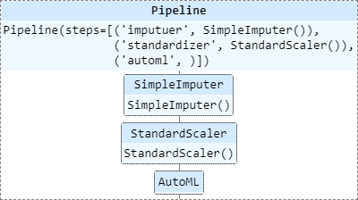

As FLAML's AutoML module can be used a transformer in the Sklearn's pipeline we can get all the benefits of pipeline.

This example requires openml==0.10.2.

### Load data

```python
from flaml.automl.data import load_openml_dataset

# Download [Airlines dataset](https://www.openml.org/d/1169) from OpenML. The task is to predict whether a given flight will be delayed, given the information of the scheduled departure.
X_train, X_test, y_train, y_test = load_openml_dataset(
    dataset_id=1169, data_dir='./', random_state=1234, dataset_format='array')
```

### Create a pipeline

```python
from sklearn import set_config
from sklearn.pipeline import Pipeline
from sklearn.impute import SimpleImputer
from sklearn.preprocessing import StandardScaler
from flaml import AutoML

set_config(display='diagram')

imputer = SimpleImputer()
standardizer = StandardScaler()
automl = AutoML()

automl_pipeline = Pipeline([
    ("imputuer",imputer),
    ("standardizer", standardizer),
    ("automl", automl)
])
automl_pipeline
```



### Run AutoML in the pipeline

```python
automl_settings = {
    "time_budget": 60,  # total running time in seconds
    "metric": "accuracy",  # primary metrics can be chosen from: ['accuracy', 'roc_auc', 'roc_auc_weighted', 'roc_auc_ovr', 'roc_auc_ovo', 'f1', 'log_loss', 'mae', 'mse', 'r2'] Check the documentation for more details (https://microsoft.github.io/FLAML/docs/Use-Cases/Task-Oriented-AutoML#optimization-metric)
    "task": "classification",  # task type
    "estimator_list": ["xgboost", "catboost", "lgbm"],
    "log_file_name": "airlines_experiment.log",  # flaml log file
}
pipeline_settings = {
    f"automl__{key}": value for key, value in automl_settings.items()
}
automl_pipeline.fit(X_train, y_train, **pipeline_settings)
```

### Get the automl object from the pipeline

```python
automl = automl_pipeline.steps[2][1]
# Get the best config and best learner
print('Best ML leaner:', automl.best_estimator)
print('Best hyperparmeter config:', automl.best_config)
print('Best accuracy on validation data: {0:.4g}'.format(1 - automl.best_loss))
print('Training duration of best run: {0:.4g} s'.format(automl.best_config_train_time))
```

[Link to notebook](https://github.com/microsoft/FLAML/blob/main/notebook/integrate_sklearn.ipynb) | [Open in colab](https://colab.research.google.com/github/microsoft/FLAML/blob/main/notebook/integrate_sklearn.ipynb)
