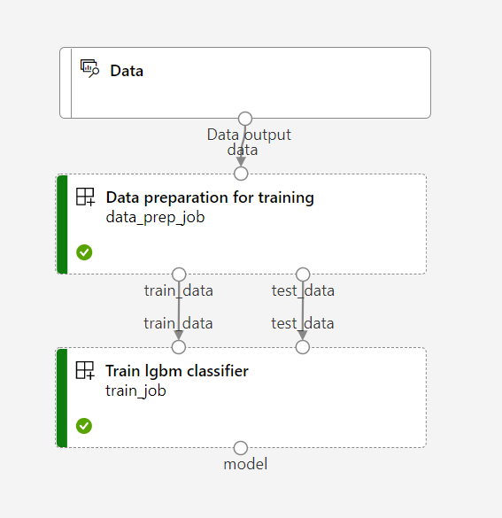

# Tune - AzureML pipeline

This example uses flaml to tune an Azure ML pipeline that fits a lightgbm classifier on the [sklearn breast cancer dataset](https://archive.ics.uci.edu/ml/datasets/Breast+Cancer+Wisconsin+(Diagnostic)).
If you already have an Azure ML pipeline, you can use the approach to tune your pipeline with flaml.

## Prepare for tuning

### Requirements

We recommend using conda or venv to create a virtual env to install the dependencies.

```bash
# set up new conda environment
conda create -n pipeline_tune python=3.8 pip=20.2 -y
conda activate pipeline_tune

# install azureml packages for runnig AzureML pipelines
pip install azureml-core==1.39.0
pip install azure-ml-component[notebooks]==0.9.10.post1
pip install azureml-dataset-runtime==1.39.0

# install hydra-core for passing AzureML pipeline parameters
pip install hydra-core==1.1.1

# install flaml
pip install flaml[blendsearch,ray]==1.0.9
```

### Azure ML training pipeline

Before we are ready for tuning, we must first have an Azure ML pipeline.
In this example, we use the following toy pipeline for illustration.
The pipeline consists of two steps: (1) data preparation and (2) model training.

.

The code example discussed in the page is included in
`test/pipeline_tuning_example/`.
We will use the relative path in the rest of the page.

### Data

The example data exsits in `data/data.csv`.
It will be uploaded to AzureML workspace to be consumed by the training pipeline
using the following code.

```python
Dataset.File.upload_directory(
    src_dir=to_absolute_path(LOCAL_DIR / "data"),
    target=(datastore, "classification_data"),
    overwrite=True,
)

dataset = Dataset.File.from_files(path=(datastore, 'classification_data'))
```

### Configurations for the pipeline

The pipeline configuration is defined in
`configs/train_config.yaml`.

```yaml
hydra:
  searchpath:
    - file://.

aml_config:
  workspace_name: your_workspace_name
  resource_group: your_resource_group
  subscription_id: your_subscription_id
  cpu_target: cpucluster

train_config:
  exp_name: sklearn_breast_cancer_classification
  test_train_ratio: 0.4
  learning_rate: 0.05
  n_estimators: 50
```

### Define and submit the pipeline

The pipeline was defined in
`submit_train_pipeline.py`.

To submit the pipeline, please specify your AzureML resources
in the `configs/train_config.yaml` and run

```bash
cd test/pipeline_tuning_example
python submit_train_pipeline.py
```

To get the pipeline ready for HPO, in the training step,
we need to log the metrics of interest to AzureML using

```python
run.log(f"{data_name}_{eval_name}", result)
```

## Hyperparameter Optimization

We are now ready to set up the HPO job for the AzureML pipeline, including:

- config the HPO job,
- set up the interaction between the HPO job and the training job.

These two steps are done in `tuner/tuner_func.py`.

### Set up the tune job

`tuner_func.tune_pipeline` sets up the search space, metric to optimize, mode, etc.

```python
def tune_pipeline(concurrent_run=1):
    start_time = time.time()

    # config the HPO job
    search_space = {
        "train_config.n_estimators": flaml.tune.randint(50, 200),
        "train_config.learning_rate": flaml.tune.uniform(0.01, 0.5),
    }

    hp_metric = "eval_binary_error"
    mode = "max"
    num_samples = 2


    if concurrent_run > 1:
        import ray  # For parallel tuning

        ray.init(num_cpus=concurrent_run)
        use_ray = True
    else:
        use_ray = False

    # launch the HPO job
    analysis = flaml.tune.run(
        run_with_config,
        config=search_space,
        metric=hp_metric,
        mode=mode,
        num_samples=num_samples,  # number of trials
        use_ray=use_ray,
    )

    # get the best config
    best_trial = analysis.get_best_trial(hp_metric, mode, "all")
    metric = best_trial.metric_analysis[hp_metric][mode]
    print(f"n_trials={len(analysis.trials)}")
    print(f"time={time.time()-start_time}")
    print(f"Best {hp_metric}: {metric:.4f}")
    print(f"Best coonfiguration: {best_trial.config}")
```

### Interact with AzureML pipeline jobs

The interaction between FLAML and AzureML pipeline jobs is in `tuner_func.run_with_config`.

```python
def run_with_config(config: dict):
    """Run the pipeline with a given config dict
    """

    # pass the hyperparameters to AzureML jobs by overwriting the config file.
    overrides = [f"{key}={value}" for key, value in config.items()]

    print(overrides)
    run = submit_train_pipeline.build_and_submit_aml_pipeline(overrides)

    print(run.get_portal_url())

    # retrieving the metrics to optimize before the job completes.
    stop = False
    while not stop:
        # get status
        status = run._core_run.get_status()
        print(f'status: {status}')

        # get metrics
        metrics = run._core_run.get_metrics(recursive=True)
        if metrics:
            run_metrics = list(metrics.values())

            new_metric = run_metrics[0]['eval_binary_error']

            if type(new_metric) == list:
                new_metric = new_metric[-1]

            print(f'eval_binary_error: {new_metric}')

            tune.report(eval_binary_error=new_metric)

        time.sleep(5)

        if status == 'FAILED' or status == 'Completed':
            stop = True

    print("The run is terminated.")
    print(status)

    return
```

Overall, to tune the hyperparameters of the AzureML pipeline, run:

```bash
# the training job will run remotely as an AzureML job in both choices
# run the tuning job locally 
python submit_tune.py --local
# run the tuning job remotely
python submit_tune.py --remote --subscription_id <your subscription_id> --resource_group <your resource_group> --workspace <your workspace>
```

The local option runs the `tuner/tuner_func.py` in your local machine.
The remote option wraps up the `tuner/tuner_func.py` as an AzureML component and
starts another AzureML job to tune the AzureML pipeline.
