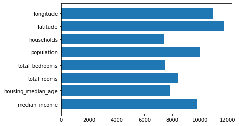
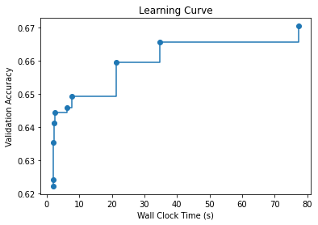

# Task Oriented AutoML

## Overview

[`flaml.AutoML`](/docs/reference/automl/automl#automl-objects) is a class for task-oriented AutoML. It can be used as a scikit-learn style estimator with the standard `fit` and `predict` functions. The minimal inputs from users are the training data and the task type.

* Training data:
    - numpy array. When the input data are stored in numpy array, they are passed to `fit()` as `X_train` and `y_train`.
    - pandas dataframe. When the input data are stored in pandas dataframe, they are passed to `fit()` either as `X_train` and `y_train`, or as `dataframe` and `label`.
* Tasks (specified via `task`):
    - 'classification': classification with tabular data.
    - 'regression': regression with tabular data.
    - 'ts_forecast': time series forecasting.
    - 'ts_forecast_classification': time series forecasting for classification.
    - 'ts_forecast_panel': time series forecasting for panel datasets (multiple time series).
    - 'rank': learning to rank.
    - 'seq-classification': sequence classification.
    - 'seq-regression': sequence regression.
    - 'summarization': text summarization.
    - 'token-classification': token classification.
    - 'multichoice-classification': multichoice classification.

Two optional inputs are `time_budget` and `max_iter` for searching models and hyperparameters. When both are unspecified, only one model per estimator will be trained (using our [zero-shot](Zero-Shot-AutoML) technique). When `time_budget` is provided, there can be randomness in the result due to runtime variance.

A typical way to use `flaml.AutoML`:

```python
# Prepare training data
# ...
from flaml import AutoML
automl = AutoML()
automl.fit(X_train, y_train, task="regression", time_budget=60, **other_settings)
# Save the model
with open("automl.pkl", "wb") as f:
    pickle.dump(automl, f, pickle.HIGHEST_PROTOCOL)

# At prediction time
with open("automl.pkl", "rb") as f:
    automl = pickle.load(f)
pred = automl.predict(X_test)
```

If users provide the minimal inputs only, `AutoML` uses the default settings for optimization metric, estimator list etc.

## Customize AutoML.fit()

### Optimization metric

The optimization metric is specified via the `metric` argument. It can be either a string which refers to a built-in metric, or a user-defined function.

* Built-in metric.
    - 'accuracy': 1 - accuracy as the corresponding metric to minimize.
    - 'log_loss': default metric for multiclass classification.
    - 'r2': 1 - r2_score as the corresponding metric to minimize. Default metric for regression.
    - 'rmse': root mean squared error.
    - 'mse': mean squared error.
    - 'mae': mean absolute error.
    - 'mape': mean absolute percentage error.
    - 'roc_auc': minimize 1 - roc_auc_score. Default metric for binary classification.
    - 'roc_auc_ovr': minimize 1 - roc_auc_score with `multi_class="ovr"`.
    - 'roc_auc_ovo': minimize 1 - roc_auc_score with `multi_class="ovo"`.
    - 'roc_auc_weighted': minimize 1 - roc_auc_score with `average="weighted"`.
    - 'roc_auc_ovr_weighted': minimize 1 - roc_auc_score with `multi_class="ovr"` and `average="weighted"`.
    - 'roc_auc_ovo_weighted': minimize 1 - roc_auc_score with `multi_class="ovo"` and `average="weighted"`.
    - 'f1': minimize 1 - f1_score.
    - 'micro_f1': minimize 1 - f1_score with `average="micro"`.
    - 'macro_f1': minimize 1 - f1_score with `average="macro"`.
    - 'ap': minimize 1 - average_precision_score.
    - 'ndcg': minimize 1 - ndcg_score.
    - 'ndcg@k': minimize 1 - ndcg_score@k. k is an integer.
* User-defined function.
A customized metric function that requires the following (input) signature, and returns the input config’s value in terms of the metric you want to minimize, and a dictionary of auxiliary information at your choice:

```python
def custom_metric(
    X_val, y_val, estimator, labels,
    X_train, y_train, weight_val=None, weight_train=None,
    config=None, groups_val=None, groups_train=None,
):
    return metric_to_minimize, metrics_to_log
```

For example,
```python
def custom_metric(
    X_val, y_val, estimator, labels,
    X_train, y_train, weight_val=None, weight_train=None,
    *args,
):
    from sklearn.metrics import log_loss
    import time

    start = time.time()
    y_pred = estimator.predict_proba(X_val)
    pred_time = (time.time() - start) / len(X_val)
    val_loss = log_loss(y_val, y_pred, labels=labels, sample_weight=weight_val)
    y_pred = estimator.predict_proba(X_train)
    train_loss = log_loss(y_train, y_pred, labels=labels, sample_weight=weight_train)
    alpha = 0.5
    return val_loss * (1 + alpha) - alpha * train_loss, {
        "val_loss": val_loss,
        "train_loss": train_loss,
        "pred_time": pred_time,
    }
```
It returns the validation loss penalized by the gap between validation and training loss as the metric to minimize, and three metrics to log: val_loss, train_loss and pred_time. The arguments `config`, `groups_val` and `groups_train` are not used in the function.

### Estimator and search space

The estimator list can contain one or more estimator names, each corresponding to a built-in estimator or a custom estimator. Each estimator has a search space for hyperparameter configurations. FLAML supports both classical machine learning models and deep neural networks.

#### Estimator
* Built-in estimator.
    - 'lgbm': LGBMEstimator for task "classification", "regression", "rank", "ts_forecast" and "ts_forecast_classification". Hyperparameters: n_estimators, num_leaves, min_child_samples, learning_rate, log_max_bin (logarithm of (max_bin + 1) with base 2), colsample_bytree, reg_alpha, reg_lambda.
    - 'xgboost': XGBoostSkLearnEstimator for task "classification", "regression", "rank", "ts_forecast" and "ts_forecast_classification". Hyperparameters: n_estimators, max_leaves, min_child_weight, learning_rate, subsample, colsample_bylevel, colsample_bytree, reg_alpha, reg_lambda.
    - 'xgb_limitdepth': XGBoostLimitDepthEstimator for task "classification", "regression", "rank", "ts_forecast" and "ts_forecast_classification". Hyperparameters: n_estimators,  max_depth, min_child_weight, learning_rate, subsample, colsample_bylevel, colsample_bytree, reg_alpha, reg_lambda.
    - 'rf': RandomForestEstimator for task "classification", "regression", "ts_forecast" and "ts_forecast_classification". Hyperparameters: n_estimators, max_features, max_leaves, criterion (for classification only). Starting from v1.1.0,
    it uses a fixed random_state by default.
    - 'extra_tree': ExtraTreesEstimator for task "classification", "regression", "ts_forecast" and "ts_forecast_classification". Hyperparameters: n_estimators, max_features, max_leaves, criterion (for classification only). Starting from v1.1.0,
    it uses a fixed random_state by default.
    - 'lrl1': LRL1Classifier (sklearn.LogisticRegression with L1 regularization) for task "classification". Hyperparameters: C.
    - 'lrl2': LRL2Classifier (sklearn.LogisticRegression with L2 regularization) for task "classification". Hyperparameters: C.
    - 'catboost': CatBoostEstimator for task "classification" and "regression". Hyperparameters: early_stopping_rounds, learning_rate, n_estimators.
    - 'kneighbor': KNeighborsEstimator for task "classification" and "regression". Hyperparameters: n_neighbors.
    - 'prophet': Prophet for task "ts_forecast". Hyperparameters: changepoint_prior_scale, seasonality_prior_scale, holidays_prior_scale, seasonality_mode.
    - 'arima': ARIMA for task "ts_forecast". Hyperparameters: p, d, q.
    - 'sarimax': SARIMAX for task "ts_forecast". Hyperparameters: p, d, q, P, D, Q, s.
    - 'holt-winters': Holt-Winters (triple exponential smoothing) model for task "ts_forecast". Hyperparameters: seasonal_perdiods, seasonal, use_boxcox, trend, damped_trend.
    - 'transformer': Huggingface transformer models for task "seq-classification", "seq-regression", "multichoice-classification", "token-classification" and "summarization". Hyperparameters: learning_rate, num_train_epochs, per_device_train_batch_size, warmup_ratio, weight_decay, adam_epsilon, seed.
    - 'temporal_fusion_transformer': TemporalFusionTransformerEstimator for task "ts_forecast_panel". Hyperparameters: gradient_clip_val, hidden_size, hidden_continuous_size, attention_head_size, dropout, learning_rate. There is a [known issue](https://github.com/jdb78/pytorch-forecasting/issues/1145) with pytorch-forecast logging.
* Custom estimator. Use custom estimator for:
    - tuning an estimator that is not built-in;
    - customizing search space for a built-in estimator.

#### Guidelines on tuning a custom estimator

To tune a custom estimator that is not built-in, you need to:
1. Build a custom estimator by inheritting [`flaml.model.BaseEstimator`](/docs/reference/automl/model#baseestimator-objects) or a derived class.
For example, if you have a estimator class with scikit-learn style `fit()` and `predict()` functions, you only need to set `self.estimator_class` to be that class in your constructor.

```python
from flaml.automl.model import SKLearnEstimator
# SKLearnEstimator is derived from BaseEstimator
import rgf


class MyRegularizedGreedyForest(SKLearnEstimator):
    def __init__(self, task="binary", **config):
        super().__init__(task, **config)

        if task in CLASSIFICATION:
        from rgf.sklearn import RGFClassifier

        self.estimator_class = RGFClassifier
        else:
        from rgf.sklearn import RGFRegressor

        self.estimator_class = RGFRegressor

    @classmethod
    def search_space(cls, data_size, task):
        space = {
        "max_leaf": {
            "domain": tune.lograndint(lower=4, upper=data_size),
            "low_cost_init_value": 4,
        },
        "n_iter": {
            "domain": tune.lograndint(lower=1, upper=data_size),
            "low_cost_init_value": 1,
        },
        "learning_rate": {"domain": tune.loguniform(lower=0.01, upper=20.0)},
        "min_samples_leaf": {
            "domain": tune.lograndint(lower=1, upper=20),
            "init_value": 20,
        },
        }
        return space
```

In the constructor, we set `self.estimator_class` as `RGFClassifier` or `RGFRegressor` according to the task type. If the estimator you want to tune does not have a scikit-learn style `fit()` and `predict()` API, you can override the `fit()` and `predict()` function of `flaml.model.BaseEstimator`, like [XGBoostEstimator](/docs/reference/automl/model#xgboostestimator-objects). Importantly, we also add the `task="binary"` parameter in the signature of `__init__` so that it doesn't get grouped together with the `**config` kwargs that determines the parameters with which the underlying estimator (`self.estimator_class`) is constructed. If your estimator doesn't use one of the parameters that it is passed, for example some regressors in `scikit-learn` don't use the `n_jobs` parameter, it is enough to add `n_jobs=None` to the signature so that it is ignored by the `**config` dict.

2. Give the custom estimator a name and add it in AutoML. E.g.,

```python
from flaml import AutoML
automl = AutoML()
automl.add_learner("rgf", MyRegularizedGreedyForest)
```

This registers the `MyRegularizedGreedyForest` class in AutoML, with the name "rgf".

3. Tune the newly added custom estimator in either of the following two ways depending on your needs:
- tune rgf alone: `automl.fit(..., estimator_list=["rgf"])`; or
- mix it with other built-in learners: `automl.fit(..., estimator_list=["rgf", "lgbm", "xgboost", "rf"])`.

#### Search space

Each estimator class, built-in or not, must have a `search_space` function. In the `search_space` function, we return a dictionary about the hyperparameters, the keys of which are the names of the hyperparameters to tune, and each value is a set of detailed search configurations about the corresponding hyperparameters represented in a dictionary. A search configuration dictionary includes the following fields:
* `domain`, which specifies the possible values of the hyperparameter and their distribution. Please refer to [more details about the search space domain](Tune-User-Defined-Function#more-details-about-the-search-space-domain).
* `init_value` (optional), which specifies the initial value of the hyperparameter.
* `low_cost_init_value`(optional), which specifies the value of the hyperparameter that is associated with low computation cost. See [cost related hyperparameters](Tune-User-Defined-Function#cost-related-hyperparameters) or [FAQ](/docs/FAQ#about-low_cost_partial_config-in-tune) for more details.

In the example above, we tune four hyperparameters, three integers and one float. They all follow a log-uniform distribution. "max_leaf" and "n_iter" have "low_cost_init_value" specified as their values heavily influence the training cost.

To customize the search space for a built-in estimator, use a similar approach to define a class that inherits the existing estimator. For example,

```python
from flaml.automl.model import XGBoostEstimator


def logregobj(preds, dtrain):
    labels = dtrain.get_label()
    preds = 1.0 / (1.0 + np.exp(-preds))  # transform raw leaf weight
    grad = preds - labels
    hess = preds * (1.0 - preds)
    return grad, hess


class MyXGB1(XGBoostEstimator):
    """XGBoostEstimator with logregobj as the objective function"""

    def __init__(self, **config):
        super().__init__(objective=logregobj, **config)
```

We override the constructor and set the training objective as a custom function `logregobj`. The hyperparameters and their search range do not change. For another example,

```python
class XGBoost2D(XGBoostSklearnEstimator):
    @classmethod
    def search_space(cls, data_size, task):
        upper = min(32768, int(data_size))
        return {
            "n_estimators": {
                "domain": tune.lograndint(lower=4, upper=upper),
                "low_cost_init_value": 4,
            },
            "max_leaves": {
                "domain": tune.lograndint(lower=4, upper=upper),
                "low_cost_init_value": 4,
            },
        }
```

We override the `search_space` function to tune two hyperparameters only, "n_estimators" and "max_leaves". They are both random integers in the log space, ranging from 4 to data-dependent upper bound. The lower bound for each corresponds to low training cost, hence the "low_cost_init_value" for each is set to 4.

##### A shortcut to override the search space

One can use the `custom_hp` argument in [`AutoML.fit()`](/docs/reference/automl/automl#fit) to override the search space for an existing estimator quickly. For example, if you would like to temporarily change the search range of "n_estimators" of xgboost, disable searching "max_leaves" in random forest, and add "subsample" in the search space of lightgbm, you can set:

```python
custom_hp = {
    "xgboost": {
        "n_estimators": {
            "domain": tune.lograndint(lower=new_lower, upper=new_upper),
            "low_cost_init_value": new_lower,
        },
    },
    "rf": {
        "max_leaves": {
            "domain": None,  # disable search
        },
    },
    "lgbm": {
        "subsample": {
            "domain": tune.uniform(lower=0.1, upper=1.0),
            "init_value": 1.0,
        },
        "subsample_freq": {
            "domain": 1,  # subsample_freq must > 0 to enable subsample
        },
    },
}
```

### Constraint

There are several types of constraints you can impose.

1. Constraints on the AutoML process.

- `time_budget`: constrains the wall-clock time (seconds) used by the AutoML process. We provide some tips on [how to set time budget](#how-to-set-time-budget).

- `max_iter`: constrains the maximal number of models to try in the AutoML process.

2. Constraints on the constructor arguments of the estimators.

Some constraints on the estimator can be implemented via the custom learner. For example,

```python
class MonotonicXGBoostEstimator(XGBoostSklearnEstimator):
    @classmethod
    def search_space(**args):
        space = super().search_space(**args)
        space.update({"monotone_constraints": {"domain": "(1, -1)"}})
        return space
```

It adds a monotonicity constraint to XGBoost. This approach can be used to set any constraint that is an argument in the underlying estimator's constructor.
A shortcut to do this is to use the [`custom_hp`](#a-shortcut-to-override-the-search-space) argument:

```python
custom_hp = {
    "xgboost": {
        "monotone_constraints": {
            "domain": "(1, -1)"  # fix the domain as a constant
        }
    }
}
```

3. Constraints on the models tried in AutoML.

Users can set constraints such as the maximal number of models to try, limit on training time and prediction time per model.
* `train_time_limit`: training time in seconds.
* `pred_time_limit`: prediction time per instance in seconds.

For example,
```python
automl.fit(X_train, y_train, max_iter=100, train_time_limit=1, pred_time_limit=1e-3)
```

4. Constraints on the metrics of the ML model tried in AutoML.

When users provide a [custom metric function](#optimization-metric), which returns a primary optimization metric and a dictionary of additional metrics (typically also about the model) to log, users can also specify constraints on one or more of the metrics in the dictionary of additional metrics.

Users need to provide a list of such constraints in the following format:
Each element in this list is a 3-tuple, which shall be expressed
in the following format: the first element of the 3-tuple is the name of the
metric, the second element is the inequality sign chosen from ">=" and "<=",
and the third element is the constraint value. E.g., `('val_loss', '<=', 0.1)`.

For example,
```python
metric_constraints = [("train_loss", "<=", 0.1), ("val_loss", "<=", 0.1)]
automl.fit(X_train, y_train, max_iter=100, train_time_limit=1, metric_constraints=metric_constraints)
```

### Ensemble

To use stacked ensemble after the model search, set `ensemble=True` or a dict. When `ensemble=True`, the final estimator and `passthrough` in the stacker will be automatically chosen. You can specify customized final estimator or passthrough option:
* "final_estimator": an instance of the final estimator in the stacker.
* "passthrough": True (default) or False, whether to pass the original features to the stacker.

For example,
```python
automl.fit(
    X_train, y_train, task="classification",
    "ensemble": {
        "final_estimator": LogisticRegression(),
        "passthrough": False,
    },
)
```

### Resampling strategy

By default, flaml decides the resampling automatically according to the data size and the time budget. If you would like to enforce a certain resampling strategy, you can set `eval_method` to be "holdout" or "cv" for holdout or cross-validation.

For holdout, you can also set:
* `split_ratio`: the fraction for validation data, 0.1 by default.
* `X_val`, `y_val`: a separate validation dataset. When they are passed, the validation metrics will be computed against this given validation dataset. If they are not passed, then a validation dataset will be split from the training data and held out from training during the model search. After the model search, flaml will retrain the model with best configuration on the full training data.
You can set`retrain_full` to be `False` to skip the final retraining or "budget" to ask flaml to do its best to retrain within the time budget.

For cross validation, you can also set `n_splits` of the number of folds. By default it is 5.

#### Data split method

flaml relies on the provided task type to infer the default splitting strategy:
* stratified split for classification;
* uniform split for regression;
* time-based split for time series forecasting;
* group-based split for learning to rank.

The data split method for classification can be changed into uniform split by setting `split_type="uniform"`. The data are shuffled when `split_type in ("uniform", "stratified")`.

For both classification and regression tasks more advanced split configurations are possible:
- time-based split can be enforced if the data are sorted by timestamps, by setting `split_type="time"`,
- group-based splits can be set by using `split_type="group"` while providing the group identifier for each sample through the `groups` argument. This is also shown in an [example notebook](https://github.com/microsoft/FLAML/blob/main/notebook/basics/understanding_cross_validation.ipynb).

More in general, `split_type` can also be set as a custom splitter object, when `eval_method="cv"`. It needs to be an instance of a derived class of scikit-learn
[KFold](https://scikit-learn.org/stable/modules/generated/sklearn.model_selection.KFold.html#sklearn.model_selection.KFold)
and have ``split`` and ``get_n_splits`` methods with the same signatures.  To disable shuffling, the splitter instance must contain the attribute `shuffle=False`.

### Parallel tuning

When you have parallel resources, you can either spend them in training and keep the model search sequential, or perform parallel search. Following scikit-learn, the parameter `n_jobs` specifies how many CPU cores to use for each training job. The number of parallel trials is specified via the parameter `n_concurrent_trials`. By default, `n_jobs=-1, n_concurrent_trials=1`. That is, all the CPU cores (in a single compute node) are used for training a single model and the search is sequential. When you have more resources than what each single training job needs, you can consider increasing `n_concurrent_trials`.

FLAML now support two backends for parallel tuning, i.e., `Ray` and `Spark`. You can use either of them, but not both for one tuning job.

#### Parallel tuning with Ray

To do parallel tuning with Ray, install the `ray` and `blendsearch` options:
```bash
pip install flaml[ray,blendsearch]
```

`ray` is used to manage the resources. For example,
```python
ray.init(num_cpus=16)
```
allocates 16 CPU cores. Then, when you run:
```python
automl.fit(X_train, y_train, n_jobs=4, n_concurrent_trials=4)
```
flaml will perform 4 trials in parallel, each consuming 4 CPU cores. The parallel tuning uses the [BlendSearch](Tune-User-Defined-Function##blendsearch-economical-hyperparameter-optimization-with-blended-search-strategy) algorithm.

#### Parallel tuning with Spark

To do parallel tuning with Spark, install the `spark` and `blendsearch` options:

> *Spark support is added in v1.1.0*
```bash
pip install flaml[spark,blendsearch]>=1.1.0
```

For more details about installing Spark, please refer to [Installation](/docs/Installation#distributed-tuning).

An example of using Spark for parallel tuning is:
```python
automl.fit(X_train, y_train, n_concurrent_trials=4, use_spark=True)
```
Details about parallel tuning with Spark could be found [here](/docs/Examples/Integrate%20-%20Spark#parallel-spark-jobs). For Spark clusters, by default, we will launch one trial per executor. However, sometimes we want to launch more trials than the number of executors (e.g., local mode). In this case, we can set the environment variable `FLAML_MAX_CONCURRENT` to override the detected `num_executors`. The final number of concurrent trials will be the minimum of `n_concurrent_trials` and `num_executors`. Also, GPU training is not supported yet when use_spark is True.

#### **Guidelines on parallel vs sequential tuning**

**(1) Considerations on wall-clock time.**

One common motivation for parallel tuning is to save wall-clock time. When sequential tuning and parallel tuning achieve a similar wall-clock time, sequential tuning should be preferred. This is a rule of thumb when the HPO algorithm is sequential by nature (e.g., Bayesian Optimization and FLAML's HPO algorithms CFO and BS). Sequential tuning allows the HPO algorithms to take advantage of the historical trial results. Then the question is **How to estimate the wall-clock-time needed by parallel tuning and sequential tuning**?

You can use the following way to roughly estimate the wall-clock time in parallel tuning and sequential tuning: To finish $N$ trials of hyperparameter tuning, i.e., run $N$ hyperparameter configurations, the total wall-clock time needed is $N/k*(SingleTrialTime + Overhead)$, in which $SingleTrialTime$ is the trial time to evaluate a particular hyperparameter configuration, $k$ is the scale of parallelism, e.g., the number of parallel CPU/GPU cores, and $Overhead$ is the computation overhead.

In sequential tuning, $k=1$, and in parallel tuning $k>1$. This may suggest that parallel tuning has a shorter wall-clock time. But it is not always the case considering the other two factors $SingleTrialTime$, and $Overhead$:

- The $Overhead$ in sequential tuning is typically negligible; while in parallel tuning, it is relatively large.

- You can also try to reduce the $SingleTrialTime$ to reduce the wall-clock time in sequential tuning: For example, by increasing the resource consumed by a single trial (distributed or multi-thread training), you can reduce $SingleTrialTime$. One concrete example is to use the `n_jobs` parameter that sets the number of threads the fitting process can use in many scikit-learn style algorithms.

**(2) Considerations on randomness.**

Potential reasons that cause randomness:
1. Parallel tuning: In the case of parallel tuning, the order of trials' finishing time is no longer deterministic. This non-deterministic order, combined with sequential HPO algorithms, leads to a non-deterministic hyperparameter tuning trajectory.

2. Distributed or multi-thread training: Distributed/multi-thread training may introduce randomness in model training, i.e., the trained model with the same hyperparameter may be different because of such randomness. This model-level randomness may be undesirable in some cases.

### Warm start

We can warm start the AutoML by providing starting points of hyperparameter configurstions for each estimator. For example, if you have run AutoML for one hour, after checking the results, you would like to run it for another two hours, then you can use the best configurations found for each estimator as the starting points for the new run.

```python
automl1 = AutoML()
automl1.fit(X_train, y_train, time_budget=3600)
automl2 = AutoML()
automl2.fit(X_train, y_train, time_budget=7200, starting_points=automl1.best_config_per_estimator)
```

`starting_points` is a dictionary or a str to specify the starting hyperparameter config. (1) When it is a dictionary, the keys are the estimator names. If you do not need to specify starting points for an estimator, exclude its name from the dictionary. The value for each key can be either a dictionary of a list of dictionaries, corresponding to one hyperparameter configuration, or multiple hyperparameter configurations, respectively. (2) When it is a str: if "data", use data-dependent defaults; if "data:path", use data-dependent defaults which are stored at path; if "static", use data-independent defaults. Please find more details about data-dependent defaults in [zero shot AutoML](Zero-Shot-AutoML#combine-zero-shot-automl-and-hyperparameter-tuning).

### Log the trials

The trials are logged in a file if a `log_file_name` is passed.
Each trial is logged as a json record in one line. The best trial's id is logged in the last line. For example,
```
{"record_id": 0, "iter_per_learner": 1, "logged_metric": null, "trial_time": 0.12717914581298828, "wall_clock_time": 0.1728971004486084, "validation_loss": 0.07333333333333332, "config": {"n_estimators": 4, "num_leaves": 4, "min_child_samples": 20, "learning_rate": 0.09999999999999995, "log_max_bin": 8, "colsample_bytree": 1.0, "reg_alpha": 0.0009765625, "reg_lambda": 1.0}, "learner": "lgbm", "sample_size": 150}
{"record_id": 1, "iter_per_learner": 3, "logged_metric": null, "trial_time": 0.07027268409729004, "wall_clock_time": 0.3756711483001709, "validation_loss": 0.05333333333333332, "config": {"n_estimators": 4, "num_leaves": 4, "min_child_samples": 12, "learning_rate": 0.2677050123105203, "log_max_bin": 7, "colsample_bytree": 1.0, "reg_alpha": 0.001348364934537134, "reg_lambda": 1.4442580148221913}, "learner": "lgbm", "sample_size": 150}
{"curr_best_record_id": 1}
```

1. `iter_per_learner` means how many models have been tried for each learner. The reason you see records like `iter_per_learner=3` for `record_id=1` is that flaml only logs better configs than the previous iters by default, i.e., `log_type='better'`. If you use `log_type='all'` instead, all the trials will be logged.
1. `trial_time` means the time taken to train and evaluate one config in that trial. `total_search_time` is the total time spent from the beginning of `fit()`.
1. flaml will adjust the `n_estimators` for lightgbm etc. according to the remaining budget and check the time budget constraint and stop in several places. Most of the time that makes `fit()` stops before the given budget. Occasionally it may run over the time budget slightly. But the log file always contains the best config info and you can recover the best model until any time point using `retrain_from_log()`.

We can also use mlflow for logging:
```python
mlflow.set_experiment("flaml")
with mlflow.start_run():
    automl.fit(X_train=X_train, y_train=y_train, **settings)
```

To disable mlflow logging pre-configured in FLAML, set `mlflow_logging=False`:
```python
automl = AutoML(mlflow_logging=False)
```
or
```python
automl.fit(X_train=X_train, y_train=y_train, mlflow_logging=False, **settings)
```

Setting `mlflow_logging=False` in the constructor will disable mlflow logging for all the `fit()` calls.
Setting `mlflow_logging=False` in `fit()` will disable mlflow logging for that `fit()` call only.

### Extra fit arguments

Extra fit arguments that are needed by the estimators can be passed to `AutoML.fit()`. For example, if there is a weight associated with each training example, they can be passed via `sample_weight`. For another example, `period` can be passed for time series forecaster. For any extra keywork argument passed to `AutoML.fit()` which has not been explicitly listed in the function signature, it will be passed to the underlying estimators' `fit()` as is. For another example, you can set the number of gpus used by each trial with the `gpu_per_trial` argument, which is only used by TransformersEstimator and XGBoostSklearnEstimator.

In addition, you can specify the different arguments needed by different estimators using the `fit_kwargs_by_estimator` argument. For example, you can set the custom arguments for a Transformers model:

```python
from flaml.automl.data import load_openml_dataset
from flaml import AutoML

X_train, X_test, y_train, y_test = load_openml_dataset(dataset_id=1169, data_dir="./")

automl = AutoML()
automl_settings = {
    "task": "classification",
    "time_budget": 10,
    "estimator_list": ["catboost", "rf"],
    "fit_kwargs_by_estimator": {
        "catboost": {
            "verbose": True,  # setting the verbosity of catboost to True
        }
    },
}
automl.fit(X_train=X_train, y_train=y_train, **automl_settings)
```

## Retrieve the Outcomes

### Get best model

The best model can be obtained by the `model` property of an `AutoML` instance. For example,

```python
automl.fit(X_train, y_train, task="regression")
print(automl.model)
# <flaml.model.LGBMEstimator object at 0x7f9b502c4550>
```

[`flaml.model.LGBMEstimator`](/docs/reference/automl/model#lgbmestimator-objects) is a wrapper class for LightGBM models. To access the underlying model, use the `estimator` property of the `flaml.model.LGBMEstimator` instance.

```python
print(automl.model.estimator)
'''
LGBMRegressor(colsample_bytree=0.7610534336273627,
              learning_rate=0.41929025492645006, max_bin=255,
              min_child_samples=4, n_estimators=45, num_leaves=4,
              reg_alpha=0.0009765625, reg_lambda=0.009280655005879943,
              verbose=-1)
'''
```

Just like a normal LightGBM model, we can inspect it. For example, we can plot the feature importance:
```python
import matplotlib.pyplot as plt
plt.barh(automl.model.estimator.feature_name_, automl.model.estimator.feature_importances_)
```


### Get best configuration

We can find the best estimator's name and best configuration by:

```python
print(automl.best_estimator)
# lgbm
print(automl.best_config)
# {'n_estimators': 148, 'num_leaves': 18, 'min_child_samples': 3, 'learning_rate': 0.17402065726724145, 'log_max_bin': 8, 'colsample_bytree': 0.6649148062238498, 'reg_alpha': 0.0009765625, 'reg_lambda': 0.0067613624509965}
```

We can also find the best configuration per estimator.

```python
print(automl.best_config_per_estimator)
# {'lgbm': {'n_estimators': 148, 'num_leaves': 18, 'min_child_samples': 3, 'learning_rate': 0.17402065726724145, 'log_max_bin': 8, 'colsample_bytree': 0.6649148062238498, 'reg_alpha': 0.0009765625, 'reg_lambda': 0.0067613624509965}, 'rf': None, 'catboost': None, 'xgboost': {'n_estimators': 4, 'max_leaves': 4, 'min_child_weight': 1.8630223791106992, 'learning_rate': 1.0, 'subsample': 0.8513627344387318, 'colsample_bylevel': 1.0, 'colsample_bytree': 0.946138073111236, 'reg_alpha': 0.0018311776973217073, 'reg_lambda': 0.27901659190538414}, 'extra_tree': {'n_estimators': 4, 'max_features': 1.0, 'max_leaves': 4}}
```

The `None` value corresponds to the estimators which have not been tried.

Other useful information:
```python
print(automl.best_config_train_time)
# 0.24841618537902832
print(automl.best_iteration)
# 10
print(automl.best_loss)
# 0.15448622217577546
print(automl.time_to_find_best_model)
# 0.4167296886444092
print(automl.config_history)
# {0: ('lgbm', {'n_estimators': 4, 'num_leaves': 4, 'min_child_samples': 20, 'learning_rate': 0.09999999999999995, 'log_max_bin': 8, 'colsample_bytree': 1.0, 'reg_alpha': 0.0009765625, 'reg_lambda': 1.0}, 1.2300517559051514)}
# Meaning: at iteration 0, the config tried is {'n_estimators': 4, 'num_leaves': 4, 'min_child_samples': 20, 'learning_rate': 0.09999999999999995, 'log_max_bin': 8, 'colsample_bytree': 1.0, 'reg_alpha': 0.0009765625, 'reg_lambda': 1.0} for lgbm, and the wallclock time is 1.23s when this trial is finished.
```

### Plot learning curve

To plot how the loss is improved over time during the model search, first load the search history from the log file:

```python
from flaml.automl.data import get_output_from_log

time_history, best_valid_loss_history, valid_loss_history, config_history, metric_history =
    get_output_from_log(filename=settings["log_file_name"], time_budget=120)
```

Then, assuming the optimization metric is "accuracy", we can plot the accuracy versus wallclock time:

```python
import matplotlib.pyplot as plt
import numpy as np

plt.title("Learning Curve")
plt.xlabel("Wall Clock Time (s)")
plt.ylabel("Validation Accuracy")
plt.step(time_history, 1 - np.array(best_valid_loss_history), where="post")
plt.show()
```



The curve suggests that increasing the time budget may further improve the accuracy.

### How to set time budget

* If you have an exact constraint for the total search time, set it as the time budget.
* If you have flexible time constraints, for example, your desirable time budget is t1=60s, and the longest time budget you can tolerate is t2=3600s, you can try the following two ways:
1. set t1 as the time budget, and check the message in the console log in the end. If the budget is too small, you will see a warning like
> WARNING - Time taken to find the best model is 91% of the provided time budget and not all estimators' hyperparameter search converged. Consider increasing the time budget.
2. set t2 as the time budget, and also set `early_stop=True`. If the early stopping is triggered, you will see a warning like
> WARNING - All estimator hyperparameters local search has converged at least once, and the total search time exceeds 10 times the time taken to find the best model.

 > WARNING - Stopping search as early_stop is set to True.

### How much time is needed to find the best model

If you want to get a sense of how much time is needed to find the best model, you can use `max_iter=2` to perform two trials first. The message will be like:
> INFO - iteration 0, current learner lgbm

> INFO - Estimated sufficient time budget=145194s. Estimated necessary time budget=2118s.

> INFO -  at 2.6s,  estimator lgbm's best error=0.4459,     best estimator lgbm's best error=0.4459

You will see that the time to finish the first and cheapest trial is 2.6 seconds. The estimated necessary time budget is 2118 seconds, and the estimated sufficient time budget is 145194 seconds. Note that this is only an estimated range to help you decide your budget.

When the time budget is set too low, it can happen that no estimator is trained at all within the budget. In this case, it is recommanded to use `max_iter` instead of `time_budget`. This ensures that you have enough time to train a model without worring about variance of the execution time for the code before starting a trainning.
