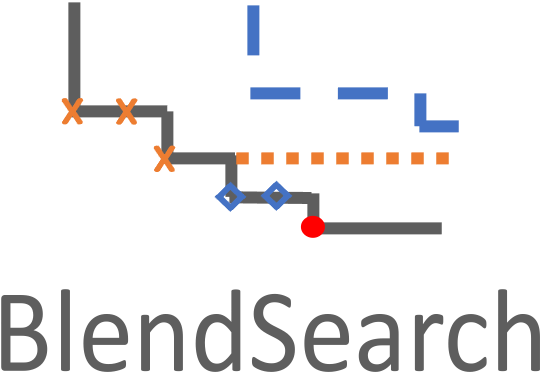

# Tune User Defined Function

[`flaml.tune`](../reference/tune/tune) is a module for economical hyperparameter tuning. It is used internally by `flaml.AutoML`. It can also be used to directly tune a user-defined function (UDF), which is not limited to machine learning model training. You can use `flaml.tune` instead of `flaml.AutoML` if one of the following is true:

1. Your machine learning task is not one of the built-in tasks from `flaml.AutoML`.
1. Your input cannot be represented as X_train + y_train or dataframe + label.
1. You want to tune a function that may not even be a machine learning procedure.

## Basic Tuning Procedure

There are three essential steps (assuming the knowledge of the set of hyperparameters to tune) to use `flaml.tune` to finish a basic tuning task:
1. Specify the [tuning objective](#tuning-objective) with respect to the hyperparameters.
1. Specify a [search space](#search-space) of the hyperparameters.
1. Specify [tuning constraints](#tuning-constraints), including constraints on the resource budget to do the tuning, constraints on the configurations, or/and constraints on a (or multiple) particular metric(s).

With these steps, you can [perform a basic tuning task](#put-together) accordingly.

### Tuning objective

Related arguments:
- `evaluation_function`: A user-defined evaluation function.
- `metric`: A string of the metric name to optimize for.
- `mode`:  A string in ['min', 'max'] to specify the objective as minimization or maximization.

The first step is to specify your tuning objective.
To do it, you should first specify your evaluation procedure (e.g., perform a machine learning model training and validation) with respect to the hyperparameters in a user-defined function `evaluation_function`.
The function requires a hyperparameter configuration as input, and can simply return a metric value in a scalar or return a dictionary of metric name and metric value pairs.

In the following code, we define an evaluation function with respect to two hyperparameters named `x` and `y` according to $obj := (x-85000)^2 - x/y$. Note that we use this toy example here for more accessible demonstration purposes. In real use cases, the evaluation function usually cannot be written in this closed form, but instead involves a black-box and expensive evaluation procedure.  Please check out [Tune HuggingFace](../Examples/Tune-HuggingFace), [Tune PyTorch](../Examples/Tune-PyTorch) and [Tune LightGBM](../Getting-Started#tune-user-defined-function) for real examples of tuning tasks.

```python
import time

def evaluate_config(config: dict):
    """evaluate a hyperparameter configuration"""
    score = (config["x"] - 85000) ** 2 - config["x"] / config["y"]
    # usually the evaluation takes an non-neglible cost
    # and the cost could be related to certain hyperparameters
    # here we simulate this cost by calling the time.sleep() function
    # here we assume the cost is proportional to x
    faked_evaluation_cost = config["x"] / 100000
    time.sleep(faked_evaluation_cost)
    # we can return a single float as a score on the input config:
    # return score
    # or, we can return a dictionary that maps metric name to metric value:
    return {"score": score, "evaluation_cost": faked_evaluation_cost, "constraint_metric": x * y}
```

When the evaluation function returns a dictionary of metrics, you need to specify the name of the metric to optimize via the argument `metric` (this can be skipped when the function is just returning a scalar). In addition, you need to specify a mode of your optimization/tuning task (maximization or minimization) via the argument `mode` by choosing from "min" or "max".

For example,

```python
flaml.tune.run(evaluation_function=evaluate_config, metric="score", mode="min", ...)
```

### Search space

Related arguments:
- `config`: A dictionary to specify the search space.
- `low_cost_partial_config` (optional): A dictionary from a subset of controlled dimensions to the initial low-cost values.
- `cat_hp_cost` (optional): A dictionary from a subset of categorical dimensions to the relative cost of each choice.

The second step is to specify a search space of the hyperparameters through the argument `config`. In the search space, you need to specify valid values for your hyperparameters and can specify how these values are sampled (e.g., from a uniform distribution or a log-uniform distribution).

In the following code example, we include a search space for the two hyperparameters `x` and `y` as introduced above. The valid values for both are integers in the range of [1, 100000]. The values for `x` are sampled uniformly in the specified range (using `tune.randint(lower=1, upper=100000)`), and the values for `y` are sampled uniformly in logarithmic space of the specified range (using `tune.lograndit(lower=1, upper=100000)`).


```python
from flaml import tune

# construct a search space for the hyperparameters x and y.
config_search_space = {
    "x": tune.lograndint(lower=1, upper=100000),
    "y": tune.randint(lower=1, upper=100000)
}  

# provide the search space to tune.run
tune.run(..., config=config_search_space, ...)
```

#### More details about the search space domain

The corresponding value of a particular hyperparameter in the search space dictionary is called a domain, for example, `tune.randint(lower=1, upper=100000)` is the domain for the hyperparameter `y`. The domain specifies a type and valid range to sample parameters from. Supported types include float, integer, and categorical. You can also specify how to sample values from certain distributions in linear scale or log scale.
It is a common practice to sample in log scale if the valid value range is large and the evaluation function changes more regularly with respect to the log domain.
See the example below for the commonly used types of domains.

```python
config = {
    # Sample a float uniformly between -5.0 and -1.0
    "uniform": tune.uniform(-5, -1),

    # Sample a float uniformly between 3.2 and 5.4,
    # rounding to increments of 0.2
    "quniform": tune.quniform(3.2, 5.4, 0.2),

    # Sample a float uniformly between 0.0001 and 0.01, while
    # sampling in log space
    "loguniform": tune.loguniform(1e-4, 1e-2),

    # Sample a float uniformly between 0.0001 and 0.1, while
    # sampling in log space and rounding to increments of 0.00005
    "qloguniform": tune.qloguniform(1e-4, 1e-1, 5e-5),

    # Sample a random float from a normal distribution with
    # mean=10 and sd=2
    "randn": tune.randn(10, 2),

    # Sample a random float from a normal distribution with
    # mean=10 and sd=2, rounding to increments of 0.2
    "qrandn": tune.qrandn(10, 2, 0.2),

    # Sample a integer uniformly between -9 (inclusive) and 15 (exclusive)
    "randint": tune.randint(-9, 15),

    # Sample a random uniformly between -21 (inclusive) and 12 (inclusive (!))
    # rounding to increments of 3 (includes 12)
    "qrandint": tune.qrandint(-21, 12, 3),

    # Sample a integer uniformly between 1 (inclusive) and 10 (exclusive),
    # while sampling in log space
    "lograndint": tune.lograndint(1, 10),

    # Sample a integer uniformly between 2 (inclusive) and 10 (inclusive (!)),
    # while sampling in log space and rounding to increments of 2
    "qlograndint": tune.qlograndint(2, 10, 2),

    # Sample an option uniformly from the specified choices
    "choice": tune.choice(["a", "b", "c"]),
}
```
<!-- Please refer to [ray.tune](https://docs.ray.io/en/latest/tune/api_docs/search_space.html#overview) for a more comprehensive introduction about possible choices of the domain. -->

#### Cost-related hyperparameters

Cost-related hyperparameters are a subset of the hyperparameters which directly affect the computation cost incurred in the evaluation of any hyperparameter configuration. For example, the number of estimators (`n_estimators`) and the maximum number of leaves (`max_leaves`) are known to affect the training cost of tree-based learners. So they are cost-related hyperparameters for tree-based learners.

When cost-related hyperparameters exist, the evaluation cost in the search space is heterogeneous.
In this case, designing a search space with proper ranges of the hyperparameter values is highly non-trivial. Classical tuning algorithms such as Bayesian optimization and random search are typically sensitive to such ranges.  It may take them a very high cost to find a good choice if the ranges are too large. And if the ranges are too small, the optimal choice(s) may not be included and thus not possible to be found. With our method, you can use a search space with larger ranges in the case of heterogeneous cost.

Our search algorithms are designed to finish the tuning process at a low total cost when the evaluation cost in the search space is heterogeneous.
So in such scenarios, if you are aware of low-cost configurations for the cost-related hyperparameters, you are encouraged to set them as the `low_cost_partial_config`, which is a dictionary of a subset of the hyperparameter coordinates whose value corresponds to a configuration with known low cost.  Using the example of the tree-based methods again, since we know that small `n_estimators` and `max_leaves` generally correspond to simpler models and thus lower cost, we set `{'n_estimators': 4, 'max_leaves': 4}` as the `low_cost_partial_config` by default (note that 4 is the lower bound of search space for these two hyperparameters), e.g., in LGBM. Please find more details on how the algorithm works [here](#cfo-frugal-optimization-for-cost-related-hyperparameters).


In addition, if you are aware of the cost relationship between different categorical hyperparameter choices, you are encouraged to provide this information through `cat_hp_cost`. It also helps the search algorithm to reduce the total cost.

### Tuning constraints

Related arguments:
- `time_budget_s`: The time budget in seconds.
- `num_samples`: An integer of the number of configs to try.
- `config_constraints` (optional): A list of config constraints to be satisfied.
- `metric_constraints` (optional): A list of metric constraints to be satisfied. e.g., `['precision', '>=', 0.9]`.

The third step is to specify constraints of the tuning task. One notable property of `flaml.tune` is that it is able to finish the tuning process (obtaining good results) within a required resource constraint. A user can either provide the resource constraint in terms of wall-clock time (in seconds) through the argument `time_budget_s`, or in terms of the number of trials through the argument `num_samples`.  The following example shows three use cases:

```python
# Set a resource constraint of 60 seconds wall-clock time for the tuning.
flaml.tune.run(..., time_budget_s=60, ...)

# Set a resource constraint of 100 trials for the tuning.
flaml.tune.run(..., num_samples=100, ...)

# Use at most 60 seconds and at most 100 trials for the tuning.
flaml.tune.run(..., time_budget_s=60, num_samples=100, ...)
```


Optionally, you can provide a list of config constraints to be satisfied through the argument `config_constraints` and provide a list of metric constraints to be satisfied through the argument `metric_constraints`. We provide more details about related use cases in the [Advanced Tuning Options](#more-constraints-on-the-tuning) section.


### Put together
After the aforementioned key steps, one is ready to perform a tuning task by calling [`flaml.tune.run()`](../reference/tune/tune#run). Below is a quick sequential tuning example using the pre-defined search space `config_search_space` and a minimization (`mode='min'`) objective for the `score` metric evaluated in `evaluate_config`, using the default serach algorithm in flaml. The time budget is 10 seconds (`time_budget_s=10`).
```python
# require: pip install flaml[blendsearch]
analysis = tune.run(
    evaluate_config,  # the function to evaluate a config
    config=config_search_space,  # the search space defined
    metric="score",
    mode="min",  # the optimization mode, "min" or "max"
    num_samples=-1,  # the maximal number of configs to try, -1 means infinite
    time_budget_s=10,  # the time budget in seconds
)
```


### Result analysis

Once the tuning process finishes, it returns an [ExperimentAnalysis](../reference/tune/analysis) object, which provides methods to analyze the tuning.

In the following code example, we retrieve the best configuration found during the tuning, and retrieve the best trial's result from the returned `analysis`.

```python
analysis = tune.run(
    evaluate_config,  # the function to evaluate a config
    config=config_search_space,  # the search space defined
    metric="score",
    mode="min",  # the optimization mode, "min" or "max"
    num_samples=-1,  # the maximal number of configs to try, -1 means infinite
    time_budget_s=10,  # the time budget in seconds
)
print(analysis.best_config)  # the best config
print(analysis.best_trial.last_result)  # the best trial's result
```

## Advanced Tuning Options

There are several advanced tuning options worth mentioning.

### More constraints on the tuning

A user can specify constraints on the configurations to be satisfied via the argument `config_constraints`. The `config_constraints` receives a list of such constraints to be satisfied. Specifically, each constraint is a tuple that consists of (1) a function that takes a configuration as input and returns a numerical value; (2) an operation chosen from "<=", ">=", "<" or ">"; (3) a numerical threshold.

In the following code example, we constrain the output of `area`, which takes a configuration as input and outputs a numerical value, to be no larger than 1000.

```python
def area(config):
    return config["width"] * config["height"]

flaml.tune.run(evaluation_function=evaluate_config, mode="min",
               config=config_search_space,
               config_constraints=[(area, "<=", 1000)], ...)
```

 You can also specify a list of metric constraints to be satisfied via the argument `metric_constraints`. Each element in the `metric_constraints` list is a tuple that consists of (1) a string specifying the name of the metric (the metric name must be defined and returned in the user-defined `evaluation_function`); (2) an operation chosen from "<=" or ">="; (3) a numerical threshold.  

 In the following code example, we constrain the metric `score` to be no larger than 0.4.

```python
flaml.tune.run(evaluation_function=evaluate_config, mode="min",
               config=config_search_space,
               metric_constraints=[("score", "<=", 0.4)],...)
```

### Parallel tuning

Related arguments:

- `use_ray`: A boolean of whether to use ray as the backend.
- `resources_per_trial`: A dictionary of the hardware resources to allocate per trial, e.g., `{'cpu': 1}`. Only valid when using ray backend.


You can perform parallel tuning by specifying `use_ray=True` (requiring flaml[ray] option installed). You can also limit the amount of resources allocated per trial by specifying `resources_per_trial`, e.g., `resources_per_trial={'cpu': 2}`.

```python
# require: pip install flaml[ray]
analysis = tune.run(
    evaluate_config,  # the function to evaluate a config
    config=config_search_space,  # the search space defined
    metric="score",
    mode="min",  # the optimization mode, "min" or "max"
    num_samples=-1,  # the maximal number of configs to try, -1 means infinite
    time_budget_s=10,  # the time budget in seconds
    use_ray=True,
    resources_per_trial={"cpu": 2}  # limit resources allocated per trial
)
print(analysis.best_trial.last_result)  # the best trial's result
print(analysis.best_config)  # the best config
```

**A headsup about computation overhead.** When parallel tuning is used, there will be a certain amount of computation overhead in each trial. In case each trial's original cost is much smaller than the overhead, parallel tuning can underperform sequential tuning. Sequential tuning is recommended when compute resource is limited, and each trial can consume all the resources.


### Trial scheduling

Related arguments:
- `scheduler`: A scheduler for executing the trials.
- `resource_attr`: A string to specify the resource dimension used by the scheduler.
- `min_resource`: A float of the minimal resource to use for the resource_attr.
- `max_resource`: A float of the maximal resource to use for the resource_attr.
- `reduction_factor`: A float of the reduction factor used for incremental pruning.

A scheduler can help manage the trials' execution. It can be used to perform multi-fiedlity evalution, or/and early stopping. You can use two different types of schedulers in `flaml.tune` via `scheduler`.

#### 1. An authentic scheduler implemented in FLAML (`scheduler='flaml'`).

This scheduler is authentic to the new search algorithms provided by FLAML. In a nutshell, it starts the search with the minimum resource. It switches between HPO with the current resource and increasing the resource for evaluation depending on which leads to faster improvement.

If this scheduler is used, you need to
- Specify a resource dimension. Conceptually a 'resource dimension' is a factor that affects the cost of the evaluation (e.g., sample size, the number of epochs). You need to specify the name of the resource dimension via `resource_attr`. For example, if `resource_attr="sample_size"`, then the config dict passed to the `evaluation_function` would contain a key "sample_size" and its value suggested by the search algorithm. That value should be used in the evaluation function to control the compute cost. The larger is the value, the more expensive the evaluation is.

- Provide the lower and upper limit of the resource dimension via `min_resource` and `max_resource`, and optionally provide `reduction_factor`, which determines the magnitude of resource (multiplicative) increase when we decide to increase the resource.

In the following code example, we consider the sample size as the resource dimension. It determines how much data is used to perform training as reflected in the `evaluation_function`. We set the `min_resource` and `max_resource` to 1000 and the size of the full training dataset, respectively.

```python
from flaml import tune
from functools import partial
from flaml.data import load_openml_task

def obj_from_resource_attr(resource_attr, X_train, X_test, y_train, y_test, config):
    from lightgbm import LGBMClassifier
    from sklearn.metrics import accuracy_score

    # in this example sample size is our resource dimension
    resource = int(config[resource_attr])
    sampled_X_train = X_train.iloc[:resource]
    sampled_y_train = y_train[:resource]

    # construct a LGBM model from the config
    # note that you need to first remove the resource_attr field
    # from the config as it is not part of the original search space
    model_config = config.copy()
    del model_config[resource_attr]
    model = LGBMClassifier(**model_config)

    model.fit(sampled_X_train, sampled_y_train)
    y_test_predict = model.predict(X_test)
    test_loss = 1.0 - accuracy_score(y_test, y_test_predict)
    return {resource_attr: resource, "loss": test_loss}

X_train, X_test, y_train, y_test = load_openml_task(task_id=7592, data_dir="test/")
max_resource = len(y_train)
resource_attr = "sample_size"
min_resource = 1000
analysis = tune.run(
    partial(obj_from_resource_attr, resource_attr, X_train, X_test, y_train, y_test),
    config = {
        "n_estimators": tune.lograndint(lower=4, upper=32768),
        "max_leaves": tune.lograndint(lower=4, upper=32768),
        "learning_rate": tune.loguniform(lower=1 / 1024, upper=1.0),
    },
    metric="loss",
    mode="min",
    resource_attr=resource_attr,
    scheduler="flaml",
    max_resource=max_resource,
    min_resource=min_resource,
    reduction_factor=2,
    time_budget_s=10,
    num_samples=-1,
)
```

You can find more details about this scheduler in [this paper](https://arxiv.org/pdf/1911.04706.pdf).


#### 2. A scheduler of the  [`TrialScheduler`](https://docs.ray.io/en/latest/tune/api_docs/schedulers.html#tune-schedulers) class from `ray.tune`.

There is a handful of schedulers of this type implemented in `ray.tune`, for example, [ASHA](https://docs.ray.io/en/latest/tune/api_docs/schedulers.html#asha-tune-schedulers-ashascheduler), [HyperBand](https://docs.ray.io/en/latest/tune/api_docs/schedulers.html#tune-original-hyperband), [BOHB](https://docs.ray.io/en/latest/tune/api_docs/schedulers.html#tune-scheduler-bohb), etc.

To use this type of scheduler you can either (1) set `scheduler='asha'`, which will automatically create an  [ASHAScheduler](https://docs.ray.io/en/latest/tune/api_docs/schedulers.html#asha-tune-schedulers-ashascheduler) instance using the provided inputs (`resource_attr`, `min_resource`, `max_resource`, and `reduction_factor`); or (2) create an instance by yourself and provided it via `scheduler`, as shown in the following code example,

```python
#  require: pip install flaml[ray]
from ray.tune.schedulers import HyperBandScheduler
my_scheduler = HyperBandScheduler(time_attr="sample_size", max_t=max_resource, reduction_factor=2)
tune.run(.., scheduler=my_scheduler, ...)
```
- Similar to the case where the `flaml` scheduler is used, you need to specify the resource dimension, use the resource dimension accordingly in your `evaluation_function`, and provide the necessary information needed for scheduling, such as `min_resource`, `max_resource` and `reduction_factor` (depending on the requirements of the specific scheduler).

- Different from the case when the `flaml` scheduler is used, the amount of resources to use at each iteration is not suggested by the search algorithm through the `resource_attr` in a configuration. You need to specify the evaluation schedule explicitly by yourself in the `evaluation_function` and **report intermediate results (using `tune.report()`) accordingly**. In the following code example, we use the ASHA scheduler by setting `scheduler="asha"`. We specify `resource_attr`, `min_resource`, `min_resource` and `reduction_factor` the same way as in the previous example (when "flaml" is used as the scheduler). We perform the evaluation in a customized schedule.

- Use ray backend or not? You can choose to use ray backend or not by specifying `use_ray=True` or  `use_ray=False`. When ray backend is not used, i.e., `use_ray=False`, you also need to stop the evaluation function by explicitly catching the `StopIteration` exception, as shown in the last two lines of the evaluation function `obj_w_intermediate_report()` in the following code example.

```python
def obj_w_intermediate_report(resource_attr, X_train, X_test, y_train, y_test, min_resource, max_resource, config):
    from lightgbm import LGBMClassifier
    from sklearn.metrics import accuracy_score

    # a customized schedule to perform the evaluation
    eval_schedule = [res for res in range(min_resource, max_resource, 5000)] + [max_resource]
    for resource in eval_schedule:
        sampled_X_train = X_train.iloc[:resource]
        sampled_y_train = y_train[:resource]

        # construct a LGBM model from the config
        model = LGBMClassifier(**config)

        model.fit(sampled_X_train, sampled_y_train)
        y_test_predict = model.predict(X_test)
        test_loss = 1.0 - accuracy_score(y_test, y_test_predict)
        # need to report the resource attribute used and the corresponding intermediate results
        try:
            tune.report(sample_size=resource, loss=test_loss)
        except StopIteration:
            return

resource_attr = "sample_size"
min_resource = 1000
max_resource = len(y_train)
analysis = tune.run(
    partial(obj_w_intermediate_report, resource_attr, X_train, X_test, y_train, y_test, min_resource, max_resource),
    config={
        "n_estimators": tune.lograndint(lower=4, upper=32768),
        "learning_rate": tune.loguniform(lower=1 / 1024, upper=1.0),
    },
    metric="loss",
    mode="min",
    resource_attr=resource_attr,
    scheduler="asha",
    max_resource=max_resource,
    min_resource=min_resource,
    reduction_factor=2,
    time_budget_s=10,
    num_samples = -1,
)
```

### Warm start

Related arguments:

- `points_to_evaluate`: A list of initial hyperparameter configurations to run first.
- `evaluated_rewards`: If you have previously evaluated the parameters passed in as `points_to_evaluate` , you can avoid re-running those trials by passing in the reward attributes as a list so the optimizer can be told the results without needing to re-compute the trial. Must be the same length as `points_to_evaluate`.

If you are aware of some good hyperparameter configurations, you are encouraged to provide them via `points_to_evaluate`. The search algorithm will try them first and use them to bootstrap the search.

You can use previously evaluated configurations to warm-start your tuning.
For example, the following code means that you know the reward for the two configs in
points_to_evaluate are 3.99 and 1.99, respectively, and want to
inform `tune.run()`.

```python
def simple_obj(config):
    return config["a"] + config["b"]

from flaml import tune
config_search_space = {
    "a": tune.uniform(lower=0, upper=0.99),
    "b": tune.uniform(lower=0, upper=3)
}

points_to_evaluate = [
    {"b": .99, "a": 3},
    {"b": .99, "a": 2},
]
evaluated_rewards = [3.99, 2.99]

analysis = tune.run(
    simple_obj,
    config=config_search_space,
    mode="max",
    points_to_evaluate=points_to_evaluate,
    evaluated_rewards=evaluated_rewards,
    time_budget_s=10,
    num_samples=-1,
)
```

### Reproducibility

By default, there is randomness in our tuning process (for versions <= 0.9.1). If reproducibility is desired, you could manually set a random seed before calling `tune.run()`. For example, in the following code, we call `np.random.seed(100)` to set the random seed.
With this random seed, running the following code multiple times will generate exactly the same search trajectory. The reproducibility can only be guaranteed in sequential tuning.

```python
import numpy as np
np.random.seed(100)  # This line is not needed starting from version v0.9.2.
analysis = tune.run(
    simple_obj,
    config=config_search_space,
    mode="max",
    num_samples=10,
)
```


## Hyperparameter Optimization Algorithm

To tune the hyperparameters toward your objective, you will want to use a hyperparameter optimization algorithm which can help suggest hyperparameters with better performance (regarding your objective). `flaml` offers two HPO methods: CFO and BlendSearch. `flaml.tune` uses BlendSearch by default when the option [blendsearch] is installed.

<!--  | 
:---:|:---: -->

### CFO: Frugal Optimization for Cost-related Hyperparameters

CFO uses the randomized direct search method FLOW<sup>2</sup> with adaptive stepsize and random restart.
It requires a low-cost initial point as input if such point exists.
The search begins with the low-cost initial point and gradually move to
high cost region if needed. The local search method has a provable convergence
rate and bounded cost.

About FLOW<sup>2</sup>: FLOW<sup>2</sup> is a simple yet effective randomized direct search method.
It is an iterative optimization method that can optimize for black-box functions.
FLOW<sup>2</sup> only requires pairwise comparisons between function values to perform iterative update. Comparing to existing HPO methods, FLOW<sup>2</sup> has the following appealing properties:

1. It is applicable to general black-box functions with a good convergence rate in terms of loss.
1. It provides theoretical guarantees on the total evaluation cost incurred.

The GIFs attached below demonstrate an example search trajectory of FLOW<sup>2</sup> shown in the loss and evaluation cost (i.e., the training time ) space respectively. FLOW<sup>2</sup> is used in tuning the # of leaves and the # of trees for XGBoost. The two background heatmaps show the loss and cost distribution of all configurations. The black dots are the points evaluated in FLOW<sup>2</sup>. Black dots connected by lines are points that yield better loss performance when evaluated.

 | 
:---:|:---:

From the demonstration, we can see that (1) FLOW<sup>2</sup> can quickly move toward the low-loss region, showing good convergence property and (2) FLOW<sup>2</sup> tends to avoid exploring the high-cost region until necessary.

Example:

```python
from flaml import CFO
tune.run(...
    search_alg=CFO(low_cost_partial_config=low_cost_partial_config),
)
```

**Recommended scenario**: There exist cost-related hyperparameters and a low-cost
initial point is known before optimization.
If the search space is complex and CFO gets trapped into local optima, consider
using BlendSearch.

### BlendSearch: Economical Hyperparameter Optimization With Blended Search Strategy

BlendSearch combines local search with global search. It leverages the frugality
of CFO and the space exploration ability of global search methods such as
Bayesian optimization. Like CFO, BlendSearch requires a low-cost initial point
as input if such point exists, and starts the search from there. Different from
CFO, BlendSearch will not wait for the local search to fully converge before
trying new start points. The new start points are suggested by the global search
method and filtered based on their distance to the existing points in the
cost-related dimensions. BlendSearch still gradually increases the trial cost.
It prioritizes among the global search thread and multiple local search threads
based on optimism in face of uncertainty.

Example:

```python
# require: pip install flaml[blendsearch]
from flaml import BlendSearch
tune.run(...
    search_alg=BlendSearch(low_cost_partial_config=low_cost_partial_config),
)
```

**Recommended scenario**: Cost-related hyperparameters exist, a low-cost
initial point is known, and the search space is complex such that local search
is prone to be stuck at local optima.

**Suggestion about using larger search space in BlendSearch**.
In hyperparameter optimization, a larger search space is desirable because it is more likely to include the optimal configuration (or one of the optimal configurations) in hindsight. However the performance (especially anytime performance) of most existing HPO methods is undesirable if the cost of the configurations in the search space has a large variation. Thus hand-crafted small search spaces (with relatively homogeneous cost) are often used in practice for these methods, which is subject to idiosyncrasy. BlendSearch combines the benefits of local search and global search, which enables a smart (economical) way of deciding where to explore in the search space even though it is larger than necessary. This allows users to specify a larger search space in BlendSearch, which is often easier and a better practice than narrowing down the search space by hand.

For more technical details, please check our papers.

* [Frugal Optimization for Cost-related Hyperparameters](https://arxiv.org/abs/2005.01571). Qingyun Wu, Chi Wang, Silu Huang. AAAI 2021.

```bibtex
@inproceedings{wu2021cfo,
    title={Frugal Optimization for Cost-related Hyperparameters},
    author={Qingyun Wu and Chi Wang and Silu Huang},
    year={2021},
    booktitle={AAAI'21},
}
```

* [Economical Hyperparameter Optimization With Blended Search Strategy](https://www.microsoft.com/en-us/research/publication/economical-hyperparameter-optimization-with-blended-search-strategy/). Chi Wang, Qingyun Wu, Silu Huang, Amin Saied. ICLR 2021.

```bibtex
@inproceedings{wang2021blendsearch,
    title={Economical Hyperparameter Optimization With Blended Search Strategy},
    author={Chi Wang and Qingyun Wu and Silu Huang and Amin Saied},
    year={2021},
    booktitle={ICLR'21},
}
```
