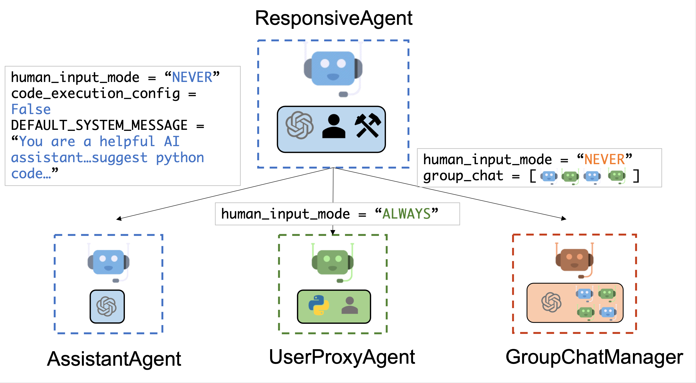
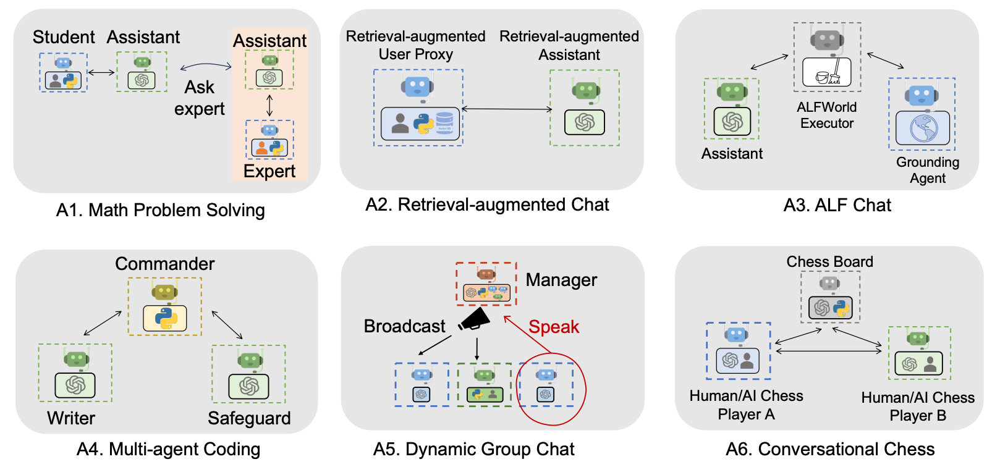

# Multi-agent Conversation Framework

AutoGen offers a unified multi-agent conversation framework as a high-level abstraction of using foundation models. It features capable, customizable and conversable agents which integrate LLMs, tools, and humans via automated agent chat.
By automating chat among multiple capable agents, one can easily make them collectively perform tasks autonomously or with human feedback, including tasks that require using tools via code.

This framework simplifies the orchestration, automation and optimization of a complex LLM workflow. It maximizes the performance of LLM models and overcome their weaknesses. It enables building next-gen LLM applications based on multi-agent conversations with minimal effort.

### Agents

AutoGen abstracts and implements conversable agents
designed to solve tasks through inter-agent conversations. Specifically, the agents in AutoGen have the following notable features:

- Conversable: Agents in AutoGen are conversable, which means that any agent can send
  and receive messages from other agents to initiate or continue a conversation

- Customizable: Agents in AutoGen can be customized to integrate LLMs, humans, tools, or a combination of them.

The figure below shows the built-in agents in AutoGen.


We have designed a generic `ConversableAgent` class for Agents that are capable of conversing with each other through the exchange of messages to jointly finish a task. An agent can communicate with other agents and perform actions. Different agents can differ in what actions they perform after receiving messages. Two representative subclasses are `AssistantAgent` and `UserProxyAgent`.

- The `AssistantAgent` is designed to act as an AI assistant, using LLMs by default but not requiring human input or code execution. It could write Python code (in a Python coding block) for a user to execute when a message (typically a description of a task that needs to be solved) is received. Under the hood, the Python code is written by LLM (e.g., GPT-4). It can also receive the execution results and suggest corrections or bug fixes. Its behavior can be altered by passing a new system message. The LLM [inference](#enhanced-inference) configuration can be configured via `llm_config`.

- The `UserProxyAgent` is conceptually a proxy agent for humans, soliciting human input as the agent's reply at each interaction turn by default and also having the capability to execute code and call functions. The `UserProxyAgent` triggers code execution automatically when it detects an executable code block in the received message and no human user input is provided. Code execution can be disabled by setting the `code_execution_config` parameter to False. LLM-based response is disabled by default. It can be enabled by setting `llm_config` to a dict corresponding to the [inference](/docs/Use-Cases/enhanced_inference) configuration. When `llm_config` is set as a dictionary, `UserProxyAgent` can generate replies using an LLM when code execution is not performed.

The auto-reply capability of `ConversableAgent` allows for more autonomous multi-agent communication while retaining the possibility of human intervention.
One can also easily extend it by registering reply functions with the `register_reply()` method.

In the following code, we create an `AssistantAgent` named "assistant" to serve as the assistant and a `UserProxyAgent` named "user_proxy" to serve as a proxy for the human user. We will later employ these two agents to solve a task.

```python
from autogen import AssistantAgent, UserProxyAgent

# create an AssistantAgent instance named "assistant"
assistant = AssistantAgent(name="assistant")

# create a UserProxyAgent instance named "user_proxy"
user_proxy = UserProxyAgent(name="user_proxy")
```

## Multi-agent Conversations

### A Basic Two-Agent Conversation Example

Once the participating agents are constructed properly, one can start a multi-agent conversation session by an initialization step as shown in the following code:

```python
# the assistant receives a message from the user, which contains the task description
user_proxy.initiate_chat(
    assistant,
    message="""What date is today? Which big tech stock has the largest year-to-date gain this year? How much is the gain?""",
)
```

After the initialization step, the conversation could proceed automatically. Find a visual illustration of how the user_proxy and assistant collaboratively solve the above task autonmously below:


1. The assistant receives a message from the user_proxy, which contains the task description.
2. The assistant then tries to write Python code to solve the task and sends the response to the user_proxy.
3. Once the user_proxy receives a response from the assistant, it tries to reply by either soliciting human input or preparing an automatically generated reply. If no human input is provided, the user_proxy executes the code and uses the result as the auto-reply.
4. The assistant then generates a further response for the user_proxy. The user_proxy can then decide whether to terminate the conversation. If not, steps 3 and 4 are repeated.

### Supporting Diverse Conversation Patterns

#### Conversations with different levels of autonomy, and human-involvement patterns

On the one hand, one can achieve fully autonomous conversations after an initialization step. On the other hand, AutoGen can be used to implement human-in-the-loop problem-solving by configuring human involvement levels and patterns (e.g., setting the `human_input_mode` to `ALWAYS`), as human involvement is expected and/or desired in many applications.

#### Static and dynamic conversations

By adopting the conversation-driven control with both programming language and natural language, AutoGen inherently allows dynamic conversation. Dynamic conversation allows the agent topology to change depending on the actual flow of conversation under different input problem instances, while the flow of a static conversation always follows a pre-defined topology. The dynamic conversation pattern is useful in complex applications where the patterns of interaction cannot be predetermined in advance. AutoGen provides two general approaches to achieving dynamic conversation:

- Registered auto-reply. With the pluggable auto-reply function, one can choose to invoke conversations with other agents depending on the content of the current message and context. A working system demonstrating this type of dynamic conversation can be found in this code example, demonstrating a [dynamic group chat](https://github.com/microsoft/autogen/blob/main/notebook/agentchat_groupchat.ipynb). In the system, we register an auto-reply function in the group chat manager, which lets LLM decide who the next speaker will be in a group chat setting.

- LLM-based function call. In this approach, LLM decides whether or not to call a particular function depending on the conversation status in each inference call.
  By messaging additional agents in the called functions, the LLM can drive dynamic multi-agent conversation. A working system showcasing this type of dynamic conversation can be found in the [multi-user math problem solving scenario](https://github.com/microsoft/autogen/blob/main/notebook/agentchat_two_users.ipynb), where a student assistant would automatically resort to an expert using function calls.

### Diverse Applications Implemented with AutoGen

The figure below shows six examples of applications built using AutoGen.


Find a list of examples in this page: [Automated Agent Chat Examples](../Examples.md#automated-multi-agent-chat)

## For Further Reading

_Interested in the research that leads to this package? Please check the following papers._

- [AutoGen: Enabling Next-Gen LLM Applications via Multi-Agent Conversation Framework](https://arxiv.org/abs/2308.08155). Qingyun Wu, Gagan Bansal, Jieyu Zhang, Yiran Wu, Shaokun Zhang, Erkang Zhu, Beibin Li, Li Jiang, Xiaoyun Zhang and Chi Wang. ArXiv 2023.

- [An Empirical Study on Challenging Math Problem Solving with GPT-4](https://arxiv.org/abs/2306.01337). Yiran Wu, Feiran Jia, Shaokun Zhang, Hangyu Li, Erkang Zhu, Yue Wang, Yin Tat Lee, Richard Peng, Qingyun Wu, Chi Wang. ArXiv preprint arXiv:2306.01337 (2023).
