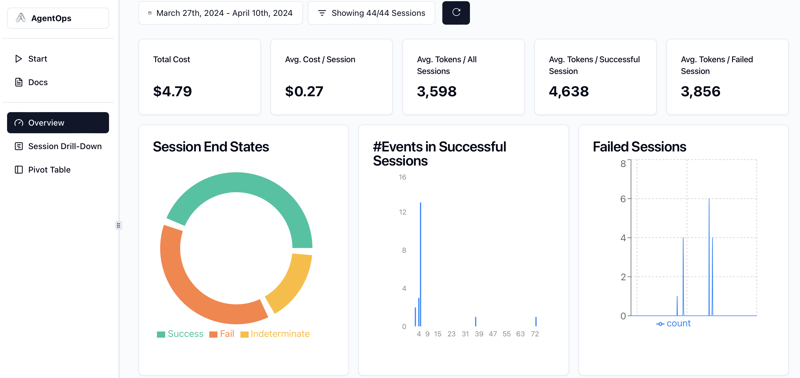
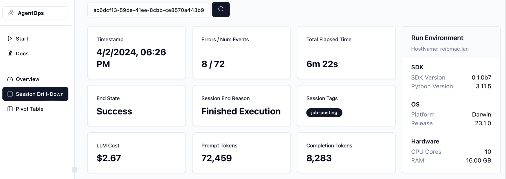
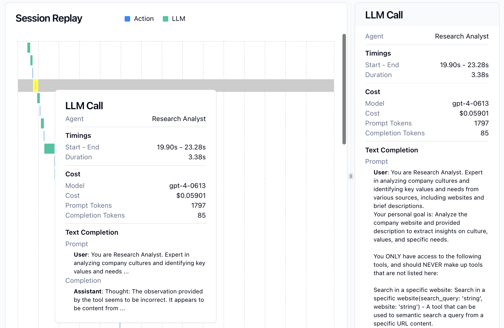

# AgentOps 🖇️


[AgentOps](https://agentops.ai/?=ag) provides session replays, metrics, and monitoring for agents.

At a high level, AgentOps gives you the ability to monitor LLM calls, costs, latency, agent failures, multi-agent interactions, tool usage, session-wide statistics, and more. For more info, check out the [AgentOps Repo](https://github.com/AgentOps-AI/agentops).

> Create an account and API key at [AgentOps.ai](https://agentops.ai/)

<details open>
  <summary>Agent Dashboard</summary>
   
</details>

<details>
  <summary>Session Statistics</summary>
   
</details>

<details>
  <summary>Session Replay</summary>
   
</details>


## Installation

AgentOps works seamlessly with applications built using Autogen.

1. **Install Autogen with AgentOps**
```bash
pip install pyautogen[agentops]
```

2. **Create an API Key:**
Create a user API key here: [Create API Key](app.agentops.ai/account)

3. **Configure Your Environment:**
Add your API key to your environment variables

```
AGENTOPS_API_KEY=<YOUR_AGENTOPS_API_KEY>
```

4. **Initialize AgentOps**

To start tracking all available data on Autogen runs, simply add two lines of code before implementing Autogen.

```python
import agentops
agentops.init()
# or agentops.init(api_key="your-api-key-here")
```

After initializing AgentOps, Autogen will now start automatically tracking your agent runs.

### Features

- **LLM Costs**: Track spend with foundation model providers
- **Replay Analytics**: Watch step-by-step agent execution graphs
- **Recursive Thought Detection**: Identify when agents fall into infinite loops
- **Custom Reporting:** Create custom analytics on agent performance
- **Analytics Dashboard:** Monitor high level statistics about agents in development and production
- **Public Model Testing**: Test your agents against benchmarks and leaderboards
- **Custom Tests:** Run your agents against domain specific tests
- **Time Travel Debugging**: Restart your sessions from checkpoints
- **Compliance and Security**: Create audit logs and detect potential threats such as profanity and PII leaks
- **Prompt Injection Detection**: Identify potential code injection and secret leaks

### Autogen + AgentOps examples
* [AgentChat with AgentOps Notebook](/docs/notebooks/agentchat_agentops)
* [More AgentOps Examples](https://docs.agentops.ai/v1/quickstart)

#### Extra links

<a href="https://twitter.com/agentopsai/">🐦 Twitter</a>
<span>&nbsp;&nbsp;•&nbsp;&nbsp;</span>
<a href="https://discord.gg/JHPt4C7r">📢 Discord</a>
<span>&nbsp;&nbsp;•&nbsp;&nbsp;</span>
<a href="https://app.agentops.ai/?=ag">🖇️ AgentOps Dashboard</a>
<span>&nbsp;&nbsp;•&nbsp;&nbsp;</span>
<a href="https://docs.agentops.ai/introduction">📙 Documentation</a>
