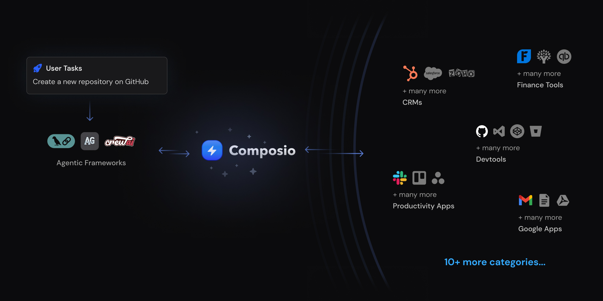

# Composio

Composio empowers AI agents to seamlessly connect with external tools, Apps, and APIs to perform actions and receive triggers. With built-in support for AutoGen, Composio enables the creation of highly capable and adaptable AI agents that can autonomously execute complex tasks and deliver personalized experiences.

- [Composio + AutoGen Documentation with Code Examples](https://docs.composio.dev/framework/autogen)
