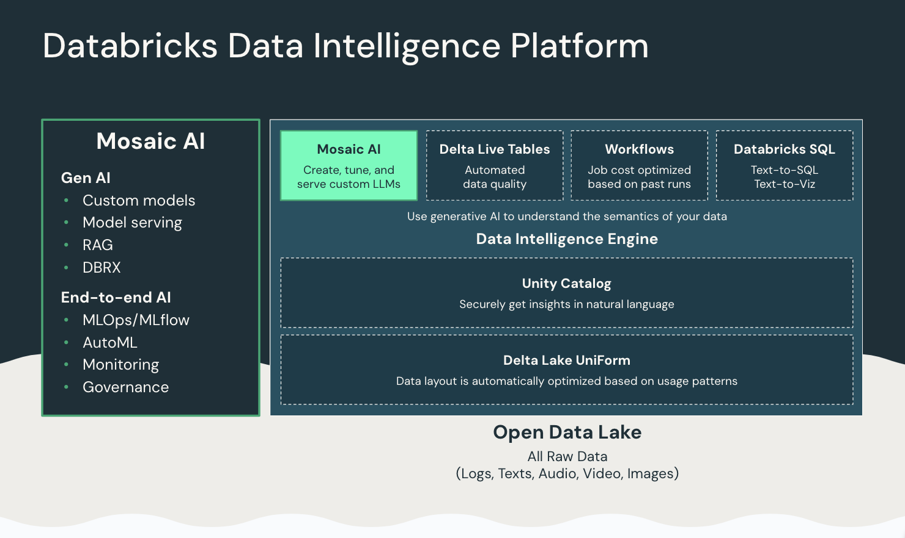

# Databricks

The [Databricks Data Intelligence Platform ](https://www.databricks.com/product/data-intelligence-platform) allows your entire organization to use data and AI. It’s built on a lakehouse to provide an open, unified foundation for all data and governance, and is powered by a Data Intelligence Engine that understands the uniqueness of your data.

This example demonstrates how to use AutoGen alongside Databricks Foundation Model APIs and open-source LLM DBRX.

- [Databricks + AutoGen Code Examples](/docs/notebooks/agentchat_databricks_dbrx)
