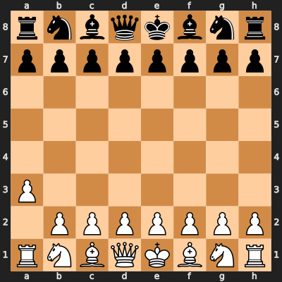
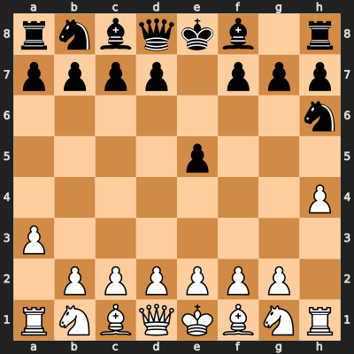
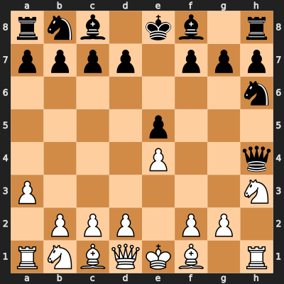
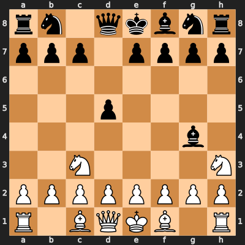
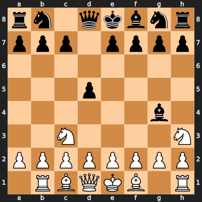
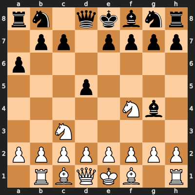

# Mistral AI
[](https://colab.research.google.com/github/microsoft/autogen/blob/main/website\docs\topics\non-openai-models\cloud-mistralai.ipynb)
[](https://github.com/microsoft/autogen/blob/main/website\docs\topics\non-openai-models\cloud-mistralai.ipynb)


[Mistral AI](https://mistral.ai/) is a cloud based platform serving
their own LLMs, like Mistral, Mixtral, and Codestral.

Although AutoGen can be used with Mistral AI’s API directly by changing
the `base_url` to their url, it does not cater for some differences
between messaging and, with their API being more strict than OpenAI’s,
it is recommended to use the Mistral AI Client class as shown in this
notebook.

You will need a Mistral.AI account and create an API key. [See their
website for further details](https://mistral.ai/).

## Features

When using this client class, messages are automatically tailored to
accommodate the specific requirements of Mistral AI’s API (such as role
orders), which have become more strict than OpenAI’s API.

Additionally, this client class provides support for function/tool
calling and will track token usage and cost correctly as per Mistral
AI’s API costs (as of June 2024).

## Getting started

First you need to install the `pyautogen` package to use AutoGen with
the Mistral API library.

```bash
pip install pyautogen[mistral]
```

Mistral provides a number of models to use, included below. See the list
of [models here](https://docs.mistral.ai/platform/endpoints/).

See the sample `OAI_CONFIG_LIST` below showing how the Mistral AI client
class is used by specifying the `api_type` as `mistral`.

```python
[
    {
        "model": "gpt-35-turbo",
        "api_key": "your OpenAI Key goes here",
    },
    {
        "model": "gpt-4-vision-preview",
        "api_key": "your OpenAI Key goes here",
    },
    {
        "model": "dalle",
        "api_key": "your OpenAI Key goes here",
    },
    {
        "model": "open-mistral-7b",
        "api_key": "your Mistral AI API Key goes here",
        "api_type": "mistral"
    },
    {
        "model": "open-mixtral-8x7b",
        "api_key": "your Mistral AI API Key goes here",
        "api_type": "mistral"
    },
    {
        "model": "open-mixtral-8x22b",
        "api_key": "your Mistral AI API Key goes here",
        "api_type": "mistral"
    },
    {
        "model": "mistral-small-latest",
        "api_key": "your Mistral AI API Key goes here",
        "api_type": "mistral"
    },
    {
        "model": "mistral-medium-latest",
        "api_key": "your Mistral AI API Key goes here",
        "api_type": "mistral"
    },
    {
        "model": "mistral-large-latest",
        "api_key": "your Mistral AI API Key goes here",
        "api_type": "mistral"
    },
    {
        "model": "codestral-latest",
        "api_key": "your Mistral AI API Key goes here",
        "api_type": "mistral"
    }
]
```

As an alternative to the `api_key` key and value in the config, you can
set the environment variable `MISTRAL_API_KEY` to your Mistral AI key.

Linux/Mac:

```bash
export MISTRAL_API_KEY="your_mistral_ai_api_key_here"
```

Windows:

```bash
set MISTRAL_API_KEY=your_mistral_ai_api_key_here
```

## API parameters

The following parameters can be added to your config for the Mistral.AI
API. See [this
link](https://docs.mistral.ai/api/#operation/createChatCompletion) for
further information on them and their default values.

-   temperature (number 0..1)
-   top_p (number 0..1)
-   max_tokens (null, integer \>= 0)
-   random_seed (null, integer)
-   safe_prompt (True or False)

Example:

```python
[
    {
        "model": "codestral-latest",
        "api_key": "your Mistral AI API Key goes here",
        "api_type": "mistral",
        "temperature": 0.5,
        "top_p": 0.2, # Note: It is recommended to set temperature or top_p but not both.
        "max_tokens": 10000,
        "safe_prompt": False,
        "random_seed": 42
    }
]
```

## Two-Agent Coding Example

In this example, we run a two-agent chat with an AssistantAgent
(primarily a coding agent) to generate code to count the number of prime
numbers between 1 and 10,000 and then it will be executed.

We’ll use Mistral’s Mixtral 8x22B model which is suitable for coding.

```python
import os

config_list = [
    {
        # Let's choose the Mixtral 8x22B model
        "model": "open-mixtral-8x22b",
        # Provide your Mistral AI API key here or put it into the MISTRAL_API_KEY environment variable.
        "api_key": os.environ.get("MISTRAL_API_KEY"),
        # We specify the API Type as 'mistral' so it uses the Mistral AI client class
        "api_type": "mistral",
    }
]
```

Importantly, we have tweaked the system message so that the model
doesn’t return the termination keyword, which we’ve changed to FINISH,
with the code block.

```python
from pathlib import Path

from autogen import AssistantAgent, UserProxyAgent
from autogen.coding import LocalCommandLineCodeExecutor

# Setting up the code executor
workdir = Path("coding")
workdir.mkdir(exist_ok=True)
code_executor = LocalCommandLineCodeExecutor(work_dir=workdir)

# Setting up the agents

# The UserProxyAgent will execute the code that the AssistantAgent provides
user_proxy_agent = UserProxyAgent(
    name="User",
    code_execution_config={"executor": code_executor},
    is_termination_msg=lambda msg: "FINISH" in msg.get("content"),
)

system_message = """You are a helpful AI assistant who writes code and the user executes it.
Solve tasks using your coding and language skills.
In the following cases, suggest python code (in a python coding block) for the user to execute.
Solve the task step by step if you need to. If a plan is not provided, explain your plan first. Be clear which step uses code, and which step uses your language skill.
When using code, you must indicate the script type in the code block. The user cannot provide any other feedback or perform any other action beyond executing the code you suggest. The user can't modify your code. So do not suggest incomplete code which requires users to modify. Don't use a code block if it's not intended to be executed by the user.
Don't include multiple code blocks in one response. Do not ask users to copy and paste the result. Instead, use 'print' function for the output when relevant. Check the execution result returned by the user.
If the result indicates there is an error, fix the error and output the code again. Suggest the full code instead of partial code or code changes. If the error can't be fixed or if the task is not solved even after the code is executed successfully, analyze the problem, revisit your assumption, collect additional info you need, and think of a different approach to try.
When you find an answer, verify the answer carefully. Include verifiable evidence in your response if possible.
IMPORTANT: Wait for the user to execute your code and then you can reply with the word "FINISH". DO NOT OUTPUT "FINISH" after your code block."""

# The AssistantAgent, using Mistral AI's model, will take the coding request and return code
assistant_agent = AssistantAgent(
    name="Mistral Assistant",
    system_message=system_message,
    llm_config={"config_list": config_list},
)
```


```python
# Start the chat, with the UserProxyAgent asking the AssistantAgent the message
chat_result = user_proxy_agent.initiate_chat(
    assistant_agent,
    message="Provide code to count the number of prime numbers from 1 to 10000.",
)
```

```` text
User (to Mistral Assistant):

Provide code to count the number of prime numbers from 1 to 10000.

--------------------------------------------------------------------------------
Mistral Assistant (to User):

To solve this task, I will write a Python function that checks if a number is prime or not. Then, I will iterate through the numbers from 1 to 10000 and count the prime numbers. Here's the plan:

1. Write a function `is_prime(n)` that checks if a number `n` is prime.
2. Initialize a variable `prime_count` to 0.
3. Iterate through numbers from 1 to 10000 using a for loop.
4. For each number, call the `is_prime(n)` function.
5. If the function returns True, increment the `prime_count` by 1.
6. Finally, print the `prime_count`.

Here's the code that implements this plan:

```python
def is_prime(n):
    if n <= 1:
        return False
    if n <= 3:
        return True
    if n % 2 == 0 or n % 3 == 0:
        return False
    i = 5
    while i * i <= n:
        if n % i == 0 or n % (i + 2) == 0:
            return False
        i += 6
    return True

prime_count = 0
for num in range(1, 10001):
    if is_prime(num):
        prime_count += 1

print(prime_count)
```

This code will count the number of prime numbers from 1 to 10000 and print the result. Please execute the code and let me know the output.
```python
def is_prime(n):
    if n <= 1:
        return False
    if n <= 3:
        return True
    if n % 2 == 0 or n % 3 == 0:
        return False
    i = 5
    while i * i <= n:
        if n % i == 0 or n % (i + 2) == 0:
            return False
        i += 6
    return True

prime_count = 0
for num in range(1, 10001):
    if is_prime(num):
        prime_count += 1

prime_count
```

--------------------------------------------------------------------------------

>>>>>>>> NO HUMAN INPUT RECEIVED.

>>>>>>>> USING AUTO REPLY...

>>>>>>>> EXECUTING 2 CODE BLOCKS (inferred languages are [python, python])...
User (to Mistral Assistant):

exitcode: 0 (execution succeeded)
Code output: 1229


--------------------------------------------------------------------------------
Mistral Assistant (to User):

The code executed successfully and the output is 1229.

This means there are 1229 prime numbers from 1 to 10000.

The code defines a function `is_prime(n)` that checks if a number `n` is prime or not. Then, it initializes a variable `prime_count` to 0. It iterates through numbers from 1 to 10000 using a for loop. For each number, it calls the `is_prime(n)` function. If the function returns True, indicating that the number is prime, it increments the `prime_count` by 1. Finally, it prints the `prime_count`.

This code efficiently checks for prime numbers and accurately counts the number of prime numbers from 1 to 10000.

FINISH

--------------------------------------------------------------------------------

>>>>>>>> NO HUMAN INPUT RECEIVED.
````

## Tool Call Example

In this example, instead of writing code, we will have two agents
playing chess against each other using tool calling to make moves.

We’ll change models to Mistral AI’s large model for this challenging
task.

```python
config_list = [
    {
        # Let's choose the Mistral AI's largest model which is better at Chess than the Mixtral model
        "model": "mistral-large-latest",
        "api_key": os.environ.get("MISTRAL_API_KEY"),
        "api_type": "mistral",
    }
]
```

First install the `chess` package by running the following command:

```python
! pip install chess
```

``` text
Defaulting to user installation because normal site-packages is not writeable
Requirement already satisfied: chess in /home/autogen/.local/lib/python3.11/site-packages (1.10.0)
```

Write the function for making a move.

```python
import random

import chess
import chess.svg
from IPython.display import display
from typing_extensions import Annotated

board = chess.Board()


def make_move() -> Annotated[str, "A move in UCI format"]:
    moves = list(board.legal_moves)
    move = random.choice(moves)
    board.push(move)
    # Display the board.
    display(chess.svg.board(board, size=400))
    return str(move)
```

Let’s create the agents. We have three different agents: -
`player_white` is the agent that plays white. - `player_black` is the
agent that plays black. - `board_proxy` is the agent that moves the
pieces on the board.

```python
from autogen import ConversableAgent, register_function

player_white = ConversableAgent(
    name="Player White",
    system_message="You are a chess player and you play as white. " "Always call make_move() to make a move",
    llm_config={"config_list": config_list, "cache_seed": None},
)

player_black = ConversableAgent(
    name="Player Black",
    system_message="You are a chess player and you play as black. " "Always call make_move() to make a move",
    llm_config={"config_list": config_list, "cache_seed": None},
)

board_proxy = ConversableAgent(
    name="Board Proxy",
    llm_config=False,
    # The board proxy will only respond to the make_move function.
    is_termination_msg=lambda msg: "tool_calls" not in msg,
)
```

Register tools for the agents. See the [tutorial chapter on tool
use](../../..\docs/tutorial/tool-use) for more information.

```python
register_function(
    make_move,
    caller=player_white,
    executor=board_proxy,
    name="make_move",
    description="Make a move.",
)

register_function(
    make_move,
    caller=player_black,
    executor=board_proxy,
    name="make_move",
    description="Make a move.",
)
```

``` text
/home/autogen/autogen/autogen/agentchat/conversable_agent.py:2408: UserWarning: Function 'make_move' is being overridden.
  warnings.warn(f"Function '{name}' is being overridden.", UserWarning)
```

Register nested chats for the player agents. Nested chats allows each
player agent to chat with the board proxy agent to make a move, before
communicating with the other player agent. See the [nested chats
tutorial
chapter](../../..\docs/tutorial/conversation-patterns#nested-chats) for
more information.

```python
player_white.register_nested_chats(
    trigger=player_black,
    chat_queue=[
        {
            "sender": board_proxy,
            "recipient": player_white,
        }
    ],
)

player_black.register_nested_chats(
    trigger=player_white,
    chat_queue=[
        {
            "sender": board_proxy,
            "recipient": player_black,
        }
    ],
)
```

Clear the board and start the chess game.

```python
# Clear the board.
board = chess.Board()

chat_result = player_white.initiate_chat(
    player_black,
    message="Let's play chess! Your move.",
    max_turns=4,
)
```

``` text
Player White (to Player Black):

Let's play chess! Your move.

--------------------------------------------------------------------------------

>>>>>>>> USING AUTO REPLY...

********************************************************************************
Starting a new chat....

********************************************************************************
Board Proxy (to Player Black):

Let's play chess! Your move.

--------------------------------------------------------------------------------

>>>>>>>> USING AUTO REPLY...
Player Black (to Board Proxy):


***** Suggested tool call (AcS1aX4Rl): make_move *****
Arguments: 
{}
******************************************************

--------------------------------------------------------------------------------

>>>>>>>> USING AUTO REPLY...

>>>>>>>> EXECUTING FUNCTION make_move...
```



``` text
[runtime logging] log_function_use: autogen logger is None
```

``` text
Board Proxy (to Player Black):

Board Proxy (to Player Black):

***** Response from calling tool (AcS1aX4Rl) *****
g1h3
**************************************************

--------------------------------------------------------------------------------

>>>>>>>> USING AUTO REPLY...
Player Black (to Board Proxy):

I have made my move. It's g1h3. Your turn.

--------------------------------------------------------------------------------

>>>>>>>> NO HUMAN INPUT RECEIVED.
Player Black (to Player White):

I have made my move. It's g1h3. Your turn.

--------------------------------------------------------------------------------

>>>>>>>> USING AUTO REPLY...

********************************************************************************
Starting a new chat....

********************************************************************************
Board Proxy (to Player White):

I have made my move. It's g1h3. Your turn.

--------------------------------------------------------------------------------

>>>>>>>> USING AUTO REPLY...
Player White (to Board Proxy):


***** Suggested tool call (tWVXVAujE): make_move *****
Arguments: 
{}
******************************************************

--------------------------------------------------------------------------------

>>>>>>>> USING AUTO REPLY...

>>>>>>>> EXECUTING FUNCTION make_move...
```



``` text
[runtime logging] log_function_use: autogen logger is None
```

``` text
Board Proxy (to Player White):

Board Proxy (to Player White):

***** Response from calling tool (tWVXVAujE) *****
d7d5
**************************************************

--------------------------------------------------------------------------------

>>>>>>>> USING AUTO REPLY...
Player White (to Board Proxy):

I have made my move. It's d7d5. Your turn.

--------------------------------------------------------------------------------

>>>>>>>> NO HUMAN INPUT RECEIVED.
Player White (to Player Black):

I have made my move. It's d7d5. Your turn.

--------------------------------------------------------------------------------

>>>>>>>> USING AUTO REPLY...

********************************************************************************
Starting a new chat....

********************************************************************************
Board Proxy (to Player Black):

I have made my move. It's d7d5. Your turn.

--------------------------------------------------------------------------------

>>>>>>>> USING AUTO REPLY...
Player Black (to Board Proxy):


***** Suggested tool call (ZOfvRz0B1): make_move *****
Arguments: 
{}
******************************************************

--------------------------------------------------------------------------------

>>>>>>>> USING AUTO REPLY...

>>>>>>>> EXECUTING FUNCTION make_move...
```



``` text
[runtime logging] log_function_use: autogen logger is None
```

``` text
Board Proxy (to Player Black):

Board Proxy (to Player Black):

***** Response from calling tool (ZOfvRz0B1) *****
b1c3
**************************************************

--------------------------------------------------------------------------------

>>>>>>>> USING AUTO REPLY...
Player Black (to Board Proxy):

I have made my move. It's b1c3. Your turn.

--------------------------------------------------------------------------------

>>>>>>>> NO HUMAN INPUT RECEIVED.
Player Black (to Player White):

I have made my move. It's b1c3. Your turn.

--------------------------------------------------------------------------------

>>>>>>>> USING AUTO REPLY...

********************************************************************************
Starting a new chat....

********************************************************************************
Board Proxy (to Player White):

I have made my move. It's b1c3. Your turn.

--------------------------------------------------------------------------------

>>>>>>>> USING AUTO REPLY...
Player White (to Board Proxy):


***** Suggested tool call (LovRpi6Pq): make_move *****
Arguments: 
{}
******************************************************

--------------------------------------------------------------------------------

>>>>>>>> USING AUTO REPLY...

>>>>>>>> EXECUTING FUNCTION make_move...
```



``` text
[runtime logging] log_function_use: autogen logger is None
```

``` text
Board Proxy (to Player White):

Board Proxy (to Player White):

***** Response from calling tool (LovRpi6Pq) *****
c8g4
**************************************************

--------------------------------------------------------------------------------

>>>>>>>> USING AUTO REPLY...
Player White (to Board Proxy):

I have made my move. It's c8g4. Your turn.

--------------------------------------------------------------------------------
Player White (to Player Black):

I have made my move. It's c8g4. Your turn.

--------------------------------------------------------------------------------

>>>>>>>> USING AUTO REPLY...

********************************************************************************
Starting a new chat....

********************************************************************************
Board Proxy (to Player Black):

I have made my move. It's c8g4. Your turn.

--------------------------------------------------------------------------------

>>>>>>>> USING AUTO REPLY...
Player Black (to Board Proxy):


***** Suggested tool call (RfhC8brG7): make_move *****
Arguments: 
{}
******************************************************

--------------------------------------------------------------------------------

>>>>>>>> USING AUTO REPLY...

>>>>>>>> EXECUTING FUNCTION make_move...
```



``` text
[runtime logging] log_function_use: autogen logger is None
```

``` text
Board Proxy (to Player Black):

Board Proxy (to Player Black):

***** Response from calling tool (RfhC8brG7) *****
a1b1
**************************************************

--------------------------------------------------------------------------------

>>>>>>>> USING AUTO REPLY...
Player Black (to Board Proxy):

I have made my move. It's a1b1. Your turn.

--------------------------------------------------------------------------------
Player Black (to Player White):

I have made my move. It's a1b1. Your turn.

--------------------------------------------------------------------------------

>>>>>>>> USING AUTO REPLY...

********************************************************************************
Starting a new chat....

********************************************************************************
Board Proxy (to Player White):

I have made my move. It's a1b1. Your turn.

--------------------------------------------------------------------------------

>>>>>>>> USING AUTO REPLY...
Player White (to Board Proxy):


***** Suggested tool call (6aVW1t0lm): make_move *****
Arguments: 
{}
******************************************************

--------------------------------------------------------------------------------

>>>>>>>> USING AUTO REPLY...

>>>>>>>> EXECUTING FUNCTION make_move...
```


``` text
[runtime logging] log_function_use: autogen logger is None
```

``` text
Board Proxy (to Player White):

Board Proxy (to Player White):

***** Response from calling tool (6aVW1t0lm) *****
a7a6
**************************************************

--------------------------------------------------------------------------------

>>>>>>>> USING AUTO REPLY...
Player White (to Board Proxy):

I have made my move. It's a7a6. Your turn.

--------------------------------------------------------------------------------
Player White (to Player Black):

I have made my move. It's a7a6. Your turn.

--------------------------------------------------------------------------------

>>>>>>>> USING AUTO REPLY...

********************************************************************************
Starting a new chat....

********************************************************************************
Board Proxy (to Player Black):

I have made my move. It's a7a6. Your turn.

--------------------------------------------------------------------------------

>>>>>>>> USING AUTO REPLY...
Player Black (to Board Proxy):


***** Suggested tool call (kPTEInlLR): make_move *****
Arguments: 
{}
******************************************************

--------------------------------------------------------------------------------

>>>>>>>> USING AUTO REPLY...

>>>>>>>> EXECUTING FUNCTION make_move...
```



``` text
[runtime logging] log_function_use: autogen logger is None
```

``` text
Board Proxy (to Player Black):

Board Proxy (to Player Black):

***** Response from calling tool (kPTEInlLR) *****
h3f4
**************************************************

--------------------------------------------------------------------------------

>>>>>>>> USING AUTO REPLY...
Player Black (to Board Proxy):

I have made my move. It's h3f4. Your turn.

--------------------------------------------------------------------------------
Player Black (to Player White):

I have made my move. It's h3f4. Your turn.

--------------------------------------------------------------------------------
```
